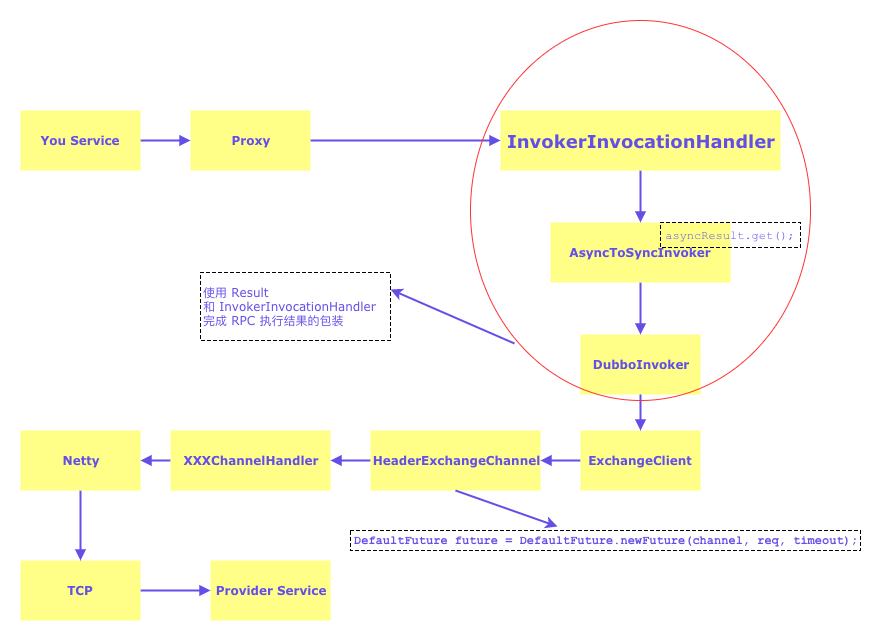
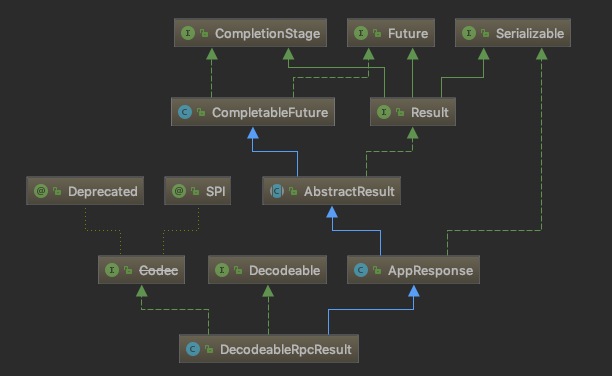
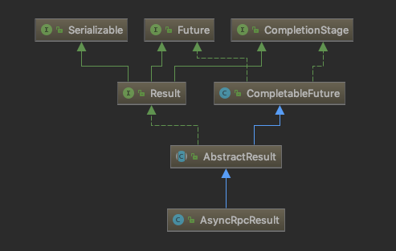
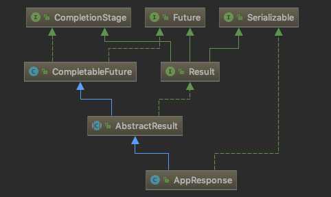

# Dubbo async

- [Dubbo async](#Dubbo-async)
  - [InvokerInvocationHandler](#InvokerInvocationHandler)
  - [RPC chain](#RPC-chain)
  - [DecodeableRpcResult](#DecodeableRpcResult)
  - [AsyncRpcResult](#AsyncRpcResult)
  - [AppResponse](#AppResponse)
  - [DefaultFuture](#DefaultFuture)
  - [AsyncToSyncInvoker](#AsyncToSyncInvoker)

> Dubbo 异步的实现

`Dubbo` 中对方法的执行结果封装成了 `Result`,`Result` 的实现有同步的，有异步的

- DecodeableRpcResult
- AsyncRpcResult

而这个 `Result` 对你来说是透明的，感知不到它的存在

## InvokerInvocationHandler

`org.apache.dubbo.rpc.proxy.InvokerInvocationHandler` 的 `recreate` 方法就是把 `Result` 中保存的方法执行结结果返回到你的业务代码中

```java
// Result#recreate
return invoker.invoke(new RpcInvocation(method, args)).recreate();
```

看下下面的 `Invoker` 实现 `invoke` 方法的返回结果就是 `Result`

```java
public interface Invoker<T> extends Node {

    Class<T> getInterface();
    Result invoke(Invocation invocation) throws RpcException;

}
```

`Dubbo` 使用 `Proxy` + `InvokerInvocationHandler` 使用代理模仿接口的实现，当调研接口的方法的时候

其实是调用 `Dubbo` 的代理方法，这个方法最终会被执行到 [Dubbo Invoker](dubbo-invoker.md)

## RPC chain



## DecodeableRpcResult

`org.apache.dubbo.rpc.protocol.dubbo.DecodeableRpcResult`



## AsyncRpcResult

`org.apache.dubbo.rpc.AsyncRpcResult`



```java
public Object recreate() throws Throwable {
    RpcInvocation rpcInvocation = (RpcInvocation) invocation;
    if (InvokeMode.FUTURE == rpcInvocation.getInvokeMode()) {
        AppResponse appResponse = new AppResponse();
        CompletableFuture<Object> future = new CompletableFuture<>();
        appResponse.setValue(future);
        this.whenComplete((result, t) -> {
            if (t != null) {
                if (t instanceof CompletionException) {
                    t = t.getCause();
                }
                future.completeExceptionally(t);
            } else {
                if (result.hasException()) {
                    future.completeExceptionally(result.getException());
                } else {
                    future.complete(result.getValue());
                }
            }
        });
        return appResponse.recreate();
    } else if (this.isDone()) {
        return this.get().recreate();
    }
    return (new AppResponse()).recreate();
}
```

## AppResponse

`org.apache.dubbo.rpc.AppResponse`



## DefaultFuture

`DefaultFuture` 继承了 `CompletableFuture`

```java
// DefaultFuture
public class DefaultFuture extends CompletableFuture<Object> {

    private static final Logger logger = LoggerFactory.getLogger(DefaultFuture.class);

    private static final Map<Long, Channel> CHANNELS = new ConcurrentHashMap<>();

    // 用来存放 DefaultFuture
    // 当服务响应的时候根据 id 来找到 DefaultFuture
    // 把远程方法的执行结果，存放在 CompletableFuture 的 Object result 字段中
    private static final Map<Long, DefaultFuture> FUTURES = new ConcurrentHashMap<>();

    // 定时器，用来检测超时
    public static final Timer TIME_OUT_TIMER = new HashedWheelTimer(
            new NamedThreadFactory("dubbo-future-timeout", true),
            30,
            TimeUnit.MILLISECONDS);

    // invoke id.
    private final Long id;
    private final Channel channel;
    private final Request request;
    private final int timeout;
    private final long start = System.currentTimeMillis();
    private volatile long sent;
    private Timeout timeoutCheckTask;

    // 省略其他的代码
}


// 设置远程方法的执行结果
private void doReceived(Response res) {
    if (res == null) {
        throw new IllegalStateException("response cannot be null");
    }
    if (res.getStatus() == Response.OK) {
        // 正常的响应，设置执行结果
        this.complete(res.getResult());
    } else if (res.getStatus() == Response.CLIENT_TIMEOUT || res.getStatus() == Response.SERVER_TIMEOUT) {
        this.completeExceptionally(new TimeoutException(res.getStatus() == Response.SERVER_TIMEOUT, channel, res.getErrorMessage()));
    } else {
        this.completeExceptionally(new RemotingException(channel, res.getErrorMessage()));
    }
}
```

## AsyncToSyncInvoker

```java
// invoke 方法会执行 asyncResult.get() 阻塞到直到完成
public Result invoke(Invocation invocation) throws RpcException {
    Result asyncResult = invoker.invoke(invocation);
    try {
        if (InvokeMode.SYNC == ((RpcInvocation)invocation).getInvokeMode()) {
            asyncResult.get();
        }
    } catch (InterruptedException e) {
        throw new RpcException("Interrupted unexpectedly while waiting for remoting result to return!  method: " + invocation.getMethodName() + ", provider: " + getUrl() + ", cause: " + e.getMessage(), e);
    } catch (ExecutionException e) {
        Throwable t = e.getCause();
        if (t instanceof TimeoutException) {
            throw new RpcException(RpcException.TIMEOUT_EXCEPTION, "Invoke remote method timeout. method: " + invocation.getMethodName() + ", provider: " + getUrl() + ", cause: " + e.getMessage(), e);
        } else if (t instanceof RemotingException) {
            throw new RpcException(RpcException.NETWORK_EXCEPTION, "Failed to invoke remote method: " + invocation.getMethodName() + ", provider: " + getUrl() + ", cause: " + e.getMessage(), e);
        }
    } catch (Throwable e) {
        throw new RpcException(e.getMessage(), e);
    }
    return asyncResult;
}
```
