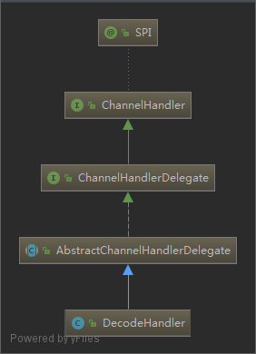
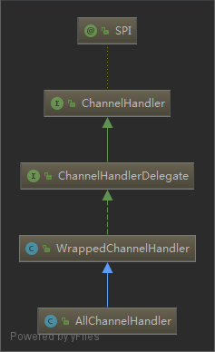

# ChannelHandler

- [ChannelHandler](#channelhandler)
  - [demo](#demo)
  - [常见的 handler](#%E5%B8%B8%E8%A7%81%E7%9A%84-handler)
  - [dubbo handler 链](#dubbo-handler-%E9%93%BE)
  - [DecodeHandler](#decodehandler)
  - [AllChannelHandler](#allchannelhandler)
  - [HeaderExchangeHandler](#headerexchangehandler)

`dubbo` 中的 `ChannelHandler` 用来处理所有 IO 相关的事件的转发：编码，解码，序列化，反序列化

> 实现类预览：


`dubbo` 中的 `ChannelHandler` 之间使用了包装，从而形成类似链式的调用,每种 `ChannelHandler` 类实现不同的功能

## demo

```java
interface ChannelHandler {
    void say();
}

class A implements ChannelHandler {

    public void say() {
        System.out.println("A#say ...");
    }

}

class B implements ChannelHandler {

    private ChannelHandler chanelHandler;

    public B(ChannelHandler chanelHandler) {
        this.chanelHandler = chanelHandler;
    }

    public void say() {
        chanelHandler.say();
        System.out.println("B#say ...");
    }
}

// 在 B 实例化的时候，实例化 A 并把 A 当作构造参数 传入 B 中
// 再调用的时候，可以同时执行 A，B两个类的方法
// 如果 ChannelHandler 中有多个方法，那么 A B 可以实现，覆盖 不同的方法
// 起到不同的作用
public static void main(String[] args){

  new B(new A()).say();
  // A#say ...
  // B#say ...
}

```

而在 `dubbo` 中，对 `ChannelHandler` 进行了更多层的包装

## 常见的 handler

> 按照模块分类

- protocol
  - org.apache.dubbo.rpc.protocol.dubbo.DubboProtocol.ExchangeHandler
- exchange
  - org.apache.dubbo.remoting.exchange.support.header.HeaderExchangeHandler
  - org.apache.dubbo.remoting.exchange.support.header.HeartbeatHandler
- transport
  - org.apache.dubbo.remoting.transport.DecodeHandler
  - org.apache.dubbo.remoting.transport.MultiMessageHandler
  - org.apache.dubbo.remoting.transport.dispatcher.all.AllChannelHandler
  - org.apache.dubbo.remoting.transport.netty4.NettyServerHandler
  - org.apache.dubbo.remoting.transport.netty4.NettyServer
  - org.apache.dubbo.remoting.transport.netty4.NettyClientHandler
  - org.apache.dubbo.remoting.transport.netty4.NettyClient

## dubbo handler 链

`dubbo` 服务器端的 `handler` 链:

服务器端的事件从 `decoder` -> `DubboProtocol#requestHandler`

```java
Netty
-> decoder
  -> encoder
    -> IdleStateHandler
      -> NettyServerHandler
        -> NettyServer
          -> MultiMessageHandler
            -> HeartbeatHandler
              -> AllChannelHandler
                -> DecodeHandler
                  -> HeaderExchangeHandler
                    -> DubboProtocol#requestHandler
```

> 注意: decoder 与 encoder 一次 IO 请求只会经过其中的一个
> 如果是请求那么就是 decoder，如果是响应 就是 encoder

每个 `Handler` 的解释:

```java
Netty
-> decoder # ByteToMessageDecoder -> InternalDecoder -> Codec2(DubboCountCodec)
  -> encoder # MessageToByteEncoder -> InternalEncoder -> Codec2(DubboCountCodec)
    -> IdleStateHandler # 闲置链接检测
      -> NettyServerHandler # netty ChannelDuplexHandler 的实现
        -> NettyServer # 负责启动netty 服务，并维护 io.netty.channel.Channel
          -> MultiMessageHandler # 支持多个消息的解析
            -> HeartbeatHandler # 心跳检测，如果是心跳IO事件，则直接返回（后续的Handler则不会执行了）
              -> AllChannelHandler # 线程池，异步执行
                -> DecodeHandler # 进行 Decodeable 的
                  -> HeaderExchangeHandler # 负责检查 Result 是否完成，并执行 Channel#send 发送结果
                    -> DubboProtocol#requestHandler # 负责查找 invoker 并执行，返回 Result
```

上面的 `decoder` 和 `encoder` 是 `io.netty.channel.ChannelHandler` 的实现类

`decoder` 和 `encoder` 他们会把具体实现交给 `org.apache.dubbo.remoting.Codec2` 的实现类，进行编码/解码的处理

`org.apache.dubbo.remoting.Codec2` 会返回 编码/解码之后的 `Object` 交给 `io.netty.channel.ChannelHandler`

`io.netty.channel.ChannelHandler` 再转发给 `org.apache.dubbo.remoting.ChannelHandler`

可参考 `org.apache.dubbo.remoting.transport.netty4.NettyCodecAdapter` 的代码

`dubbo` 客户端端的 `handler` 链:

```java
Netty
-> decoder
  -> encoder
    -> IdleStateHandler
      -> NettyClientHandler
        -> NettyClient
          -> MultiMessageHandler
            -> HeartbeatHandler
              -> AllChannelHandler
                -> DecodeHandler
                  -> HeaderExchangeHandler
                    -> DubboProtocol#requestHandler
```

客户端端的事件从 `decoder` -> `DubboProtocol#requestHandler`

## DecodeHandler



## AllChannelHandler



## HeaderExchangeHandler
