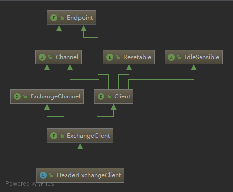
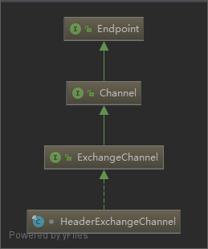

# Exchanger

- [Exchanger](#exchanger)
  - [HeaderExchanger](#headerexchanger)
  - [HeaderExchangeChannel](#headerexchangechannel)
  - [HeaderExchangeClient](#headerexchangeclient)
  - [HeaderExchangeServer](#headerexchangeserver)
  - [HeaderExchangeHandler](#headerexchangehandler)
    - [connected](#connected)
    - [disconnected](#disconnected)
    - [sent](#sent)
    - [received](#received)

`HeaderExchanger` 提供了下面的几个功能：

1. 心跳任务，重新连接任务 HeartbeatTimerTask ReconnectTimerTask CloseTimerTask
2. request reply 消息机制 HeaderExchangeHandler
3. 提供异步的 Future 结果功能 HeaderExchangeChannel

> TODO: 后续会进行 demo 举例，同时找到遗漏点

## HeaderExchanger

```java
public class HeaderExchanger implements Exchanger {

    public static final String NAME = "header";

    @Override
    public ExchangeClient connect(URL url, ExchangeHandler handler) throws RemotingException {
        // HeaderExchangeClient 包装了 返回的 Client
        // 同时包装了 DecodeHandler 和 HeaderExchangeHandler
        return new HeaderExchangeClient(Transporters.connect(url, new DecodeHandler(new HeaderExchangeHandler(handler))), true);
    }

    @Override
    public ExchangeServer bind(URL url, ExchangeHandler handler) throws RemotingException {
        // HeaderExchangeServer 包装了 Transporters.bind 返回的 Server
        // 同时包装了 DecodeHandler 和 HeaderExchangeHandler
        return new HeaderExchangeServer(Transporters.bind(url, new DecodeHandler(new HeaderExchangeHandler(handler))));
    }

}
```

参考 [dubbo-protocol-dubbo-protocol.md](dubbo-protocol-dubbo-protocol.md#NettyClientHandler) 进行 ChannelHandler 填充之后的数据流向：

```log
    TCP
    ↓
    Netty
    ↓
    Codec2
    ↓
    NettyClientHandler
    ↓
    NettyClient
    ↓
    DecodeHandler
    ↓
    HeaderExchangeHandler
    ↓
    DubboProtocol#requestHandler (ExchangeHandler)
    ↓
    Invoker
```

上面的图中多了 `DecodeHandler` 和 `HeaderExchangeHandler` 分析它们重写那些方法， 就知道它们的作用

| HeaderExchangeClient                                           | HeaderExchangeServer                                           |
| -------------------------------------------------------------- | -------------------------------------------------------------- |
|  |  |

## HeaderExchangeChannel

对 `org.apache.dubbo.remoting.Channel` 进行包装，提供异步任务的结果功能



```java
// HeaderExchangeChannel 实现了 ExchangeChannel
// 从下面的签名方法 ResponseFuture 就可以看出 HeaderExchangeChannel 提供了异步结果的功能
// 当执行 request 方法时候，会放回 ResponseFuture，方便在后续获取结果
public interface ExchangeChannel extends Channel {

    /**
     * send request.
     *
     * @param request
     * @return response future
     * @throws RemotingException
     */
    ResponseFuture request(Object request) throws RemotingException;

    /**
     * send request.
     *
     * @param request
     * @param timeout
     * @return response future
     * @throws RemotingException
     */
    ResponseFuture request(Object request, int timeout) throws RemotingException;

    /**
     * get message handler.
     *
     * @return message handler
     */
    ExchangeHandler getExchangeHandler();

    /**
     * graceful close.
     *
     * @param timeout
     */
    @Override
    void close(int timeout);
}
```

## HeaderExchangeClient

```java
// HeaderExchangeClient 包装了 HeaderExchangeChannel
// 同时启动了二个定时任务
// startReconnectTask(url) 重新连接检查任务
// startHeartBeatTask(url) 心跳检查任务
public HeaderExchangeClient(Client client, boolean startTimer) {
    Assert.notNull(client, "Client can't be null");
    this.client = client;
    this.channel = new HeaderExchangeChannel(client);
    if (startTimer) {
        URL url = client.getUrl();
        startReconnectTask(url);
        startHeartBeatTask(url);
    }
}
```

## HeaderExchangeServer

```java
// HeaderExchangeServer 从构造函数可以看出，它包装了从 Transporters.bind 返回的 Server
// 同事启动了一个闲置检查任务
public HeaderExchangeServer(Server server) {
    Assert.notNull(server, "server == null");
    this.server = server;
    startIdleCheckTask(getUrl());
}
```

## HeaderExchangeHandler

`org.apache.dubbo.remoting.exchange.support.header.HeaderExchangeHandler`

HeaderExchangeHandler 重写了下面的几个方法:

- connected
- disconnected
- sent
- received
- caught
- getHandler

### connected

```java
@Override
public void connected(Channel channel) throws RemotingException {
    channel.setAttribute(KEY_READ_TIMESTAMP, System.currentTimeMillis());
    channel.setAttribute(KEY_WRITE_TIMESTAMP, System.currentTimeMillis());
    // 把当前的 channle 包装成 HeaderExchangeChannel
    ExchangeChannel exchangeChannel = HeaderExchangeChannel.getOrAddChannel(channel);
    try {
        handler.connected(exchangeChannel);
    } finally {
        HeaderExchangeChannel.removeChannelIfDisconnected(channel);
    }
}
```

### disconnected

```java
@Override
public void disconnected(Channel channel) throws RemotingException {
    channel.setAttribute(KEY_READ_TIMESTAMP, System.currentTimeMillis());
    channel.setAttribute(KEY_WRITE_TIMESTAMP, System.currentTimeMillis());
    // 把当前的 channle 包装成 HeaderExchangeChannel
    ExchangeChannel exchangeChannel = HeaderExchangeChannel.getOrAddChannel(channel);
    try {
        handler.disconnected(exchangeChannel);
    } finally {
        DefaultFuture.closeChannel(channel);
        HeaderExchangeChannel.removeChannelIfDisconnected(channel);
    }
}
```

### sent

```java
 @Override
 public void sent(Channel channel, Object message) throws RemotingException {
     Throwable exception = null;
     try {
         channel.setAttribute(KEY_WRITE_TIMESTAMP, System.currentTimeMillis());
         // 把当前的 channle 包装成 HeaderExchangeChannel
         ExchangeChannel exchangeChannel = HeaderExchangeChannel.getOrAddChannel(channel);
         try {
             handler.sent(exchangeChannel, message);
         } finally {
             HeaderExchangeChannel.removeChannelIfDisconnected(channel);
         }
     } catch (Throwable t) {
         exception = t;
     }
     if (message instanceof Request) {
         Request request = (Request) message;
         DefaultFuture.sent(channel, request);
     }
     if (exception != null) {
         if (exception instanceof RuntimeException) {
             throw (RuntimeException) exception;
         } else if (exception instanceof RemotingException) {
             throw (RemotingException) exception;
         } else {
             throw new RemotingException(channel.getLocalAddress(), channel.getRemoteAddress(),
                     exception.getMessage(), exception);
         }
     }
 }
```

### received

```java
// 这里是在接收到消息时，根据消息类型，做不同的处理
// isEvent 设置 Channel 属性事件
// isTwoWay 消息需要执行回复，会执行 ExchangeHandler#reply 事件
// Request
// Response 会找到 Future 并设置结果，唤醒等待的线程
// String 支持 telnet
@Override
public void received(Channel channel, Object message) throws RemotingException {
    channel.setAttribute(KEY_READ_TIMESTAMP, System.currentTimeMillis());
    // 把当前的 channle 包装成 HeaderExchangeChannel
    final ExchangeChannel exchangeChannel = HeaderExchangeChannel.getOrAddChannel(channel);
    try {
        if (message instanceof Request) {
            // handle request.
            Request request = (Request) message;
            if (request.isEvent()) {
                handlerEvent(channel, request);
            } else {
                if (request.isTwoWay()) {
                    handleRequest(exchangeChannel, request);
                } else {
                    handler.received(exchangeChannel, request.getData());
                }
            }
        } else if (message instanceof Response) {
            handleResponse(channel, (Response) message);
        } else if (message instanceof String) {
            if (isClientSide(channel)) {
                Exception e = new Exception("Dubbo client can not supported string message: " + message + " in channel: " + channel + ", url: " + channel.getUrl());
                logger.error(e.getMessage(), e);
            } else {
                String echo = handler.telnet(channel, (String) message);
                if (echo != null && echo.length() > 0) {
                    channel.send(echo);
                }
            }
        } else {
            handler.received(exchangeChannel, message);
        }
    } finally {
        HeaderExchangeChannel.removeChannelIfDisconnected(channel);
    }
}
```