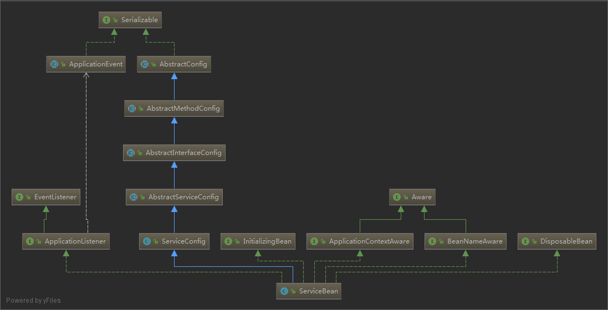
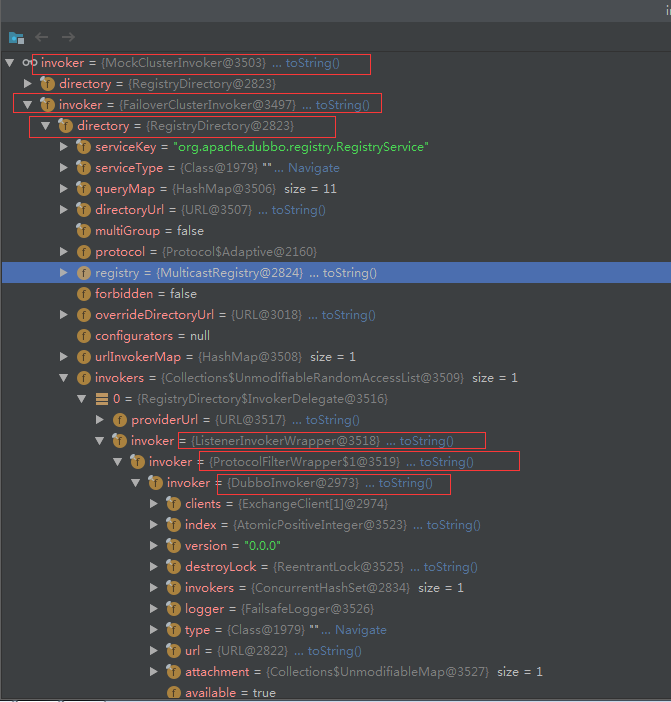

# dubbo init

从以下这个几个方面分析 `dubbo` 初始化：

- [dubbo init](#dubbo-init)
  - [Protocol](#protocol)
  - [provider init](#provider-init)
    - [ServiceBean](#servicebean)
    - [export](#export)
    - [registry](#registry)
    - [provider subscribe](#provider-subscribe)
    - [provider invoker](#provider-invoker)
  - [consumer init](#consumer-init)
    - [ReferenceBean](#referencebean)
    - [init](#init)
    - [refer](#refer)
    - [getProxy](#getproxy)
    - [InvokerInvocationHandler](#invokerinvocationhandler)
    - [customer subscribe](#customer-subscribe)
    - [customer client](#customer-client)
  - [Summary](#summary)

一个简单的 dubbo 例子

- [demo of dubbo](https://github.com/web1992/dubbos)

## Protocol

`Protocol` 在 `dubbo` 中是一个十分重要的概念,`dubbo` 服务的，启动，初始，注册(发布)，订阅 等等，都是通过 `Protocol` 不同的实现类

组合实现的，因此在了解 `dubbo` 的初始之前，需要对 `Protocol` 有一个概念。

```java
@SPI("dubbo")
public interface Protocol {

    int getDefaultPort();

    // export 方法，主要负责 dubbo provider 的初始化
    @Adaptive
    <T> Exporter<T> export(Invoker<T> invoker) throws RpcException;

    // refer 方法，主要负责 dubbo customer 的初始化
    @Adaptive
    <T> Invoker<T> refer(Class<T> type, URL url) throws RpcException;

    void destroy();
}
```

`Protocol` 可以参考下面的这些文档：

- [dubbo-protocol.md](dubbo-protocol.md)
- [dubbo-protocol-registry-protocol.md](dubbo-protocol-registry-protocol.md)
- [dubbo-protocol-dubbo-protocol.md](dubbo-protocol-dubbo-protocol.md)

## provider init

初始化过程，以下面的这个简单的 xml 配置为例子

`provider` 的初始化，其实是类 `ServiceBean`的初始化过程,具体的实现在 `ServiceConfig`类中

> 说明：

`dubbo` 很多可扩展的类方法(如 `org.apache.dubbo.rpc.Protocol`,`org.apache.dubbo.registry.Registry`)，都是基于 `dubbo` 的 `SPI` 机制进行方法调用的

如果要想理解代码的执行逻辑，最好对 `dubbo` 的 `SPI` 的机制有所了解。

关于 `SPI` 可参考 [dubbo-extension-loader.md](dubbo-extension-loader.md)

> dubbo-provider.xml

```xml
<?xml version="1.0" encoding="UTF-8"?>
<beans xmlns:xsi="http://www.w3.org/2001/XMLSchema-instance"
       xmlns:dubbo="http://dubbo.apache.org/schema/dubbo"
       xmlns="http://www.springframework.org/schema/beans"
       xsi:schemaLocation="http://www.springframework.org/schema/beans http://www.springframework.org/schema/beans/spring-beans-4.3.xsd
       http://dubbo.apache.org/schema/dubbo http://dubbo.apache.org/schema/dubbo/dubbo.xsd">

    <!-- provider's application name, used for tracing dependency relationship -->
    <dubbo:application name="demo-provider"/>

    <dubbo:registry address="multicast://224.5.6.7:1234" />

    <!-- use dubbo protocol to export service on port 20880 -->
    <dubbo:protocol name="dubbo"/>

    <!-- service implementation, as same as regular local bean -->
    <bean id="demoService" class="cn.web1992.dubbo.demo.provider.DemoServiceImpl"/>

    <!-- declare the service interface to be exported -->
    <dubbo:service interface="cn.web1992.dubbo.demo.DemoService" ref="demoService"/>

</beans>
```

`dubbo`的初始化是以 `spring` 的扩展点为基础，进行配置，实现初始化的。

源码`org.apache.dubbo.config.spring.schema.DubboNamespaceHandler`

`spring`扩展点的相关配置，可以参照这个例子 [spring-extensible-xml](https://github.com/web1992/springs/tree/master/spring-extensible-xml)

下面是`DubboNamespaceHandler`源码：

```java
public class DubboNamespaceHandler extends NamespaceHandlerSupport {

    static {
        Version.checkDuplicate(DubboNamespaceHandler.class);
    }

    @Override
    public void init() {
        registerBeanDefinitionParser("application", new DubboBeanDefinitionParser(ApplicationConfig.class, true));
        registerBeanDefinitionParser("module", new DubboBeanDefinitionParser(ModuleConfig.class, true));
        registerBeanDefinitionParser("registry", new DubboBeanDefinitionParser(RegistryConfig.class, true));
        registerBeanDefinitionParser("config-center", new DubboBeanDefinitionParser(ConfigCenterBean.class, true));
        registerBeanDefinitionParser("metadata-report", new DubboBeanDefinitionParser(MetadataReportConfig.class, true));
        registerBeanDefinitionParser("monitor", new DubboBeanDefinitionParser(MonitorConfig.class, true));
        registerBeanDefinitionParser("provider", new DubboBeanDefinitionParser(ProviderConfig.class, true));
        registerBeanDefinitionParser("consumer", new DubboBeanDefinitionParser(ConsumerConfig.class, true));
        registerBeanDefinitionParser("protocol", new DubboBeanDefinitionParser(ProtocolConfig.class, true));
        registerBeanDefinitionParser("service", new DubboBeanDefinitionParser(ServiceBean.class, true));
        registerBeanDefinitionParser("reference", new DubboBeanDefinitionParser(ReferenceBean.class, false));
        registerBeanDefinitionParser("annotation", new AnnotationBeanDefinitionParser());
    }

}
```

从上面的代码可以看到熟悉的字样`application`，`service`，`reference`，`registry`等等

> 说明

`<dubbo:service />` 这个可以看做是一个 spring `<bean />`,bean 标签需要 Spring 容器进行解析，
而`<dubbo:service />`是我们自定义的格式需要我们`自己`进行相关的`解析`，`初始化`等操作，而`DubboNamespaceHandler`
中包含了这些解析自定义标签相关的实现类。

`DubboBeanDefinitionParser`实现了`BeanDefinitionParser`中的`BeanDefinition parse(Element element, ParserContext parserContext)`方法

这个方法返回一个`BeanDefinition`,本质就是根据 xml 中的配置信息，生成一个`BeanDefinition`实例交给 spring 容器。

### ServiceBean

`<dubbo:service />`标签对应的解析类是`ServiceBean`

> `ServiceBean` 类图：



从类图中可以看到，`ServiceBean`实现了 Spring 相关类的很多接口，如`InitializingBean`,`ApplicationListener`

而 dubbo 相关初始是在`ApplicationListener`的实现方法中触发的，代码如下：

`export()`方法是入口

```java
    @Override
    public void onApplicationEvent(ContextRefreshedEvent event) {
        if (!isExported() && !isUnexported()) {
            if (logger.isInfoEnabled()) {
                logger.info("The service ready on spring started. service: " + getInterface());
            }
            export();
        }
    }
```

> 这里思考下，为什么在`ContextRefreshedEvent`事件中进行服务的初始化？

`ServiceBean`中会根据配置，来初始化服务，如使用`netty`启动本地服务，注册服务到`zookeeper`等

> `dubbo` 服务提供者的初始化过程，这里主要分析服务的`export`(暴露)和`registry`(注册)
>
> 下面分析`export`和`registry` 这两个过程

### export

`export` 的主要作用是在本地启动一个 `TCP` 服务，并生成一个 `Exporter` 对象

以下面的 `DemoService` 为例子

```xml
<dubbo:service interface="cn.web1992.dubbo.demo.DemoService" ref="demoService"/>
```

export 过程会把 `DemoService`这个接口中的所有的方法进行解析，拼接成一个`URL` 字符串，当作一种资源，在暴露服务的时候使用。

`ServiceConfig`中会调用`protocol.export`进行服务的暴露，而我使用的 protocol 配置是`<dubbo:protocol name="dubbo"/>`

因此会使用`DubboProtocol`进行服务的暴露

`ServiceConfig`代码片段：

```java
// proxyFactory 是通过 SPI 机制来找具体的实现类的
Invoker<?> invoker = proxyFactory.getInvoker(ref, (Class) interfaceClass, registryURL.addParameterAndEncoded(Constants.EXPORT_KEY, url.toFullString()));
DelegateProviderMetaDataInvoker wrapperInvoker = new DelegateProviderMetaDataInvoker(invoker, this);
// export 方法也是通过 SPI 机制调用具体的实现类的
// 这里protocol.export的实现类是 RegistryProtocol
Exporter<?> exporter = protocol.export(wrapperInvoker);
```

`RegistryProtocol` 的`export`方法

```java
  @Override
    public <T> Exporter<T> export(final Invoker<T> originInvoker) throws RpcException {
        URL registryUrl = getRegistryUrl(originInvoker);
        // url to export locally
        URL providerUrl = getProviderUrl(originInvoker);

        // Subscribe the override data
        // FIXME When the provider subscribes, it will affect the scene : a certain JVM exposes the service and call
        //  the same service. Because the subscribed is cached key with the name of the service, it causes the
        //  subscription information to cover.
        final URL overrideSubscribeUrl = getSubscribedOverrideUrl(providerUrl);
        final OverrideListener overrideSubscribeListener = new OverrideListener(overrideSubscribeUrl, originInvoker);
        overrideListeners.put(overrideSubscribeUrl, overrideSubscribeListener);

        providerUrl = overrideUrlWithConfig(providerUrl, overrideSubscribeListener);
        //export invoker
        // 进行服务的暴露
        // 这里是使用 DubboProtocol 进行服务的暴露
        final ExporterChangeableWrapper<T> exporter = doLocalExport(originInvoker, providerUrl);

        // url to registry
        final Registry registry = getRegistry(originInvoker);
        final URL registeredProviderUrl = getRegisteredProviderUrl(providerUrl, registryUrl);
        ProviderInvokerWrapper<T> providerInvokerWrapper = ProviderConsumerRegTable.registerProvider(originInvoker,
                registryUrl, registeredProviderUrl);
        //to judge if we need to delay publish
        boolean register = registeredProviderUrl.getParameter("register", true);
        if (register) {
            // 这里进行服务的注册
            register(registryUrl, registeredProviderUrl);
            providerInvokerWrapper.setReg(true);
        }

        // Deprecated! Subscribe to override rules in 2.6.x or before.
        registry.subscribe(overrideSubscribeUrl, overrideSubscribeListener);

        exporter.setRegisterUrl(registeredProviderUrl);
        exporter.setSubscribeUrl(overrideSubscribeUrl);
        //Ensure that a new exporter instance is returned every time export
        return new DestroyableExporter<>(exporter);
    }
```

`DubboProtocol`的代码片段：

```java
 @Override
    public <T> Exporter<T> export(Invoker<T> invoker) throws RpcException {
        URL url = invoker.getUrl();
        // ...
        // 在这里启动tcp服务
        // 会调用 createServer 创建服务
        openServer(url);
        optimizeSerialization(url);
        return exporter;
    }
```

`createServer` 方法中会使用 `server = Exchangers.bind(url, requestHandler);` 调用`Transporter`实现类`NettyTransporter`启动一个 `TCP` 服务

> `ExchangeServer`和`Transporter`实现类的查找都是通过 `dubbo`的`SPI` 机制,`SPI` 的实现类，可以参考：[dubbo-extension-loader](dubbo-extension-loader.md)

`NettyTransporter`的代码片段：

```java
public class NettyTransporter implements Transporter {

   public static final String NAME = "netty";

   @Override
   public Server bind(URL url, ChannelHandler listener) throws RemotingException {
       return new NettyServer(url, listener);
   }

   @Override
   public Client connect(URL url, ChannelHandler listener) throws RemotingException {
       return new NettyClient(url, listener);
   }

}
```

`NettyServer`的代码片段：

下面的代码是 `Netty` 启动的经典代码

```java
 @Override
    protected void doOpen() throws Throwable {
        bootstrap = new ServerBootstrap();

        bossGroup = new NioEventLoopGroup(1, new DefaultThreadFactory("NettyServerBoss", true));
        workerGroup = new NioEventLoopGroup(getUrl().getPositiveParameter(Constants.IO_THREADS_KEY, Constants.DEFAULT_IO_THREADS),
                new DefaultThreadFactory("NettyServerWorker", true));

        final NettyServerHandler nettyServerHandler = new NettyServerHandler(getUrl(), this);
        channels = nettyServerHandler.getChannels();

        bootstrap.group(bossGroup, workerGroup)
                .channel(NioServerSocketChannel.class)
                .childOption(ChannelOption.TCP_NODELAY, Boolean.TRUE)
                .childOption(ChannelOption.SO_REUSEADDR, Boolean.TRUE)
                .childOption(ChannelOption.ALLOCATOR, PooledByteBufAllocator.DEFAULT)
                .childHandler(new ChannelInitializer<NioSocketChannel>() {
                    @Override
                    protected void initChannel(NioSocketChannel ch) throws Exception {
                        NettyCodecAdapter adapter = new NettyCodecAdapter(getCodec(), getUrl(), NettyServer.this);
                        ch.pipeline()//.addLast("logging",new LoggingHandler(LogLevel.INFO))//for debug
                                .addLast("decoder", adapter.getDecoder())
                                .addLast("encoder", adapter.getEncoder())
                                .addLast("handler", nettyServerHandler);
                    }
                });
        // bind
        ChannelFuture channelFuture = bootstrap.bind(getBindAddress());
        channelFuture.syncUninterruptibly();
        channel = channelFuture.channel();

    }
```

### registry

`registry`的主要作用是把本地启动的服务信息,如: ip + 端口 + 接口 + 方法等信息，注册到服务中心（如：zookeeper）

registry 是在`RegistryProtocol` 的`export`方法中触发的

代码片段：

```java
// url to registry
// 获取注册实现类，通过 SPI 获取
final Registry registry = getRegistry(originInvoker);
final URL registeredProviderUrl = getRegisteredProviderUrl(providerUrl, registryUrl);
ProviderInvokerWrapper<T> providerInvokerWrapper = ProviderConsumerRegTable.registerProvider(originInvoker,
        registryUrl, registeredProviderUrl);
//to judge if we need to delay publish
boolean register = registeredProviderUrl.getParameter("register", true);
if (register) {
    // 开始注册
    register(registryUrl, registeredProviderUrl);
    providerInvokerWrapper.setReg(true);
}
// Deprecated! Subscribe to override rules in 2.6.x or before.
registry.subscribe(overrideSubscribeUrl, overrideSubscribeListener);
```

### provider subscribe

### provider invoker

先说 `invoker` 的`暴露`，其实就是把 `invoker` 放入到 `Map` 中

```java
// DubboProtocol 的 export 方法
// 把 invoker 放入到 exporterMap 中
@Override
public <T> Exporter<T> export(Invoker<T> invoker) throws RpcException {
    URL url = invoker.getUrl();
    // export service.
    String key = serviceKey(url);
    // 把 invoker 包装成 DubboExporter
    DubboExporter<T> exporter = new DubboExporter<T>(invoker, key, exporterMap);
    // 放入到 exporterMap 中
    exporterMap.put(key, exporter);
    //export an stub service for dispatching event
    Boolean isStubSupportEvent = url.getParameter(Constants.STUB_EVENT_KEY, Constants.DEFAULT_STUB_EVENT);
    Boolean isCallbackservice = url.getParameter(Constants.IS_CALLBACK_SERVICE, false);
    if (isStubSupportEvent && !isCallbackservice) {
        String stubServiceMethods = url.getParameter(Constants.STUB_EVENT_METHODS_KEY);
        if (stubServiceMethods == null || stubServiceMethods.length() == 0) {
            if (logger.isWarnEnabled()) {
                logger.warn(new IllegalStateException("consumer [" + url.getParameter(Constants.INTERFACE_KEY) +
                        "], has set stubproxy support event ,but no stub methods founded."));
            }
        } else {
            stubServiceMethodsMap.put(url.getServiceKey(), stubServiceMethods);
        }
    }
    openServer(url);
    optimizeSerialization(url);
    return exporter;
}
```

通过上面的 `export` 方法，`Invoker` 暴露完成。

下面看下 `Invoker` 查找

在这篇文章中 [dubbo-channel-handler.md](dubbo-channel-handler.md) 我们知道 `TCP` 请求经过层层的 `ChannelHandler` 处理

最终会执行到 `DubboProtocol` 的 `ExchangeHandler#requestHandler` 中

然后会执行 `getInvoker` 方法，从 `exporterMap` 中查询 `Invoker`

```java
// 代码片段，查询 Invoker
DubboExporter<?> exporter = (DubboExporter<?>) exporterMap.get(serviceKey);
```

至此 `Invoker` 的`暴露`和`查找`，形成闭环

## consumer init

通过下面的配置，来分析 `consumer` 的初始化过程

> dubbo-consumer.xml

```xml
<?xml version="1.0" encoding="UTF-8"?>
<beans xmlns:xsi="http://www.w3.org/2001/XMLSchema-instance"
       xmlns:dubbo="http://dubbo.apache.org/schema/dubbo"
       xmlns="http://www.springframework.org/schema/beans"
       xsi:schemaLocation="http://www.springframework.org/schema/beans http://www.springframework.org/schema/beans/spring-beans-4.3.xsd
       http://dubbo.apache.org/schema/dubbo http://dubbo.apache.org/schema/dubbo/dubbo.xsd">

    <dubbo:application name="demo-consumer"/>

    <dubbo:registry address="multicast://224.5.6.7:1234"/>

    <!-- generate proxy for the remote service, then demoService can be used in the same way as the
    local regular interface -->
    <dubbo:reference id="demoService" check="false" interface="cn.web1992.dubbo.demo.DemoService"/>

</beans>
```

### ReferenceBean

`<dubbo:reference` 对应的解析类是 `ReferenceBean`

类的定义如下：

```java
public class ReferenceBean<T> extends ReferenceConfig<T> implements FactoryBean, ApplicationContextAware, InitializingBean, DisposableBean
{
 //
}
```

`ReferenceBean` 的类图：


`ReferenceBean` 实现了 `FactoryBean` 接口,通过 `getObject` 来进行客户端的初始化

### init

```java
@Override
public Object getObject() {
    // get 会调用 init 方法
    return get();
}
```

`init`方法

```java
    private void init() {
        if (initialized) {
            return;
        }
        initialized = true;
        // 省略其它代码
        // map 当前客户端的一些配置信息，如:接口类，版本，等
        // 创建客户端代理
        ref = createProxy(map);

        ConsumerModel consumerModel = new ConsumerModel(getUniqueServiceName(), interfaceClass, ref, interfaceClass.getMethods(), attributes);
        ApplicationModel.initConsumerModel(getUniqueServiceName(), consumerModel);
    }

```

`createProxy` 方法

```java
// createProxy 方法主要有两个操作，创建invoker和生成proxy
// 通过 SPI 创建 invoker
invoker = refprotocol.refer(interfaceClass, urls.get(0));

// 通过 SPI 创建 proxy(包装 invoker) 并返回
return (T) proxyFactory.getProxy(invoker);
```

```java
// 这里的 demoService 其实就是 createProxy 方法中 proxyFactory.getProxy(invoker) 返回的 proxy 对象
DemoService demoService = context.getBean("demoService", DemoService.class);
String hello = demoService.sayHello("world");
System.out.println("result: " + hello);
```

> 说明：

我们为了调用`DemoService`的`sayHello`方法，但是我们客户端只有一个`接口类`，没有`实现类`，那怎么办呢？为了调用远程的方法
我们为`DemoService`生成一个代理类(`Proxy`), 并且宣称我实现了`DemoService`中的所有方法.当我们调用`sayHello`方法
的时候，我们其实是调用代理类，代理类通过`TCP`发送请求，等待处理响应，然后返回结果。

### refer

`refer` 和上面的 `export` 方法类似，都是 `Protocol` 接口中定义的方法, refer 主要负责初始化客户端&生成 invoker

```java
// RegistryProtocol
@Override
@SuppressWarnings("unchecked")
public <T> Invoker<T> refer(Class<T> type, URL url) throws RpcException {
    url = URLBuilder.from(url)
            .setProtocol(url.getParameter(REGISTRY_KEY, DEFAULT_REGISTRY))
            .removeParameter(REGISTRY_KEY)
            .build();
    Registry registry = registryFactory.getRegistry(url);
    if (RegistryService.class.equals(type)) {
        return proxyFactory.getInvoker((T) registry, type, url);
    }
    // group="a,b" or group="*"
    Map<String, String> qs = StringUtils.parseQueryString(url.getParameterAndDecoded(REFER_KEY));
    String group = qs.get(Constants.GROUP_KEY);
    if (group != null && group.length() > 0) {
        if ((COMMA_SPLIT_PATTERN.split(group)).length > 1 || "*".equals(group)) {
            return doRefer(getMergeableCluster(), registry, type, url);
        }
    }
    return doRefer(cluster, registry, type, url);
}
// RegistryProtocol
private <T> Invoker<T> doRefer(Cluster cluster, Registry registry, Class<T> type, URL url) {
    // 目录服务
    RegistryDirectory<T> directory = new RegistryDirectory<T>(type, url);
    directory.setRegistry(registry);
    directory.setProtocol(protocol);
    // all attributes of REFER_KEY
    Map<String, String> parameters = new HashMap<String, String>(directory.getUrl().getParameters());
    URL subscribeUrl = new URL(CONSUMER_PROTOCOL, parameters.remove(REGISTER_IP_KEY), 0, type.getName(), parameters);
    if (!ANY_VALUE.equals(url.getServiceInterface()) && url.getParameter(REGISTER_KEY, true)) {
        directory.setRegisteredConsumerUrl(getRegisteredConsumerUrl(subscribeUrl, url));
        registry.register(directory.getRegisteredConsumerUrl());
    }
    // 路由功能
    directory.buildRouterChain(subscribeUrl);
    // 注册服务
    directory.subscribe(subscribeUrl.addParameter(CATEGORY_KEY,
            PROVIDERS_CATEGORY + "," + CONFIGURATORS_CATEGORY + "," + ROUTERS_CATEGORY));
    // 集群功能
    // Invoker = Cluster + Directory
    Invoker invoker = cluster.join(directory);
    ProviderConsumerRegTable.registerConsumer(invoker, url, subscribeUrl, directory);
    return invoker;
}
```

### getProxy

包装生成的 `invoker`

```java
// JavassistProxyFactory
@Override
@SuppressWarnings("unchecked")
public <T> T getProxy(Invoker<T> invoker, Class<?>[] interfaces) {
    return (T) Proxy.getProxy(interfaces).newInstance(new InvokerInvocationHandler(invoker));
}
```

### InvokerInvocationHandler

`dubbo` 使用 `JavassistProxyFactory` 来进行生产代理类，当执行 `sayHello` 方法时，实际执行的是 `InvokerInvocationHandler` 中的 `invoke` 方法

`InvokerInvocationHandler` 的 `invoke` 方法代码:

```java
@Override
public Object invoke(Object proxy, Method method, Object[] args) throws Throwable {
    String methodName = method.getName();
    Class<?>[] parameterTypes = method.getParameterTypes();
    if (method.getDeclaringClass() == Object.class) {
        return method.invoke(invoker, args);
    }
    if ("toString".equals(methodName) && parameterTypes.length == 0) {
        return invoker.toString();
    }
    if ("hashCode".equals(methodName) && parameterTypes.length == 0) {
        return invoker.hashCode();
    }
    if ("equals".equals(methodName) && parameterTypes.length == 1) {
        return invoker.equals(args[0]);
    }   
    return invoker.invoke(createInvocation(method, args)).recreate();
}
// createInvocation 用来创建 RpcInvocation
// RpcInvocation 实现了 Serializable 接口从而可进行网络传输
private RpcInvocation createInvocation(Method method, Object[] args) {
    RpcInvocation invocation = new RpcInvocation(method, args);
    if (RpcUtils.hasFutureReturnType(method)) {
        invocation.setAttachment(Constants.FUTURE_RETURNTYPE_KEY, "true");
        invocation.setAttachment(Constants.ASYNC_KEY, "true");
    }
    return invocation;
}
```

这里说明下为什么要了解一下`invoker`,`dubbo` 对 `invoker`进行了包装，来实现如`mock`服务的功能

看一个`invoker`的结构,可以看到`invoker`包装了很多层,从而实现 mock,filter 等功能



### customer subscribe

`subscribe` 的主要作用：

1. 执行服务的订阅
2. 建立 customer 与 provider 的 TCP 连接
3. 生成 DubboInvoker 对象

`RegistryDirectory` 的接口定义

```java
// RegistryDirectory
// RegistryDirectory 实现了 NotifyListener
public class RegistryDirectory<T> extends AbstractDirectory<T> implements NotifyListener {

}
```

```java
// RegistryDirectory
public void subscribe(URL url) {
    setConsumerUrl(url);
    consumerConfigurationListener.addNotifyListener(this);
    serviceConfigurationListener = new ReferenceConfigurationListener(this, url);
    registry.subscribe(url, this);// 这里传入自己，在订阅完成之后，会执行下面的 notify 方法
}

// 这里个方法在订阅完成之后会执行 notify，类似函数回调
@Override
public synchronized void notify(List<URL> urls) {
    Map<String, List<URL>> categoryUrls = urls.stream()
            .filter(Objects::nonNull)
            .filter(this::isValidCategory)
            .filter(this::isNotCompatibleFor26x)
            .collect(Collectors.groupingBy(url -> {
                if (UrlUtils.isConfigurator(url)) {
                    return CONFIGURATORS_CATEGORY;
                } else if (UrlUtils.isRoute(url)) {
                    return ROUTERS_CATEGORY;
                } else if (UrlUtils.isProvider(url)) {
                    return PROVIDERS_CATEGORY;
                }
                return "";
            }));
    List<URL> configuratorURLs = categoryUrls.getOrDefault(CONFIGURATORS_CATEGORY, Collections.emptyList());
    this.configurators = Configurator.toConfigurators(configuratorURLs).orElse(this.configurators);
    List<URL> routerURLs = categoryUrls.getOrDefault(ROUTERS_CATEGORY, Collections.emptyList());
    toRouters(routerURLs).ifPresent(this::addRouters);
    // providers
    List<URL> providerURLs = categoryUrls.getOrDefault(PROVIDERS_CATEGORY, Collections.emptyList());
    // 这里会创建 invoker
    // 最终会执行到 toInvokers 方法
    refreshOverrideAndInvoker(providerURLs);
}

// toInvokers 代码片段
// protocol 是通过 SPI 加载的，因此进行了多层的包装，最内层的是 DubboProtocol
// 这里的 refer 方法最终会执行到 DubboProtocol 的 refer 方法
// DubboProtocol 负责生成 client (customer 与 provider 建立 TCP 连接)
// 并创建 DubboInvoker
invoker = new InvokerDelegate<>(protocol.refer(serviceType, url), url, providerUrl);


// DubboProtocol refer 方法
@Override
public <T> Invoker<T> refer(Class<T> serviceType, URL url) throws RpcException {
    optimizeSerialization(url);
    // create rpc invoker.
    // getClients 其实就是创建 TCP 连接 ExchangeClient
    // 并被 DubboInvoker 包装
    // 当我执行方调用的时候，就会执行这个流程: proxy -> invoker ->  ExchangeClient -> TCP(网络)
    DubboInvoker<T> invoker = new DubboInvoker<T>(serviceType, url, getClients(url), invokers);
    invokers.add(invoker);
    return invoker;
}
```

### customer client

`ExchangeClient` 可以看做是 `dubbo` 对底层的网络通信（TCP）的封装

如果你想调用远程的方法，把数据请求包装之后，交给 `HeaderExchangeClient` 它就会进行数据的网络传输，完成一次 `RPC` 调用

## Summary

最终的调用链：

```txt
    ---------------customer----------------                 ------------------------provider------------------
    |                                     |                 |                                                |
    |                                     |                 |                                                |
    |                                     |                 |                                                |
  bean  -> proxy -> Invoker -> ExchangeClient  -> TCP -> ExchangeServer -> Exporter -> Invoker -> proxy ->  bean
```

图解：bean = spring bean

`RegistryProtocol` 在 `dubbo` 中是负责创建 `DubboInvoker` 等等

`DubboProtocol` 在 `dubbo` 中是负责创建 `ExchangeClient` `ExchangeServer`