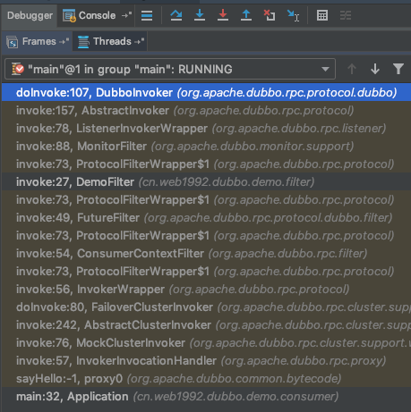

# Invoker

- [Invoker](#invoker)
  - [简介](#简介)
  - [invoker uml](#invoker-uml)
  - [FailoverClusterInvoker](#failoverclusterinvoker)
    - [FailoverCluster](#failovercluster)
    - [doInvoke](#doinvoke)
  - [DubboInvoker](#dubboinvoker)
  - [Filter](#filter)

## 简介

```java
public interface Invoker<T> extends Node {
    Class<T> getInterface();
    Result invoke(Invocation invocation) throws RpcException;
}
```

`invoker` 对象可以理解为在 `customer` 启动时创建

`invoker` 对象被 `ProxyFactory` 进行包装, `ProxyFactory` 生成代理类配合 `InvokerInvocationHandler` 实现远程方法的调用

`dubbo` 中对 `invoker` 进行了很多包装类的包装，提供了 `mock`,`filter`,`cluster` 等功能

## invoker uml


由于存在多个集群模式，因此有多个 `xxxClusterInvoker` 的实现

`dubbo` `cluster` 参考: [dubbo-cluster.md](dubbo-cluster.md)

一个调用线程堆栈图：



从上图可以看到从 `proxy -> DubboInvoker` 的调用链

`DemoFilter` 是我们自定义的 `Filter`

下面看下 `FailoverClusterInvoker` 和 `DubboInvoker` 的实现

## FailoverClusterInvoker

`FailoverCluster` 是默认的集群模式

### FailoverCluster

`FailoverClusterInvoker` 是通过 `FailoverCluster` 对象创建的

```java
public class FailoverCluster implements Cluster {

    public final static String NAME = "failover";

    @Override
    public <T> Invoker<T> join(Directory<T> directory) throws RpcException {
        return new FailoverClusterInvoker<T>(directory);
    }

}
```

### doInvoke

```java
    @Override
    @SuppressWarnings({"unchecked", "rawtypes"})
    public Result doInvoke(Invocation invocation, final List<Invoker<T>> invokers, LoadBalance loadbalance) throws RpcException {
        List<Invoker<T>> copyInvokers = invokers;
        checkInvokers(copyInvokers, invocation);
        String methodName = RpcUtils.getMethodName(invocation);
        int len = getUrl().getMethodParameter(methodName, Constants.RETRIES_KEY, Constants.DEFAULT_RETRIES) + 1;
        if (len <= 0) {
            len = 1;
        }
        // retry loop.
        RpcException le = null; // last exception.
        List<Invoker<T>> invoked = new ArrayList<Invoker<T>>(copyInvokers.size()); // invoked invokers.
        Set<String> providers = new HashSet<String>(len);
        for (int i = 0; i < len; i++) {
            //Reselect before retry to avoid a change of candidate `invokers`.
            //NOTE: if `invokers` changed, then `invoked` also lose accuracy.
            if (i > 0) {
                checkWhetherDestroyed();
                copyInvokers = list(invocation);
                // check again
                checkInvokers(copyInvokers, invocation);
            }
            Invoker<T> invoker = select(loadbalance, invocation, copyInvokers, invoked);
            invoked.add(invoker);
            RpcContext.getContext().setInvokers((List) invoked);
            try {
                Result result = invoker.invoke(invocation);
                if (le != null && logger.isWarnEnabled()) {
                    logger.warn("Although retry the method " + methodName
                            + " in the service " + getInterface().getName()
                            + " was successful by the provider " + invoker.getUrl().getAddress()
                            + ", but there have been failed providers " + providers
                            + " (" + providers.size() + "/" + copyInvokers.size()
                            + ") from the registry " + directory.getUrl().getAddress()
                            + " on the consumer " + NetUtils.getLocalHost()
                            + " using the dubbo version " + Version.getVersion() + ". Last error is: "
                            + le.getMessage(), le);
                }
                return result;
            } catch (RpcException e) {
                if (e.isBiz()) { // biz exception.
                    throw e;
                }
                le = e;
            } catch (Throwable e) {
                le = new RpcException(e.getMessage(), e);
            } finally {
                providers.add(invoker.getUrl().getAddress());
            }
        }
        throw new RpcException(le.getCode(), "Failed to invoke the method "
                + methodName + " in the service " + getInterface().getName()
                + ". Tried " + len + " times of the providers " + providers
                + " (" + providers.size() + "/" + copyInvokers.size()
                + ") from the registry " + directory.getUrl().getAddress()
                + " on the consumer " + NetUtils.getLocalHost() + " using the dubbo version "
                + Version.getVersion() + ". Last error is: "
                + le.getMessage(), le.getCause() != null ? le.getCause() : le);
    }

```

## DubboInvoker

`DubboInvoker` 的初始化实在 `DubboProtocol` 中的 `refer` 方法中被调用的

```java
// DubboInvoker 实现了 AbstractInvoker 的 doInvoke 方法
// DubboInvoker 的代码逻辑很简单就是调用 ExchangeClient 发送 RpcInvocation 对象
// 然后返回 Result
@Override
protected Result doInvoke(final Invocation invocation) throws Throwable {
    RpcInvocation inv = (RpcInvocation) invocation;
    final String methodName = RpcUtils.getMethodName(invocation);
    inv.setAttachment(Constants.PATH_KEY, getUrl().getPath());
    inv.setAttachment(Constants.VERSION_KEY, version);
    ExchangeClient currentClient;
    if (clients.length == 1) {
        currentClient = clients[0];
    } else {
        currentClient = clients[index.getAndIncrement() % clients.length];
    }
    try {
        boolean isAsync = RpcUtils.isAsync(getUrl(), invocation);
        boolean isAsyncFuture = RpcUtils.isReturnTypeFuture(inv);
        boolean isOneway = RpcUtils.isOneway(getUrl(), invocation);
        int timeout = getUrl().getMethodParameter(methodName, Constants.TIMEOUT_KEY, Constants.DEFAULT_TIMEOUT);
        if (isOneway) {
            boolean isSent = getUrl().getMethodParameter(methodName, Constants.SENT_KEY, false);
            currentClient.send(inv, isSent);
            RpcContext.getContext().setFuture(null);
            return new RpcResult();
        } else if (isAsync) {
            ResponseFuture future = currentClient.request(inv, timeout);
            // For compatibility
            FutureAdapter<Object> futureAdapter = new FutureAdapter<>(future);
            RpcContext.getContext().setFuture(futureAdapter);
            Result result;
            if (isAsyncFuture) {
                // register resultCallback, sometimes we need the async result being processed by the filter chain.
                result = new AsyncRpcResult(futureAdapter, futureAdapter.getResultFuture(), false);
            } else {
                result = new SimpleAsyncRpcResult(futureAdapter, futureAdapter.getResultFuture(), false);
            }
            return result;
        } else {
            RpcContext.getContext().setFuture(null);
            return (Result) currentClient.request(inv, timeout).get();
        }
    } catch (TimeoutException e) {
        throw new RpcException(RpcException.TIMEOUT_EXCEPTION, "Invoke remote method timeout. method: " + invocation.getMethodName() + ", provider: " + getUrl() + ", cause: " + e.getMessage(), e);
    } catch (RemotingException e) {
        throw new RpcException(RpcException.NETWORK_EXCEPTION, "Failed to invoke remote method: " + invocation.getMethodName() + ", provider: " + getUrl() + ", cause: " + e.getMessage(), e);
    }
}
```

## Filter

从 `Filter` 的接口声明可以看到 `Filter` 主要是对 `invoker` 进行操作

```java
@SPI
public interface Filter {
    Result invoke(Invoker<?> invoker, Invocation invocation) throws RpcException;
    default Result onResponse(Result result, Invoker<?> invoker, Invocation invocation) {
        return result;
    }
}

public interface Invoker<T> extends Node {
    Class<T> getInterface();
    Result invoke(Invocation invocation) throws RpcException;
}
```