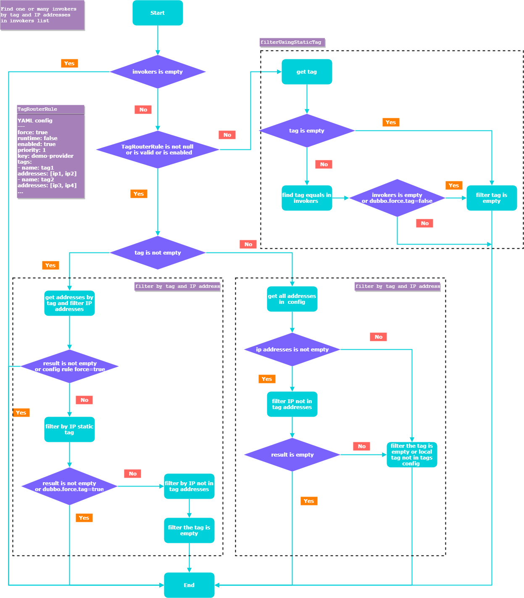

# Router

`Router` `dubbo` 服务动态路由的实现

`dubbo` `2.7` 版本中对 `Router` 进行了增强，可参考 [http://dubbo.apache.org/zh-cn/blog/dubbo-27-features.html](http://dubbo.apache.org/zh-cn/blog/dubbo-27-features.html)

- [Router](#router)
  - [Router interface](#router-interface)
  - [Router implement](#router-implement)
  - [Router init](#router-init)
  - [RouterFactory](#routerfactory)
  - [TagRouter](#tagrouter)
  - [AppRouter](#approuter)
  - [ServiceRouter](#servicerouter)
  - [参考](#%E5%8F%82%E8%80%83)

## Router interface

```java
// 接口定义
public interface Router extends Comparable<Router> {

    int DEFAULT_PRIORITY = Integer.MAX_VALUE;

    URL getUrl();

    <T> List<Invoker<T>> route(List<Invoker<T>> invokers, URL url, Invocation invocation) throws RpcException;

    default <T> void notify(List<Invoker<T>> invokers) {

    }

    boolean isRuntime();

    boolean isForce();

    int getPriority();

    @Override
    default int compareTo(Router o) {
        if (o == null) {
            throw new IllegalArgumentException();
        }
        return Integer.compare(this.getPriority(), o.getPriority());
    }
}
```

## Router implement

- AppRouter
- ConditionRouter
- ScriptRouter
- ServiceRouter
- TagRouter

## Router init

```java
// RegistryDirectory
// router 是在 RegistryDirectory 的 buildRouterChain 方法中执行的
public void buildRouterChain(URL url) {
    this.setRouterChain(RouterChain.buildChain(url));
}

// 最终会执行这个构造方法
// 通过 dubbo 的 SPI 机制去 加载 RouterFactory 并创建 Router
private RouterChain(URL url) {
    // 这里会加载所有  @Activate 注解的 RouterFactory 实现类
    List<RouterFactory> extensionFactories = ExtensionLoader.getExtensionLoader(RouterFactory.class)
            .getActivateExtension(url, (String[]) null);
    List<Router> routers = extensionFactories.stream()
            .map(factory -> factory.getRouter(url))
            .collect(Collectors.toList());
    initWithRouters(routers);
}
```


`Router` 在一个 `RPC` 调用链的位置，可参考：[dubbo-protocol-registry-protocol.md](dubbo-protocol-registry-protocol.md#cluster-and-router-and-directory)

## RouterFactory

```java
@SPI
public interface RouterFactory {
    @Adaptive("protocol")
    Router getRouter(URL url);
}
```

旧的 Router

- MockRouterFactory -> MockInvokersSelector
- ConditionRouterFactory -> ConditionRouter
- ScriptRouterFactory -> ScriptRouter

dubbo 2.7 新的 Router

- TagRouterFactory -> TagRouter
- AppRouterFactory -> AppRouter
- ServiceRouterFactory -> ServiceRouter

可动态修改的 Router

- ListenableRouter

`ServiceRouter` 和 `AppRouter` 继承了 `ListenableRouter` 实现了动态修改路由的功能

可参考 [dubbo-dynamic-configuration.md](dubbo-dynamic-configuration.md)

## TagRouter

通过 tag 来筛选服务

tag 有两类：一类是静态 tag 如下载 配置文件中，无法动态修改的 tag

```xml
<dubbo:application name="demo-consumer">
        <!-- static tag -->
        <dubbo:parameter key="dubbo.tag" value="test1"/>
</dubbo:application>
```

另一种是动态的 tag 通过配置中心配置的 tag 如

```yaml
---
force: true
runtime: false
enabled: true
priority: 1
key: demo-provider
tags:
- name: tag1
addresses: [ip1, ip2]
- name: tag2
addresses: [ip3, ip4]
...
```

上面动态配置的 tag 会配置在配置中心服务(比如 zookeeper)

customer 在选择服务进行调用的时候，会对 tag 进行对比

此外可以通过代码动态的设置客户端的 tag 如

```java
RpcContext.getContext().setAttachment(TAG_KEY,"test-tag");
```

> 核心代码

```java
@Override
public <T> List<Invoker<T>> route(List<Invoker<T>> invokers, URL url, Invocation invocation) throws RpcException {
    if (CollectionUtils.isEmpty(invokers)) {
        return invokers;
    }
    // since the rule can be changed by config center, we should copy one to use.
    final TagRouterRule tagRouterRuleCopy = tagRouterRule;
    // 如果 tagRouterRuleCopy 为空或者不可用，则返回
    if (tagRouterRuleCopy == null || !tagRouterRuleCopy.isValid() || !tagRouterRuleCopy.isEnabled()) {
        return filterUsingStaticTag(invokers, url, invocation);
    }
    List<Invoker<T>> result = invokers;
    String tag = StringUtils.isEmpty(invocation.getAttachment(TAG_KEY)) ? url.getParameter(TAG_KEY) :
            invocation.getAttachment(TAG_KEY);
    // if we are requesting for a Provider with a specific tag
    if (StringUtils.isNotEmpty(tag)) {
        List<String> addresses = tagRouterRuleCopy.getTagnameToAddresses().get(tag);
        // filter by dynamic tag group first
        if (CollectionUtils.isNotEmpty(addresses)) {
            result = filterInvoker(invokers, invoker -> addressMatches(invoker.getUrl(), addresses));
            // if result is not null OR it's null but force=true, return result directly
            if (CollectionUtils.isNotEmpty(result) || tagRouterRuleCopy.isForce()) {
                return result;
            }
        } else {
            // dynamic tag group doesn't have any item about the requested app OR it's null after filtered by
            // dynamic tag group but force=false. check static tag
            result = filterInvoker(invokers, invoker -> tag.equals(invoker.getUrl().getParameter(TAG_KEY)));
        }
        // If there's no tagged providers that can match the current tagged request. force.tag is set by default
        // to false, which means it will invoke any providers without a tag unless it's explicitly disallowed.
        if (CollectionUtils.isNotEmpty(result) || isForceUseTag(invocation)) {
            return result;
        }
        // FAILOVER: return all Providers without any tags.
        else {
            // 找到那些地址不匹配的
            List<Invoker<T>> tmp = filterInvoker(invokers, invoker -> addressNotMatches(invoker.getUrl(),
                    tagRouterRuleCopy.getAddresses()));
            // 找到那些 tag 为空的
            return filterInvoker(tmp, invoker -> StringUtils.isEmpty(invoker.getUrl().getParameter(TAG_KEY)));
        }
    } else {
        // List<String> addresses = tagRouterRule.filter(providerApp);
        // return all addresses in dynamic tag group.
        List<String> addresses = tagRouterRuleCopy.getAddresses();
        if (CollectionUtils.isNotEmpty(addresses)) {
            result = filterInvoker(invokers, invoker -> addressNotMatches(invoker.getUrl(), addresses));
            // 1. all addresses are in dynamic tag group, return empty list.
            if (CollectionUtils.isEmpty(result)) {
                return result;
            }
            // 2. if there are some addresses that are not in any dynamic tag group, continue to filter using the
            // static tag group.
        }
        return filterInvoker(result, invoker -> {
            String localTag = invoker.getUrl().getParameter(TAG_KEY);
            return StringUtils.isEmpty(localTag) || !tagRouterRuleCopy.getTagNames().contains(localTag);
        });
    }
}
```

> 通过流程图来解释



## AppRouter

## ServiceRouter

## 参考

- [routing rule](http://dubbo.apache.org/zh-cn/docs/user/demos/routing-rule.html)