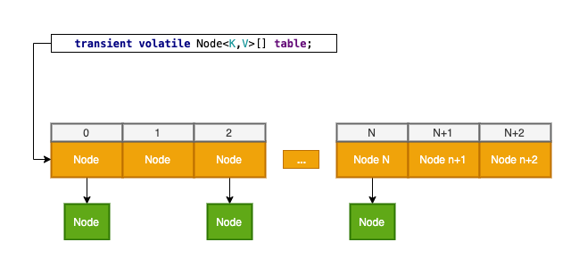

# ConcurrentHashMap

`ConcurrentHashMap` 是为了并发而生的容器，那么底层是通过哪些手段来保证并发访问中出现的问题的呢？

比如：并发的`修改`，`访问`，`扩容` 同时保证较高的性能。

> 下面的源码基于 `jdk1.8.0_221`

- [ConcurrentHashMap](#concurrenthashmap)
  - [Node](#node)
  - [Api 操作](#api-%e6%93%8d%e4%bd%9c)
    - [Put](#put)
      - [tabAt](#tabat)
      - [casTabAt](#castabat)
      - [helpTransfer](#helptransfer)
      - [treeifyBin](#treeifybin)
      - [addCount](#addcount)
    - [Get](#get)
    - [Remove](#remove)
    - [Transfer](#transfer)
  - [数据结构](#%e6%95%b0%e6%8d%ae%e7%bb%93%e6%9e%84)
    - [Node](#node-1)
    - [TreeNode](#treenode)
    - [TreeBin](#treebin)
    - [ForwardingNode](#forwardingnode)

## Node

`Node` 的几种类型

- Node
- TreeNode
- TreeBins
- ForwardingNodes
- ReservationNode

下面的注释来自 javadoc

 The types `TreeBin`, `ForwardingNode`, and
 `ReservationNode` do not hold normal user `keys`, `values`, or
 `hashes`, and are readily distinguishable during search etc
 because they have `negative hash` fields and `null key` and `value`
 fields. (These special nodes are either uncommon or transient,
 so the impact of carrying around some unused fields is
 insignificant.)

## Api 操作

在学习源码之前，需要知道的知识：

- [CAS & Unsafe](cas.md)
- [volatile](volatile.md)

### Put

```java
put
  -> putVal
    -> initTable
      -> tabAt
```

```java
// put 方法的源码
// 一些核心的方法:
// tabAt
// casTabAt
// helpTransfer
// treeifyBin
// addCount
final V putVal(K key, V value, boolean onlyIfAbsent) {
if (key == null || value == null) throw new NullPointerException();
int hash = spread(key.hashCode());
int binCount = 0;
for (Node<K,V>[] tab = table;;) {
    Node<K,V> f; int n, i, fh;
    if (tab == null || (n = tab.length) == 0)
        tab = initTable();// 初始化Table
    else if ((f = tabAt(tab, i = (n - 1) & hash)) == null) {
        // 如果这个位置为空，那么使用CAS加入新Node
        // CAS 成功，结束循环，失败继续for循环
        if (casTabAt(tab, i, null,
                     new Node<K,V>(hash, key, value, null)))
            break;                   // no lock when adding to empty bin
    }
    else if ((fh = f.hash) == MOVED)
        tab = helpTransfer(tab, f);
    else {
        V oldVal = null;
        synchronized (f) {// 加锁
            if (tabAt(tab, i) == f) {// 再次检查(在加锁的时候可能被其他线程修改了)，如果相等，说明table中索引为i的值，没有被修改
                if (fh >= 0) {
                    binCount = 1;// 用来记录链表的长度(默认使用链表的形式解决hash冲突)
                    for (Node<K,V> e = f;; ++binCount) {
                        K ek;
                        if (e.hash == hash &&
                            ((ek = e.key) == key ||
                             (ek != null && key.equals(ek)))) {
                            oldVal = e.val;
                            if (!onlyIfAbsent)// 是否覆盖旧值
                                e.val = value;
                            break;
                        }
                        Node<K,V> pred = e;
                        if ((e = e.next) == null) {// 遍历到链表结尾，还没有找到，就把它插入尾部，结束循环
                            pred.next = new Node<K,V>(hash, key,
                                                      value, null);
                            break;
                        }
                    }
                }
                else if (f instanceof TreeBin) {
                    Node<K,V> p;
                    binCount = 2;
                    if ((p = ((TreeBin<K,V>)f).putTreeVal(hash, key,
                                                   value)) != null) {
                        oldVal = p.val;
                        if (!onlyIfAbsent)
                            p.val = value;
                    }
                }
            }
        }// synchronized end
        // 注意这块代码是在 synchronized 外执行的，并没有加锁
        // 因此 treeifyBin 中使用了CAS
        if (binCount != 0) {
            if (binCount >= TREEIFY_THRESHOLD)// binCount 链表的长度大于 TREEIFY_THRESHOLD(默认是8)
                treeifyBin(tab, i);// 变成tree 结构
            if (oldVal != null)
                return oldVal;
            break;
        }
    }
}
addCount(1L, binCount);
return null;
}
```

#### tabAt

```java
// getObjectVolatile 方法的含义：
// 获取obj对象中offset偏移地址对应的object型field的值,支持volatile load语义。
static final <K,V> Node<K,V> tabAt(Node<K,V>[] tab, int i) {
    // ((long)i << ASHIFT) + ABASE 是用来计算 offset 的
    // getObjectVolatile 用来获取offest 位置的值
    return (Node<K,V>)U.getObjectVolatile(tab, ((long)i << ASHIFT) + ABASE);
}

// ABASE 和 的定义 ASHIFT
Class<?> ak = Node[].class;
ABASE = U.arrayBaseOffset(ak); //返回数组中第一个元素的偏移地址
int scale = U.arrayIndexScale(ak);// 返回数组中一个元素占用的大小
if ((scale & (scale - 1)) != 0)
    throw new Error("data type scale not a power of two");
// 00000000 00000000 00000000 00000011
// 31-29=2
ASHIFT = 31 - Integer.numberOfLeadingZeros(scale);
// numberOfLeadingZeros
// 该方法的作用是返回无符号整型i的最高非零位前面的0的个数
```

#### casTabAt

```java
static final <K,V> boolean casTabAt(Node<K,V>[] tab, int i,
                                    Node<K,V> c, Node<K,V> v) {
    return U.compareAndSwapObject(tab, ((long)i << ASHIFT) + ABASE, c, v);
}
```

#### helpTransfer

`ConcurrentHashMap` 内部数组的数据结构



```java
/**
 * Helps transfer if a resize is in progress.
 */
 // tab 是 ConcurrentHashMap 底层的数组
 // f 是通过key的hash 计算出来，已经存在的元素
final Node<K,V>[] helpTransfer(Node<K,V>[] tab, Node<K,V> f) {
    Node<K,V>[] nextTab; int sc;
    if (tab != null && (f instanceof ForwardingNode) &&
        (nextTab = ((ForwardingNode<K,V>)f).nextTable) != null) {
        int rs = resizeStamp(tab.length);
        while (nextTab == nextTable && table == tab &&
               (sc = sizeCtl) < 0) {
            if ((sc >>> RESIZE_STAMP_SHIFT) != rs || sc == rs + 1 ||
                sc == rs + MAX_RESIZERS || transferIndex <= 0)
                break;
            if (U.compareAndSwapInt(this, SIZECTL, sc, sc + 1)) {
                transfer(tab, nextTab);
                break;
            }
        }
        return nextTab;
    }
    return table;
}
```

#### treeifyBin

```java
/**
 * Replaces all linked nodes in bin at given index unless table is
 * too small, in which case resizes instead.
 */
private final void treeifyBin(Node<K,V>[] tab, int index) {
    Node<K,V> b; int n, sc;
    if (tab != null) {
        if ((n = tab.length) < MIN_TREEIFY_CAPACITY)// MIN_TREEIFY_CAPACITY=64
            tryPresize(n << 1);
        else if ((b = tabAt(tab, index)) != null && b.hash >= 0) {
            synchronized (b) {
                if (tabAt(tab, index) == b) {
                    TreeNode<K,V> hd = null, tl = null;
                    for (Node<K,V> e = b; e != null; e = e.next) {
                        TreeNode<K,V> p =
                            new TreeNode<K,V>(e.hash, e.key, e.val,
                                              null, null);
                        if ((p.prev = tl) == null)
                            hd = p;
                        else
                            tl.next = p;
                        tl = p;
                    }
                    setTabAt(tab, index, new TreeBin<K,V>(hd));
                }
            }
        }
    }
}
```

#### addCount

### Get

### Remove

### Transfer

## 数据结构

### Node

### TreeNode

### TreeBin

### ForwardingNode
