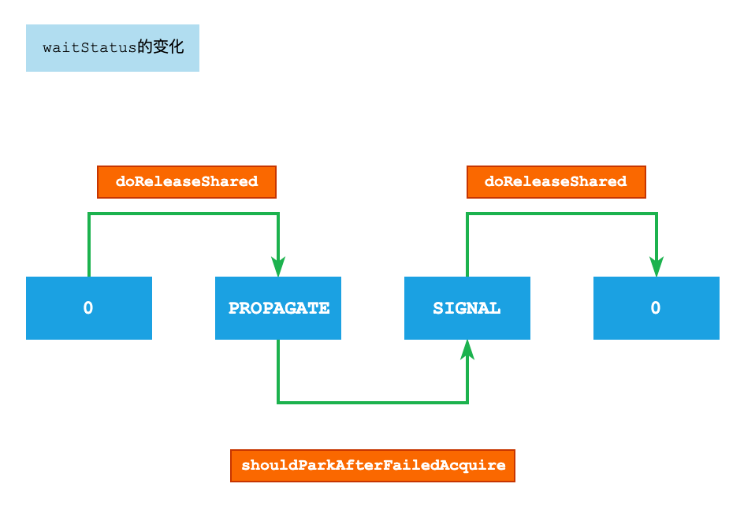
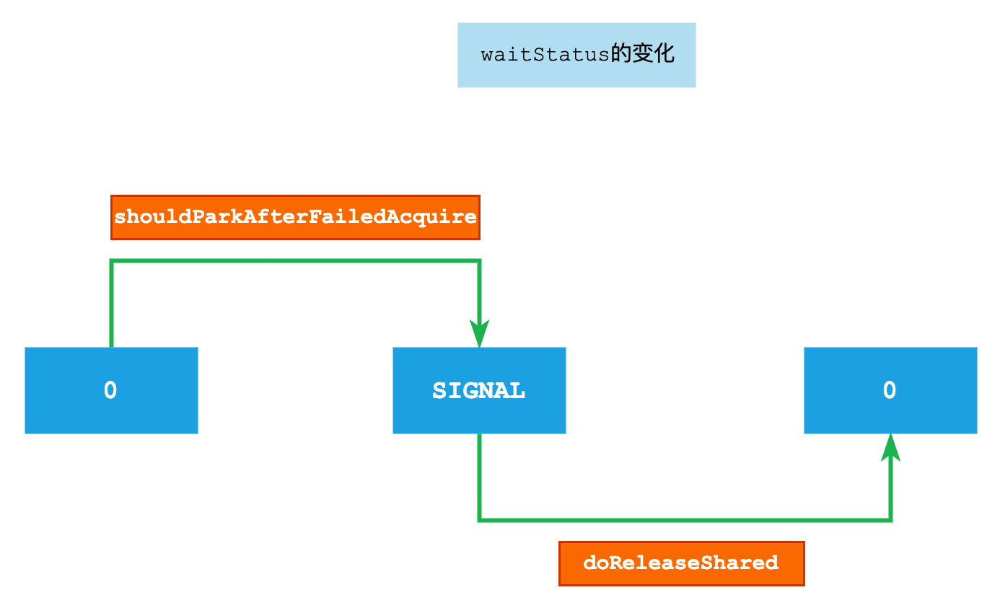

# CountDownLatch

- [CountDownLatch](#countdownlatch)
  - [例子](#%e4%be%8b%e5%ad%90)
  - [CountDownLatch init](#countdownlatch-init)
  - [CountDownLatch await](#countdownlatch-await)
  - [shouldParkAfterFailedAcquire](#shouldparkafterfailedacquire)
  - [setHeadAndPropagate](#setheadandpropagate)
  - [CountDownLatch countDown](#countdownlatch-countdown)
  - [example1](#example1)
  - [example2](#example2)
  - [example3](#example3)
  - [参考](#%e5%8f%82%e8%80%83)

> A synchronization aid that allows one or more threads to wait until a set of operations being performed in other threads completes.

`CountDownLatch` 可用来实现线程之间的协作(或者理解为一个`计数器`)，如线程 A 等待线程 B,C,D 执行完成之后，再进行继续其它操作

此外 `Latch` 单词有 `门闩` 的含义（当你达到某一个条件的之后，才能通过这扇门）

类似 `Thread#join` 的方法, `Thread#join` 可参照这个 [thread-join](thread.md#join)

`Thread#join` 的方法可以实现二个线程之间`协作等待`，`CountDownLatch` 可以方便的实现多个(超过2个线程)线程之间的协作

这里通过 `await` 和 `countDown` 方法的实现来分析的 `CountDownLatch` 的原理

在开始之前，需要理解下面 `aqs` 相关的知识，阅读起来才不费力

预先了解的知识：

- [java.util.concurrent.locks.AbstractQueuedSynchronizer](aqs.md)
- [java.util.concurrent.locks.LockSupport](lock-support.md)

`CountDownLatch` 内部也是基于 AQS 实现的，`await` 可以理解为线程去`竞争锁`,竞争失败就`阻塞`线程

`countDown` 可以理解为线程去`释放锁`，并`唤醒`线程

## 例子

在下面的例子中，会把 `CountDownLatch` 当做 `计数器` 来解说

`CountDownLatch` 可以用来处理几个线程之间的协作，如 A 线程等待 B,C,D 线程任务完成之后，再执行 A 自己的任务。

```java
public class CountDownLatchTest {
    public static void main(String[] args) throws InterruptedException {

        // 这里进行初始化，参数是2,需要执行两次 countDown （计数器减少2，执行两次）
        // await 才会继续执行
        CountDownLatch cdl = new CountDownLatch(2);

        Runnable r = () -> {
            try {
                TimeUnit.SECONDS.sleep(1);
                System.out.println("sleep end");
                cdl.countDown();
                cdl.countDown();
            } catch (InterruptedException e) {
                e.printStackTrace();
            }
        };
        // 主线程执行了 await，因此一直在阻塞
        new Thread(r).start();
        cdl.await();// 线程进行等待
        System.out.println("main end");
    }
}
```

## CountDownLatch init

```java
// 在进行 new CountDownLatch 会创建一个 Sync 对象
// Sync 是 CountDownLatch 的内部类
// Sync 继承了 AbstractQueuedSynchronizer
public CountDownLatch(int count) {
    if (count < 0) throw new IllegalArgumentException("count < 0");
    this.sync = new Sync(count);
}
Sync(int count) {
    setState(count);
}
// 设置 state 的值
protected final void setState(int newState) {
    state = newState;
}
```

## CountDownLatch await

分析 `await` 方法为什么会使线程阻塞

```java
// CountDownLatch
public void await() throws InterruptedException {
        sync.acquireSharedInterruptibly(1);
}
```

```java
// AbstractQueuedSynchronizer
public final void acquireSharedInterruptibly(int arg)
        throws InterruptedException {
    if (Thread.interrupted())
        throw new InterruptedException();
    // 首先通过 tryAcquireShared 尝试一下获取锁
    // 其实就是判断一下 state 是否等于0
    // 如果小于 0 说明,计数器不为0,需要等待,否则不需要阻塞
    if (tryAcquireShared(arg) < 0)
        doAcquireSharedInterruptibly(arg);// try 失败，再次尝试
}
// CountDownLatch
// 在初始化的时候 设置了 state 的值，在没有执行 countDown 方法之前
// state 一直是大于0，因此会执行 doAcquireSharedInterruptibly 方法
protected int tryAcquireShared(int acquires) {
    // -1 表示还有其他线程在获取锁
    return (getState() == 0) ? 1 : -1;
 }
```

```java
// AbstractQueuedSynchronizer
// 下面的 for;; + shouldParkAfterFailedAcquire 方法实现了cas 语义
// doAcquireSharedInterruptibly 主要做4件事：
// 1. 查询 state 的值
//    再次执行 tryAcquireShared 尝试查询 state 的值是否为 0，state=0 表示没有其他线程持有锁了
// 2. [获取锁成功] 修改 head
//    执行 setHeadAndPropagate 修改队列的 head（这里没有使用CAS进行修改head,下面会说明原因）
// 3. [获取锁失败] 修改 waitStatus
//    shouldParkAfterFailedAcquire 方法会去修改 waitStatus = SIGNAL
// 4. [获取锁失败] 阻塞线程
//    当上面的 tryAcquireShared 查询 state !=0
//    说明有其他线程已经持有了锁，执行 shouldParkAfterFailedAcquire 和 parkAndCheckInterrupt 尝试阻塞
//    而是否需要进入阻塞，要看是否存在其他线程已经释放锁的情况(后续会有说明)
// doAcquireSharedInterruptibly 中的逻辑主要有二个分支：
// 分支一：执行 tryAcquireShared 成功，执行 setHeadAndPropagate
// 分支二：执行 tryAcquireShared 失败，执行 shouldParkAfterFailedAcquire
private void doAcquireSharedInterruptibly(int arg)
    throws InterruptedException {
    // 当前线程进入队列排队
    final Node node = addWaiter(Node.SHARED);
    boolean failed = true;
    try {
        for (;;) {// 无限循环
            final Node p = node.predecessor();// 获取当前的节点的前一个节点
            if (p == head) {// 如果前一个节点为 head 说明只有一个线程在排队，进行尝试获取 计数器
                int r = tryAcquireShared(arg);
                if (r >= 0) {// r>=0 说明计数器为 0 了，不需要阻塞了
                    // 当 await 唤醒之后，会执行这个代码
                    // 修改 head
                    setHeadAndPropagate(node, r);
                    p.next = null; // help GC
                    failed = false;
                    return;
                }
            }
            // shouldParkAfterFailedAcquire + for 循环，去改变前一个节点的状态
            // 直到修改成功（也是cas）
            // shouldParkAfterFailedAcquire 会修改前一个 Node 节点的 waitStatus = Node.SIGNAL
            // 修改成功，才会阻塞当前线程(执行parkAndCheckInterrupt)
            if (shouldParkAfterFailedAcquire(p, node) &&
                parkAndCheckInterrupt())// parkAndCheckInterrupt 这里使用 LockSupport.park 阻塞当前线程
                throw new InterruptedException();// parkAndCheckInterrupt 在线程被 interrupt 之后就会抛出 InterruptedException 异常
        }
    } finally {
        if (failed)// 如果线程被 interrupt 了，那么需要取消获取锁的请求
            cancelAcquire(node);// 如果是正常结束，会执行 failed = false，cancelAcquire 不会执行
    }
}
```

## shouldParkAfterFailedAcquire

先看 `tryAcquireShared` 执行失败之后, `shouldParkAfterFailedAcquire` 方法的逻辑：

```java
// shouldParkAfterFailedAcquire 方法是在 for;; 循环中执行的，会被执行多次
// shouldParkAfterFailedAcquire 方法的主要目的是设置 waitStatus = Node.SIGNAL
// 这里的 pred 其实是当前线程的前一个线程 （源码中有 Requires that pred == node.prev 这样的注释）
// shouldParkAfterFailedAcquire 方法的作用就是把 pred 的 waitStatus 修改成 SIGNAL
// 如果修改成功就 返回 true 阻塞当前线程(node 里面的线程)
// 那么为什么要这样做呢？(pred 的waitStatus=SIGNAL成功后,当前线程就可以阻塞了？)
// 这里需要与 doReleaseShared 方法一起看
// shouldParkAfterFailedAcquire 与 doReleaseShared 存在竞争修改 head.waitStatus 的情况
// 原因是存在这种情况：
// 在执行 shouldParkAfterFailedAcquire 的时候 waitStatus=0
// 但是存在线程A正在修改 waitStatus 0 -> SIGNAL 准备进入阻塞状态的时候
// 线程B执行了 doReleaseShared 已经释放了锁，修改 waitStatus=PROPAGATE,此时线程A其实是不需要进入阻塞状态了
// 但是实际的逻辑有两种:(看下面的图片)
// 第一种： waitStatus [0 ->PROPAGATE -> SIGNAL -> 0]
// 第二种： waitStatus [0 -> SIGNAL ->0 ]
private static boolean shouldParkAfterFailedAcquire(Node pred, Node node) {
    int ws = pred.waitStatus;// 第一次 ws = 0
    if (ws == Node.SIGNAL)// 第一次中 ws 被设置了等于 SIGNAL，第二次执行的时候返回 true
        /*
         * This node has already set status asking a release
         * to signal it, so it can safely park.
         */
        return true;
    if (ws > 0) {// 第一次 ws = 0,不执行这里
        /*
         * Predecessor was cancelled. Skip over predecessors and
         * indicate retry.
         */
        do {
            node.prev = pred = pred.prev;
        } while (pred.waitStatus > 0);
        pred.next = node;
    } else {// 第一次 ws = 0,执行了这里，设置 waitStatus=SIGNAL
        /*
         * waitStatus must be 0 or PROPAGATE.  Indicate that we
         * need a signal, but don't park yet.  Caller will need to
         * retry to make sure it cannot acquire before parking.
         */
         // 这里的注释也说明了可能存在 ws=PROPAGATE 的状态
        compareAndSetWaitStatus(pred, ws, Node.SIGNAL);// 更新为 SIGNAL
    }
    return false;
}
```

第一种：



第二种：



## setHeadAndPropagate

再看 `setHeadAndPropagate` 的逻辑

```java
// AbstractQueuedSynchronizer
// setHeadAndPropagate 在获取锁成功之后执行
private void setHeadAndPropagate(Node node, int propagate) {
    Node h = head; // Record old head for check below
    setHead(node);
    /*
     * Try to signal next queued node if:
     *   Propagation was indicated by caller,
     *     or was recorded (as h.waitStatus either before
     *     or after setHead) by a previous operation
     *     (note: this uses sign-check of waitStatus because
     *      PROPAGATE status may transition to SIGNAL.)
     * and
     *   The next node is waiting in shared mode,
     *     or we don't know, because it appears null
     *
     * The conservatism in both of these checks may cause
     * unnecessary wake-ups, but only when there are multiple
     * racing acquires/releases, so most need signals now or soon
     * anyway.
     */
    if (propagate > 0 || h == null || h.waitStatus < 0 ||
        (h = head) == null || h.waitStatus < 0) {
        Node s = node.next;
        if (s == null || s.isShared())
            doReleaseShared();
    }
}
// 修改 head
// 这里并没有使用 cas 去修改的原因是：
// 其他线线程在 tryAcquireShared 的时候失败了(在 CountDownLatch 的实现中就是判断 state 的值是否等于 0)
// state !=0 也就是有其他线程已经持有了锁，那么会继续执行 parkAndCheckInterrupt 方法，进行阻塞
// 其他线程就进行了阻塞，因此此时不会存在竞争去修改 head 的情况
private void setHead(Node node) {
    head = node;
    node.thread = null;
    node.prev = null;
}
```

## CountDownLatch countDown

分析 `countDown` 为什么会使线程取消阻塞状态

```java
// CountDownLatch
public void countDown() {
        sync.releaseShared(1);// 计数器 -1
}

// AbstractQueuedSynchronizer
public final boolean releaseShared(int arg) {
        if (tryReleaseShared(arg)) {// 尝试释放锁
            doReleaseShared();// 返回 false 就不执行这个，存在其他线程已经执行了 countDown(没有再次执行的必要)
            return true;
        }
        return false;
}
// CountDownLatch
// 只有在 被修改为 state =0 的时候 tryReleaseShared 才返回true
// 本身已经是 0 了，返回false
// 才会执行 doReleaseShared 的代码，去真正的释放锁，唤醒线程
protected boolean tryReleaseShared(int releases) {
            // Decrement count; signal when transition to zero
            for (;;) {
                int c = getState();
                if (c == 0)// 如果 state =0 说明其他线程已经执行 countDown 了，返回 false
                    return false;
                int nextc = c-1;// 这里使用 for + cas 把 state-1
                if (compareAndSetState(c, nextc))
                    return nextc == 0;
            }
}

// AbstractQueuedSynchronizer
// 这里会有唤醒线程的操作 unparkSuccessor
private void doReleaseShared() {
        /*
         * Ensure that a release propagates, even if there are other
         * in-progress acquires/releases.  This proceeds in the usual
         * way of trying to unparkSuccessor of head if it needs
         * signal. But if it does not, status is set to PROPAGATE to
         * ensure that upon release, propagation continues.
         * Additionally, we must loop in case a new node is added
         * while we are doing this. Also, unlike other uses of
         * unparkSuccessor, we need to know if CAS to reset status
         * fails, if so rechecking.
         */
        for (;;) {
            Node h = head;
            if (h != null && h != tail) {// head 不等于 tail 说明至少有一个线程在队列中
                int ws = h.waitStatus;// 获取 head 的状态
                if (ws == Node.SIGNAL) {// 如果是需要唤醒的状态，修改 waitStatus
                    if (!compareAndSetWaitStatus(h, Node.SIGNAL, 0))// 　修改失败，继续修改
                        continue;            // loop to recheck cases
                    unparkSuccessor(h);// 修改 waitStatus 成功，唤醒线程
                }
                // 如果 waitStatus =0 说明线程进入队列还没有成功
                // 与 shouldParkAfterFailedAcquire 方法在竞争修改 head 的 waitStatus
                // 例子：二个线程，线程A,线程B。线程B 获取锁成功，线程A 获取锁失败，正在准备进入阻塞
                //      线程A获取锁失败，正在执行 shouldParkAfterFailedAcquire 方法，还没执行完
                //      这时线程B 说我干完了，并释放锁了，这个时候线程A 正在进入队列进行阻塞，
                //      但是线程A 其实没有阻塞的必要了，因为B 线程已经释放锁了
                //      此时线程A继续执行即可，不需要进入阻塞状态
                // 下面的 waitStatus = 0 也即是线程A 还没有被阻塞
                // 如果下面的代码执行成功了，waitStatus=PROPAGATE,shouldParkAfterFailedAcquire 就会返回false
                // 后续的 parkAndCheckInterrupt 方法也就不回执行，线程A也就不会进入阻塞状态
                // for;; 再次循环就会执行 setHeadAndPropagate 中的代码
                // 但是如果下面的 ws=Node.PROPAGATE 执行失败，要怎么处理呢？
                // 执行失败意味着本来不需要进入阻塞状态的，现在却需要进入阻塞状态了
                // 那么我们怎么去让线程不进入阻塞状态(或者想办法唤醒线程)呢？
                // 下面的 ws=Node.PROPAGATE 执行失败
                // 一定是因为ws 在 shouldParkAfterFailedAcquire 中修改成了  ws == Node.SIGNAL
                // 那么就继续循环 执行上面的CAS 修改 ws=0,然后在唤醒线程
                else if (ws == 0 &&
                         !compareAndSetWaitStatus(h, 0, Node.PROPAGATE))
                    continue;                // loop on failed CAS
            }
            // 在执行 unparkSuccessor 之后，之前阻塞的线程会被唤醒
            // 而被唤醒的线程会执行 setHead 把自己作为 head
            if (h == head)                   // loop if head changed
                break;
        }
}
// AbstractQueuedSynchronizer
private void unparkSuccessor(Node node) {
        /*
         * If status is negative (i.e., possibly needing signal) try
         * to clear in anticipation of signalling.  It is OK if this
         * fails or if status is changed by waiting thread.
         */
        // doReleaseShared 中其实已经把 waitStatus 改成 0了
        // 如果被其他线程该了，尝试修改成 0
        int ws = node.waitStatus;
        if (ws < 0)
            compareAndSetWaitStatus(node, ws, 0);

        /*
         * Thread to unpark is held in successor, which is normally
         * just the next node.  But if cancelled or apparently null,
         * traverse backwards from tail to find the actual
         * non-cancelled successor.
         */
         // 对于 CountDownLatch 来说 s!=null waitStatus 也不会取消
        Node s = node.next;
        if (s == null || s.waitStatus > 0) {// waitStatus 大于 0 是取消状态
            s = null;
            for (Node t = tail; t != null && t != node; t = t.prev)
                if (t.waitStatus <= 0)// 线程的状态需要唤醒，
                    s = t;
        }
        if (s != null)
            LockSupport.unpark(s.thread);// 唤醒线程
}
```

## example1

The first is a start signal that prevents any worker from proceeding
until the driver is ready for them to proceed;
The second is a completion signal that allows the driver to wait
until all workers have completed.

```java
class Driver {
  void main() throws InterruptedException {
    // startSignal 开始的信号
    CountDownLatch startSignal = new CountDownLatch(1);
    //  完成的信号
    CountDownLatch doneSignal = new CountDownLatch(N);
    for (int i = 0; i < N; ++i) // create and start threads
    new Thread(new Worker(startSignal, doneSignal)).start();
    doSomethingElse();            // don't let run yet
    // 发出开始的信号
    startSignal.countDown();      // let all threads proceed
    doSomethingElse();
    // 完成的信号进行等待（等待所有线程完成任务）
    doneSignal.await();           // wait for all to finish
  }
}
 class Worker implements Runnable {
  private final CountDownLatch startSignal;
  private final CountDownLatch doneSignal;
  Worker(CountDownLatch startSignal, CountDownLatch doneSignal) {
    this.startSignal = startSignal;
    this.doneSignal = doneSignal;
  }
  public void run() {
    try {
      // 这里是异步的，每个线程都等待 开始的信号
      startSignal.await();
      doWork();
      // 每个线程执行之后，通知说：我完成了任务
      doneSignal.countDown();
    } catch (InterruptedException ex) {} // return;
  }
   void doWork() {
       // ...
    }
}
```

## example2

Another typical usage would be to divide a problem into N parts,
describe each part with a Runnable that executes that portion and
counts down on the latch, and queue all the `Runnables` to an
Executor. When all sub-parts are complete, the coordinating thread
will be able to pass through await. (When threads must repeatedly
count down in this way, instead use a {@link `CyclicBarrier`}.)

```java
class Driver2 {
   void main() throws InterruptedException {
     CountDownLatch doneSignal = new CountDownLatch(N);
     Executor e = //...
     for (int i = 0; i < N; ++i) // create and start threads
       e.execute(new WorkerRunnable(doneSignal, i));
     // 在其它线程完成任务之前，主线程一直阻塞
     doneSignal.await();           // wait for all to finish
   }
 }
 class WorkerRunnable implements Runnable {
   private final CountDownLatch doneSignal;
   private final int i;
   WorkerRunnable(CountDownLatch doneSignal, int i) {
     this.doneSignal = doneSignal;
     this.i = i;
   }
   public void run() {
     try {
       doWork(i);
       doneSignal.countDown();
     } catch (InterruptedException ex) {} // return;
   }
   void doWork() { /* ...*/ }
 }
```

[Thread#join()](thread.md#join)A 程等待 B 线程执行完毕之后，A 线程继续执行，实现了二个线程协作的机制

`CountDownLatch`A 线程等待 B,C,D,E 线程等完成之后，A 线程继续执行，实现了 N 个线程之间的协作机制

## example3

```java
    /**
     *  模拟一个开会的场景，10人到齐了，会议开始
     *
     * @param args
     * @throws InterruptedException
     */
    public static void main(String[] args) throws InterruptedException {

        // 10人
        int meeters = 10;
        CountDownLatch enter = new CountDownLatch(1);
        CountDownLatch arrive = new CountDownLatch(meeters);


        for (int i = 0; i < meeters; i++) {
            new Thread(() -> {
                try {
                    enter.await();
                    doWork();
                } catch (InterruptedException e) {
                    e.printStackTrace();
                } finally {
                    arrive.countDown();

                }

            }).start();
        }

        // 开始入场
        enter.countDown();
        // 等待人到齐
        arrive.await();
        // 人到齐了，开始开会
        System.out.println("meet begin...");
    }

    private static void doWork() {
        String name = Thread.currentThread().getName();
        System.out.println(name + " arrive ...");
    }
```

## 参考

- [CountDownLatch & CyclicBarrier](https://github.com/CL0610/Java-concurrency/tree/master/25.%E5%A4%A7%E7%99%BD%E8%AF%9D%E8%AF%B4java%E5%B9%B6%E5%8F%91%E5%B7%A5%E5%85%B7%E7%B1%BB-CountDownLatch%EF%BC%8CCyclicBarrier)
- [CountDownLatch](https://www.cnblogs.com/shiyanch/archive/2011/04/04/2005233.html)
- [CountDownLatch from oracle docs](https://docs.oracle.com/javase/8/docs/api/java/util/concurrent/CountDownLatch.html)
