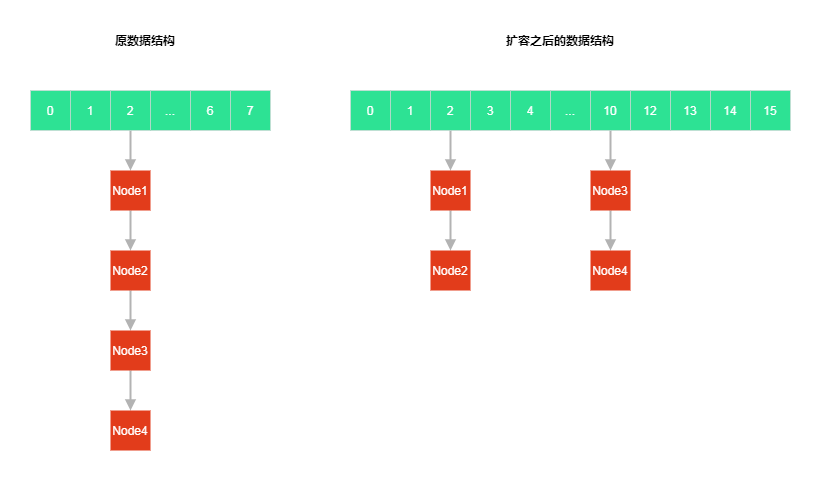

HashMap 的初始化和扩容 (jdk1.8)

`HashMap` 中使用 `hash` 函数来计算元素在底层`数组`的位置，而在扩容之后，底层`数组`的长度发生了改变

因此需要对已经存在的元素再次 `hash` ，从而把元素放在正确的位置上。

而本文的重点是 `扩容导致的元素移动`

<!--truncate-->

- [Init and resize](#init-and-resize)
- [Move element](#move-element)
  - [e.hash & oldCap](#ehash--oldcap)
  - [j + oldCap](#j--oldcap)
- [Links](#links)

## Init and resize

`HashMap` 是延迟初始化的，在 `put` 之后进行初始化操作的

```java
// put -> resize
final Node<K,V>[] resize() {
    Node<K,V>[] oldTab = table;
    // hashmap 无参数初始化的时候 oldCap 和 oldThr 都是0
    // 使用有参数初始化 hashmap 那么 threshold 不为0
    int oldCap = (oldTab == null) ? 0 : oldTab.length;
    // threshold -> The next size value at which to resize (capacity * load factor).
    int oldThr = threshold;// 默认的数组大小，默认是0
    int newCap, newThr = 0;
    if (oldCap > 0) {// 扩容走这里
        if (oldCap >= MAXIMUM_CAPACITY) {
            // 超过最大容量，调整 threshold 结束
            threshold = Integer.MAX_VALUE;
            return oldTab;
        }
        else if ((newCap = oldCap << 1) < MAXIMUM_CAPACITY &&// newCap 加倍
                 oldCap >= DEFAULT_INITIAL_CAPACITY)// 如果旧的容量小于16，newThr 加倍
            newThr = oldThr << 1; // double threshold
    }
    else if (oldThr > 0) // initial capacity was placed in threshold 扩容走这里/指定初始容量也走这里
        newCap = oldThr;
    else {               // zero initial threshold signifies using defaults
        // 初始化走这里
        newCap = DEFAULT_INITIAL_CAPACITY;// 默认数组大小是16
        newThr = (int)(DEFAULT_LOAD_FACTOR * DEFAULT_INITIAL_CAPACITY);//  0.75*16=12.0
    }
    if (newThr == 0) {
        float ft = (float)newCap * loadFactor;
        newThr = (newCap < MAXIMUM_CAPACITY && ft < (float)MAXIMUM_CAPACITY ?
                  (int)ft : Integer.MAX_VALUE);
    }
    threshold = newThr;
    @SuppressWarnings({"rawtypes","unchecked"})
    Node<K,V>[] newTab = (Node<K,V>[])new Node[newCap];// 创建新数组
    table = newTab;
    if (oldTab != null) {// 扩容，需要重新计算hash
        // 在扩容完成之后，在这个for循环里面开始进行元素的移动
        for (int j = 0; j < oldCap; ++j) {// 遍历旧数组大小
            Node<K,V> e;
            if ((e = oldTab[j]) != null) {// 找到那些不为 null 的数组中的元素
                oldTab[j] = null;
                if (e.next == null)// 如果这个位置上的元素上只有一个元素(没有hash冲突)
                    newTab[e.hash & (newCap - 1)] = e;// 直接把这个元素重新进行hash,放到新数组的位置上即可
                else if (e instanceof TreeNode)
                    ((TreeNode<K,V>)e).split(this, newTab, j, oldCap);// 如果是树数据结构
                else { // preserve order 保证顺序
                    // 代码执行到这里，说明 e 这个 Node 已经是链表了
                    // 那么需要把这个链表进行拆分和元素移动
                    // 具体的细节和做法，在后面 Move element 部分详细解释
                    Node<K,V> loHead = null, loTail = null;
                    Node<K,V> hiHead = null, hiTail = null;
                    Node<K,V> next;
                    do {
                        next = e.next;
                        if ((e.hash & oldCap) == 0) {
                            if (loTail == null)
                                loHead = e;
                            else
                                loTail.next = e;
                            loTail = e;
                        }
                        else {
                            if (hiTail == null)
                                hiHead = e;
                            else
                                hiTail.next = e;
                            hiTail = e;
                        }
                    } while ((e = next) != null);
                    if (loTail != null) {
                        loTail.next = null;
                        newTab[j] = loHead;
                    }
                    if (hiTail != null) {
                        hiTail.next = null;
                        newTab[j + oldCap] = hiHead;
                    }
                }
            }
        }
    }
    return newTab;
}
```

## Move element

> 元素移动

先看下数据扩容之后一种可能的元素位置的变化,如下图



如上图所示，移动前后元素位置和链表的对比(这里是数据扩容之后，链表拆分&元素移动之后的结果)

一部分元素依然在索引为2的位置，另一部分则移动到了索引为10的位置上

> 下面再看问题&解决方案

或者你认为，数组在扩容之后，元素依然在旧的位置，这样也可以啊，为什么需要移动呢？

这里需要考虑二个问题:

1. 在数组扩容之后，数组的长度变了，那么在进行 `e.hash & (newCap - 1)` 新hash操作的时候，旧的那些元素旧不一定在放在索引为2位置上面了，如果不移动元素，那么在 `get`(扩容之后)的时候，执行 `tab[(n - 1) & hash` 肯定是那查询不到当前元素的

2. 如何快速的把扩容之前在索引为2为元素，但是扩容之后索引不在2的元素进行筛选和移动(重新计算索引)

下面通过举例来说明：

> 问题1

假如: 旧数组长度为 8（索引0-7），扩容之后的新数组的长度是 16 （索引0-15）,假如一个Node 的 hash = 10,

那么：根据公式 `e.hash & (newCap - 1)` 这个元素在数组扩容之前的位置是 `10 & 7= 2`,扩容之后的位置是 `10 & 15=10`

可见：在数据扩容之后，Node 元素在新数组中的索引位置发生了变化(从2变成了10)

> 问题2

对应上面的例子就是`如何`把就数组中在索引为`2`的元素（进行筛选）移动到新数组中索引为`10`的位置上面

而下面的这段代码逻辑就是处理上面的二个问题

```java
// 代码执行到这里，说明 e 这个 Node 已经是链表了
// 那么需要把这个链表进行 拆分
// 这里先新建二个链表，用来存储Node
Node<K,V> loHead = null, loTail = null;// 新链表1
Node<K,V> hiHead = null, hiTail = null;// 新链表2
Node<K,V> next;
do {
    next = e.next;
    if ((e.hash & oldCap) == 0) {// 进行筛选
        // 旧位置
        if (loTail == null)
            loHead = e;
        else
            loTail.next = e;
        loTail = e;
    }
    else {
        // 新位置
        if (hiTail == null)
            hiHead = e;
        else
            hiTail.next = e;
        hiTail = e;
    }
} while ((e = next) != null);
if (loTail != null) {// 不为空
    loTail.next = null;
    newTab[j] = loHead;// 旧位置
}
if (hiTail != null) {// 不为空
    hiTail.next = null;
    newTab[j + oldCap] = hiHead; // 新位置
}
```

### e.hash & oldCap

上面的代码重点是 `(e.hash & oldCap) == 0` 和 `j + oldCap` 理解了这个就掌握了作者的思想

还是来举例:

假如有二个Node, `Node1.hash=2` ,`Node2.hash=10`，旧数组的长度为8，新数组长度为16

那么：`2&7=2` `10&7=2`, `2&15=2` `10&15=10` (扩容之前这二个元素的位置都是2，扩容之后一个是2，另一个变成了10)

我们这里把新的数组分成两部分，`旧位置`和`新位置`（只是为了方便理解），如下图:


那么 `Node1.hash=2` 应该放在`旧数组`的位置， `Node2.hash=10` 应该放在`新数组`的位置（这样才能保证get在新数组中执行Hash计算的位置是正确的）

hashmap 中数组的长度都是2的n次方,如： $2^3=8$ ,而2的n次方的结果，这个的数字的二进制有一个特点，就是有效位高位是1，低位都是0，如`8`的二进制是`1000`,`16`的二进制`10000`

如果 hash<8,hash与8进行&计算，结果肯定是0(hash<8,意味着hash的二进制的最高位肯定是0,不是1),比如 `100 & 1000`, `10 & 1000`, `1 &1000`

而 `(e.hash & oldCap) == 0` 的最终目的就是根据&结果是否为零,来确定这个元素到底是放在`旧位置`还是`新位置`

### j + oldCap

- 旧位置： `newTab[j] = loHead`
- 新位置： `newTab[j + oldCap] = hiHead`

下面说明下为什么通过 `j + oldCap` 来计算新位置

如果： `hash=10` `oldCap =8` `newCap=16`

旧index： `1010 & 01000`

新index： `1010 & 10000`

| 二进制                                              | 十进制           |
| --------------------------------------------------- | ---------------- |
| 而 (1010 & 10000) - (1010 & 01000) = 01000 = oldCap | 新 - 旧 =oldCap  |
| 所以 (1010 & 10000) =   (1010 & 01000)  +oldCap     | 新 = 旧  +oldCap |
| 即 (1010 & 10000) = j + oldCap                      | 新 = j+oldCap    |

[如果这里没看懂，可以看文章末尾的连接](#links)

## Links

- [HashMap 扩容](https://segmentfault.com/a/1190000015812438)
- [HashMap 扩容](https://www.jianshu.com/p/ee0de4c99f87)
