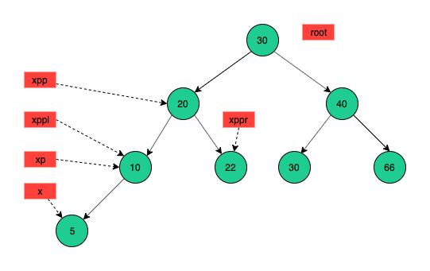

Hashmap 的数据结构之 Tree

Hashmap 中使用红黑树这种数据结构，解决hash 冲突之后，数据查询效率下降的问题。

<!--truncate-->

- [TreeifyBin](#treeifybin)
- [TreeNode](#treenode)
  - [balanceInsertion](#balanceinsertion)
  - [balanceDeletion](#balancedeletion)
  - [putTreeVal](#puttreeval)

## TreeifyBin

```java
/**
 * Replaces all linked nodes in bin at index for given hash unless
 * table is too small, in which case resizes instead.
 */
final void treeifyBin(Node<K,V>[] tab, int hash) {
    int n, index; Node<K,V> e;
    // MIN_TREEIFY_CAPACITY =64 小于64仅仅是扩容
    // 数组的大于64才开始把链表变成树
    if (tab == null || (n = tab.length) < MIN_TREEIFY_CAPACITY)
        resize();
    else if ((e = tab[index = (n - 1) & hash]) != null) {// 元素所在的位置有值
        // 这个hash是你put元素的hash,因此这里仅仅是把这个hash
        // 所在数组的链表转化成树
        TreeNode<K,V> hd = null, tl = null;
        do {// 开始转化
            TreeNode<K,V> p = replacementTreeNode(e, null);// Node -> TreeNode
            if (tl == null)
                hd = p;// hd 是第一个被转化的元素
            else {
                p.prev = tl;// 改当前一个元素的prev
                tl.next = p;// 改变前一个元素的next
                // 上面的两个操作创建了双向链表
            }
            tl = p;// 每次循环都会更新 tl
        } while ((e = e.next) != null);
        if ((tab[index] = hd) != null)// 把上面创建的链放在index位置
            hd.treeify(tab);// 这里才是链表变成树的重点
    }
}
```

## TreeNode

```java
// TreeNode#treeify
/**
 * Forms tree of the nodes linked from this node.
 */
// hd.treeify(tab)
// 上面说过在treeifyBin 中已经创建了 TreeNode 链表
// 而hd 是第一个元素，下面的循环就是从第一个元素开始
final void treeify(Node<K,V>[] tab) {
    TreeNode<K,V> root = null;
    for (TreeNode<K,V> x = this, next; x != null; x = next) {
        next = (TreeNode<K,V>)x.next;
        x.left = x.right = null;
        if (root == null) {
            x.parent = null;
            x.red = false;
            root = x;
        }
        else {
            K k = x.key;
            int h = x.hash;
            Class<?> kc = null;
            for (TreeNode<K,V> p = root;;) {
                int dir, ph;
                K pk = p.key;
                if ((ph = p.hash) > h)
                    dir = -1;
                else if (ph < h)
                    dir = 1;
                else if ((kc == null &&
                          (kc = comparableClassFor(k)) == null) ||
                         (dir = compareComparables(kc, k, pk)) == 0)
                    dir = tieBreakOrder(k, pk);
                TreeNode<K,V> xp = p;
                if ((p = (dir <= 0) ? p.left : p.right) == null) {
                    x.parent = xp;
                    if (dir <= 0)
                        xp.left = x;
                    else
                        xp.right = x;
                    root = balanceInsertion(root, x);// 插入成功，进行重新树的平衡
                    break;// 结束循环
                }
            }
        }
    }
    moveRootToFront(tab, root);
}
```

### balanceInsertion

> 插入操作

```java
// HashMap.TreeNode#balanceInsertion
// 在 treeify 可以，此时 x 已经插入到树种了
// 下面的操作就是进行重新平衡
static <K,V> TreeNode<K,V> balanceInsertion(TreeNode<K,V> root,
                                            TreeNode<K,V> x) {
    x.red = true;
    for (TreeNode<K,V> xp, xpp, xppl, xppr;;) {
        if ((xp = x.parent) == null) {
            x.red = false;
            return x;
        }
        else if (!xp.red || (xpp = xp.parent) == null)
            return root;
        if (xp == (xppl = xpp.left)) {
            if ((xppr = xpp.right) != null && xppr.red) {
                xppr.red = false;
                xp.red = false;
                xpp.red = true;
                x = xpp;
            }
            else {
                if (x == xp.right) {
                    root = rotateLeft(root, x = xp);
                    xpp = (xp = x.parent) == null ? null : xp.parent;
                }
                if (xp != null) {
                    xp.red = false;
                    if (xpp != null) {
                        xpp.red = true;
                        root = rotateRight(root, xpp);
                    }
                }
            }
        }
        else {
            if (xppl != null && xppl.red) {
                xppl.red = false;
                xp.red = false;
                xpp.red = true;
                x = xpp;
            }
            else {
                if (x == xp.left) {
                    root = rotateRight(root, x = xp);
                    xpp = (xp = x.parent) == null ? null : xp.parent;
                }
                if (xp != null) {
                    xp.red = false;
                    if (xpp != null) {
                        xpp.red = true;
                        root = rotateLeft(root, xpp);
                    }
                }
            }
        }
    }
}
```



### balanceDeletion

```java
// HashMap.TreeNode#balanceDeletion
static <K,V> TreeNode<K,V> balanceDeletion(TreeNode<K,V> root,
                                           TreeNode<K,V> x) {
    for (TreeNode<K,V> xp, xpl, xpr;;) {
        if (x == null || x == root)
            return root;
        else if ((xp = x.parent) == null) {
            x.red = false;
            return x;
        }
        else if (x.red) {
            x.red = false;
            return root;
        }
        else if ((xpl = xp.left) == x) {
            if ((xpr = xp.right) != null && xpr.red) {
                xpr.red = false;
                xp.red = true;
                root = rotateLeft(root, xp);
                xpr = (xp = x.parent) == null ? null : xp.right;
            }
            if (xpr == null)
                x = xp;
            else {
                TreeNode<K,V> sl = xpr.left, sr = xpr.right;
                if ((sr == null || !sr.red) &&
                    (sl == null || !sl.red)) {
                    xpr.red = true;
                    x = xp;
                }
                else {
                    if (sr == null || !sr.red) {
                        if (sl != null)
                            sl.red = false;
                        xpr.red = true;
                        root = rotateRight(root, xpr);
                        xpr = (xp = x.parent) == null ?
                            null : xp.right;
                    }
                    if (xpr != null) {
                        xpr.red = (xp == null) ? false : xp.red;
                        if ((sr = xpr.right) != null)
                            sr.red = false;
                    }
                    if (xp != null) {
                        xp.red = false;
                        root = rotateLeft(root, xp);
                    }
                    x = root;
                }
            }
        }
        else { // symmetric
            if (xpl != null && xpl.red) {
                xpl.red = false;
                xp.red = true;
                root = rotateRight(root, xp);
                xpl = (xp = x.parent) == null ? null : xp.left;
            }
            if (xpl == null)
                x = xp;
            else {
                TreeNode<K,V> sl = xpl.left, sr = xpl.right;
                if ((sl == null || !sl.red) &&
                    (sr == null || !sr.red)) {
                    xpl.red = true;
                    x = xp;
                }
                else {
                    if (sl == null || !sl.red) {
                        if (sr != null)
                            sr.red = false;
                        xpl.red = true;
                        root = rotateLeft(root, xpl);
                        xpl = (xp = x.parent) == null ?
                            null : xp.left;
                    }
                    if (xpl != null) {
                        xpl.red = (xp == null) ? false : xp.red;
                        if ((sl = xpl.left) != null)
                            sl.red = false;
                    }
                    if (xp != null) {
                        xp.red = false;
                        root = rotateRight(root, xp);
                    }
                    x = root;
                }
            }
        }
    }
}
```

### putTreeVal
