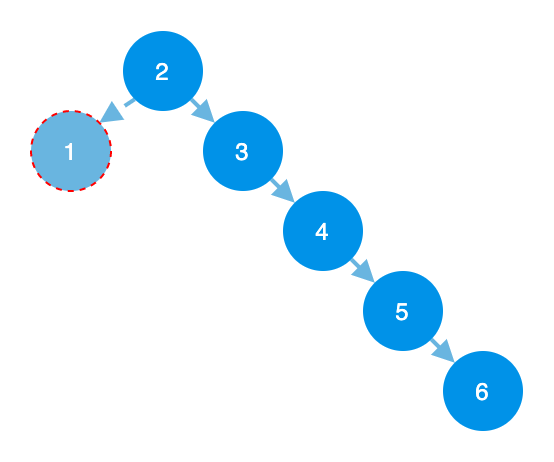
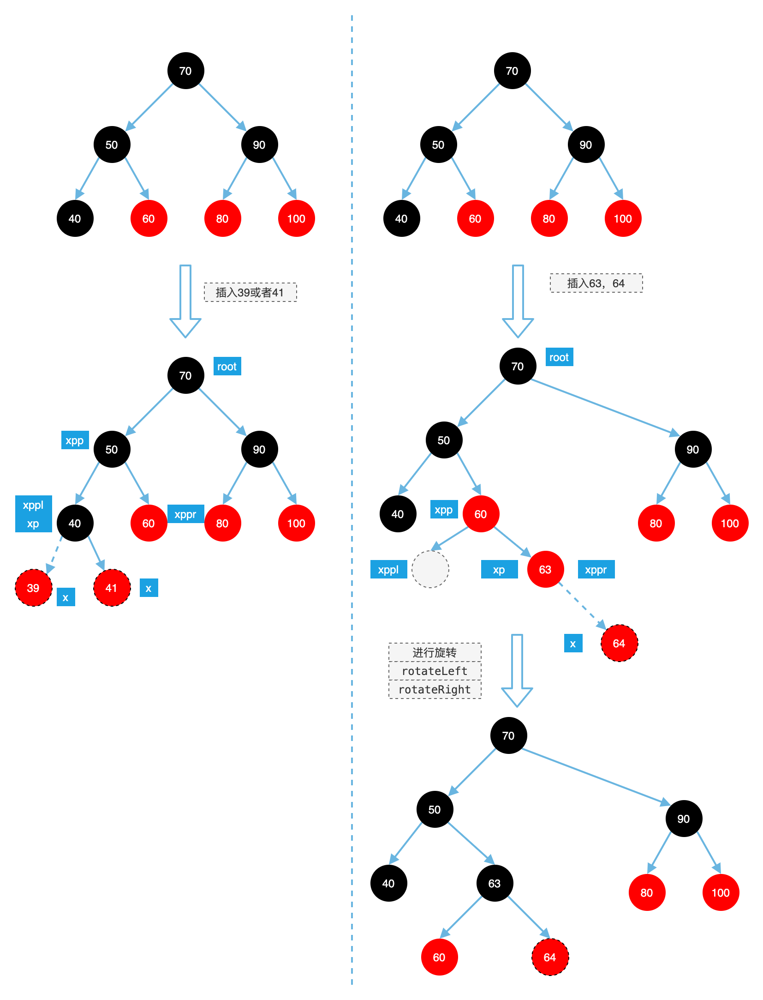
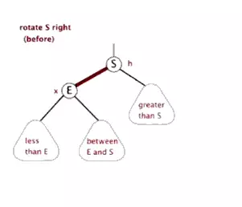
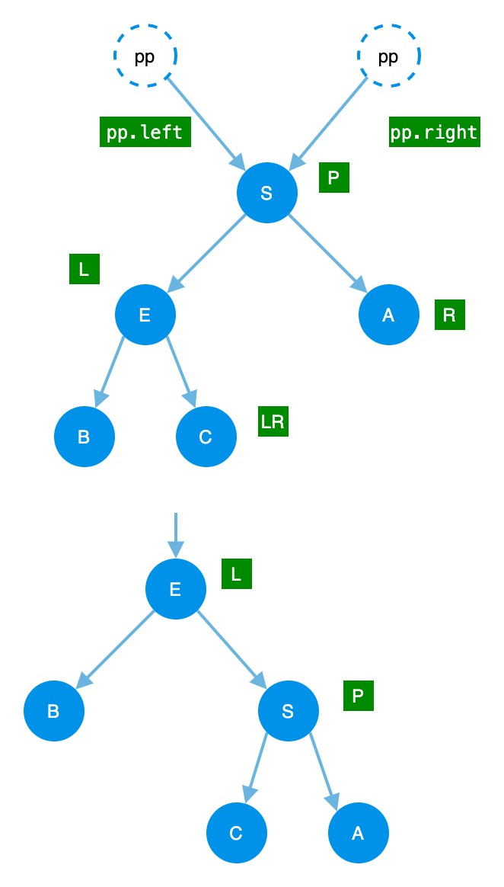
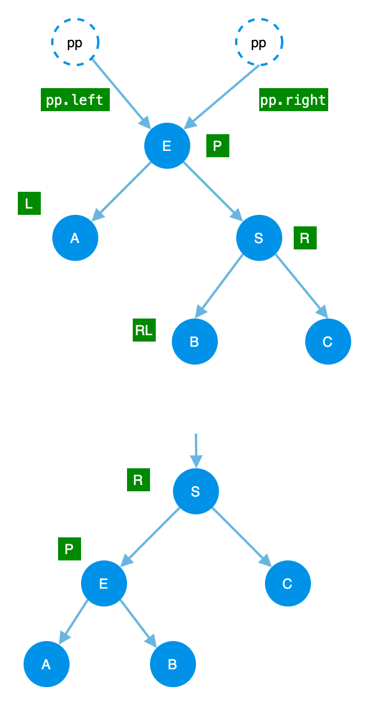

`HashMap` 的数据结构之 `Red-Black Tree`

`HashMap` 中使用`红黑树`这种数据结构，解决 `hash` 冲突之后，数据查询效率下降的问题。

这里对 `HashMap` 中与树的创建，插入，删除，左旋，右旋的方法的进行拆解

其他关于红黑树的概念，可以参考文章末尾的链接

<!--truncate-->

- [Red-Black Tree](#red-black-tree)
  - [Red-Black Tree 5个特性](#red-black-tree-5个特性)
- [treeifyBin](#treeifybin)
- [treeify](#treeify)
- [balanceInsertion](#balanceinsertion)
- [balanceDeletion](#balancedeletion)
- [rotateRight](#rotateright)
- [rotateLeft](#rotateleft)
- [Links](#links)

## Red-Black Tree

红黑树/二叉树 创建的可视化网站

- [https://www.cs.usfca.edu/~galles/visualization/RedBlack.html](https://www.cs.usfca.edu/~galles/visualization/RedBlack.html)
- [https://visualgo.net/en/bst](https://visualgo.net/en/bst)

### Red-Black Tree 5个特性

1. 节点是红色或黑色。

2. 根节点是黑色。

3. 所有叶子节点都是黑色的空节点。(叶子节点是NIL节点或NULL节点)

4. 每个红色节点的两个子节点都是黑色节点。(从每个叶子节点到根的所有路径上不能有两个连续的红色节点)

5. 从任一节点到其每个叶子节点的所有路径都包含相同数目的黑色节点。

下面来自 `Introduction to Algorithms - 3rd Edition`

A red-black tree is a binary tree that satisfies the following red-black properties:

1. Every node is either red or black.
2. The root is black.
3. Every leaf (NIL) is black.
4. If a node is red, then both its children are black.
5. For each node, all simple paths from the node to descendant leaves contain the same number of black nodes.

## treeifyBin

下面是代码，后面会有解释

```java
/**
 * Replaces all linked nodes in bin at index for given hash unless
 * table is too small, in which case resizes instead.
 */
final void treeifyBin(Node<K,V>[] tab, int hash) {
    int n, index; Node<K,V> e;
    // MIN_TREEIFY_CAPACITY =64 小于64仅仅是扩容
    // 数组的长度大于64才开始把链表变成树
    if (tab == null || (n = tab.length) < MIN_TREEIFY_CAPACITY)
        resize();
    else if ((e = tab[index = (n - 1) & hash]) != null) {// 元素所在的位置有值
        // 这个hash是你put元素的hash,因此这里仅仅是把这个hash
        // 所在数组的链表转化成树
        TreeNode<K,V> hd = null, tl = null;
        do {// 开始转化
            TreeNode<K,V> p = replacementTreeNode(e, null);// Node -> TreeNode
            if (tl == null)
                hd = p;// hd 是第一个被转化的元素
            else {
                p.prev = tl;// 改当前一个元素的prev
                tl.next = p;// 改变前一个元素的next
                // 上面的两个操作创建了双向链表
            }
            tl = p;// 每次循环都会更新 tl
        } while ((e = e.next) != null);
        if ((tab[index] = hd) != null)// 把上面创建的链放在index位置
            hd.treeify(tab);// 这里才是链表变成树的重点
    }
}
```

`treeifyBin` 方法，把 `Node` 链表转换成 `TreeNode` 链表，`treeify` 方法然后在把`链表`变成`树`

下图是一个转换过程:


## treeify

```java
final void treeify(Node<K,V>[] tab) {
    TreeNode<K,V> root = null;
    // TreeNode 链表循环
    for (TreeNode<K,V> x = this, next; x != null; x = next) {
        next = (TreeNode<K,V>)x.next;
        x.left = x.right = null;
        if (root == null) {
            x.parent = null;
            x.red = false;
            root = x;
        }
        else {
            // x 是当前要插入的新节点
            K k = x.key;
            int h = x.hash;
            Class<?> kc = null;
            // 从树的根节点开始进行节点比较放到合适的位置
            for (TreeNode<K,V> p = root;;) {
                int dir, ph;
                K pk = p.key;
                // 计算 dir
                if ((ph = p.hash) > h)
                    dir = -1;
                else if (ph < h)
                    dir = 1;
                else if ((kc == null &&
                          (kc = comparableClassFor(k)) == null) ||
                         (dir = compareComparables(kc, k, pk)) == 0)
                    dir = tieBreakOrder(k, pk);
                // 计算 dir 结束，也是计算新插入的节点，放在左边还是右边已经确定了
                TreeNode<K,V> xp = p;
                // 找到节点p,如果p 的左/右字节点为空
                // 就是找到插入的位置了，插入节点，进行树的平衡
                // 然后结束循环
                if ((p = (dir <= 0) ? p.left : p.right) == null) {
                    x.parent = xp;
                    if (dir <= 0)
                        xp.left = x;
                    else
                        xp.right = x;
                    root = balanceInsertion(root, x);// 插入成功，进行重新树的平衡
                    break;// 结束循环
                }
                // 不为空，继续循环
            }
        }
    } // TreeNode 链表循环结束
    moveRootToFront(tab, root);
}
```

这里说下为什么需要进行 `树的平衡` 这个操作，如下图，如果不进行树的平衡，那么创建的一棵树有可能是下面这样子的。



如果创建了一个这样的树，那么本来是`树`的数据结构就`退化`成了链表，这样子的树是没有意义的，因此需要执行树的平衡

## balanceInsertion

> 插入操作

`balanceInsertion` 的代码可以参考下面的图，进行理解。(下图只是列举了xpp节点是黑色的情况)

```java
// HashMap.TreeNode#balanceInsertion
// 在 treeify 可以，此时 x 已经插入到树种了
// 下面的操作就是进行重新平衡
static <K,V> TreeNode<K,V> balanceInsertion(TreeNode<K,V> root,
                                            TreeNode<K,V> x) {// x 是当前插入的新节点
    x.red = true;// 设置成红色，这样做的目的是减少插入节点导致违背 红黑树5个特性的概率
    for (TreeNode<K,V> xp, xpp, xppl, xppr;;) {
        if ((xp = x.parent) == null) {
            x.red = false;
            return x;
        }
        else if (!xp.red || (xpp = xp.parent) == null)
            return root;
        if (xp == (xppl = xpp.left)) {
            if ((xppr = xpp.right) != null && xppr.red) {
                xppr.red = false;
                xp.red = false;
                xpp.red = true;
                x = xpp;
            }
            else {
                if (x == xp.right) {
                    root = rotateLeft(root, x = xp);
                    xpp = (xp = x.parent) == null ? null : xp.parent;
                }
                if (xp != null) {
                    xp.red = false;
                    if (xpp != null) {
                        xpp.red = true;
                        root = rotateRight(root, xpp);
                    }
                }
            }
        }
        else {
            if (xppl != null && xppl.red) {
                xppl.red = false;
                xp.red = false;
                xpp.red = true;
                x = xpp;
            }
            else {
                if (x == xp.left) {
                    root = rotateRight(root, x = xp);
                    xpp = (xp = x.parent) == null ? null : xp.parent;
                }
                if (xp != null) {
                    xp.red = false;
                    if (xpp != null) {
                        xpp.red = true;
                        root = rotateLeft(root, xpp);
                    }
                }
            }
        }
    }
}
```



## balanceDeletion

```java
// HashMap.TreeNode#balanceDeletion
static <K,V> TreeNode<K,V> balanceDeletion(TreeNode<K,V> root,
                                           TreeNode<K,V> x) {
    for (TreeNode<K,V> xp, xpl, xpr;;) {
        if (x == null || x == root)
            return root;
        else if ((xp = x.parent) == null) {
            x.red = false;
            return x;
        }
        else if (x.red) {
            x.red = false;
            return root;
        }
        else if ((xpl = xp.left) == x) {
            if ((xpr = xp.right) != null && xpr.red) {
                xpr.red = false;
                xp.red = true;
                root = rotateLeft(root, xp);
                xpr = (xp = x.parent) == null ? null : xp.right;
            }
            if (xpr == null)
                x = xp;
            else {
                TreeNode<K,V> sl = xpr.left, sr = xpr.right;
                if ((sr == null || !sr.red) &&
                    (sl == null || !sl.red)) {
                    xpr.red = true;
                    x = xp;
                }
                else {
                    if (sr == null || !sr.red) {
                        if (sl != null)
                            sl.red = false;
                        xpr.red = true;
                        root = rotateRight(root, xpr);
                        xpr = (xp = x.parent) == null ?
                            null : xp.right;
                    }
                    if (xpr != null) {
                        xpr.red = (xp == null) ? false : xp.red;
                        if ((sr = xpr.right) != null)
                            sr.red = false;
                    }
                    if (xp != null) {
                        xp.red = false;
                        root = rotateLeft(root, xp);
                    }
                    x = root;
                }
            }
        }
        else { // symmetric
            if (xpl != null && xpl.red) {
                xpl.red = false;
                xp.red = true;
                root = rotateRight(root, xp);
                xpl = (xp = x.parent) == null ? null : xp.left;
            }
            if (xpl == null)
                x = xp;
            else {
                TreeNode<K,V> sl = xpl.left, sr = xpl.right;
                if ((sl == null || !sl.red) &&
                    (sr == null || !sr.red)) {
                    xpl.red = true;
                    x = xp;
                }
                else {
                    if (sl == null || !sl.red) {
                        if (sr != null)
                            sr.red = false;
                        xpl.red = true;
                        root = rotateLeft(root, xpl);
                        xpl = (xp = x.parent) == null ?
                            null : xp.left;
                    }
                    if (xpl != null) {
                        xpl.red = (xp == null) ? false : xp.red;
                        if ((sl = xpl.left) != null)
                            sl.red = false;
                    }
                    if (xp != null) {
                        xp.red = false;
                        root = rotateRight(root, xp);
                    }
                    x = root;
                }
            }
        }
    }
}
```

## rotateRight

- 一：为什么需要右旋
- 二：什么时候进行右旋
- 三：怎么右旋

:::tip
右旋：以某个节点作为支点(旋转节点)，其左子节点变为旋转节点的父节点，左子节点的右子节点变为旋转节点的左子节点，旋转节点的右子节点保持不变。左子节点的右子节点相当于从左子节点上“断开”，重新连接到旋转节点上。
:::



```java
static <K,V> TreeNode<K,V> rotateRight(TreeNode<K,V> root,
                                       TreeNode<K,V> p) {
    TreeNode<K,V> l, pp, lr;
    if (p != null && (l = p.left) != null) {// 右旋 左子节点必须不为空 l=E
        if ((lr = p.left = l.right) != null)// E.left=C,lr=C
            lr.parent = p;//C.parent=S
        if ((pp = l.parent = p.parent) == null)
            (root = l).red = false;// 没有其他节点，更新root 节点为S,同时修改颜色
        else if (pp.right == p)//S 是pp 的左子节点还是右子节点
            pp.right = l;// 更新pp 的右子节点
        else
            pp.left = l;// 更新pp 的左子节点
        l.right = p;// E.right=S
        p.parent = l;//S.parent=E
    }
    return root;
}
```



## rotateLeft

- 一：为什么需要左旋
- 二：什么时候进行左旋
- 三：怎么左旋

:::tip
左旋：以某个节点作为支点(旋转节点)，其右子节点变为旋转节点的父节点，右子节点的左子节点变为旋转节点的右子节点，旋转节点的左子节点保持不变。右子节点的左子节点相当于从右子节点上“断开”，重新连接到旋转节点上。
:::


```java
static <K,V> TreeNode<K,V> rotateLeft(TreeNode<K,V> root,
                                      TreeNode<K,V> p) {
    TreeNode<K,V> r, pp, rl;
    if (p != null && (r = p.right) != null) {// 左旋，右节点必须存在
        if ((rl = p.right = r.left) != null)//E.right=B,rl=B
            rl.parent = p;// B.parent=E
        if ((pp = r.parent = p.parent) == null)// S.parent=pp
            (root = r).red = false;// 没有其他节点，更新root 节点为S,同时修改颜色
        else if (pp.left == p)//E 是pp 的左节点还是右节点
            pp.left = r;// 更新pp的左子节点
        else
            pp.right = r;// 更新pp的右子节点
        r.left = p;// S.left=E
        p.parent = r;//E.parent=S
    }
    return root;
}
```



## Links

参考文章

- [红黑树-左旋-右旋](https://zhuanlan.zhihu.com/p/37470948)
- [红黑树简介及左旋、右旋、变色](https://blog.csdn.net/weixin_43790276/article/details/106042360)
- [https://www.cnblogs.com/skywang12345/p/3245399.html](https://www.cnblogs.com/skywang12345/p/3245399.html)