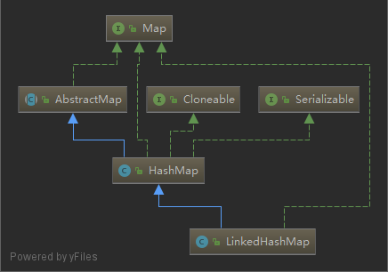

# map

- [map](#map)
  - [概要](#%E6%A6%82%E8%A6%81)
  - [问题思考](#%E9%97%AE%E9%A2%98%E6%80%9D%E8%80%83)
  - [HashMap](#hashmap)
  - [LinkedHashMap](#linkedhashmap)
    - [插入顺序的实现](#%E6%8F%92%E5%85%A5%E9%A1%BA%E5%BA%8F%E7%9A%84%E5%AE%9E%E7%8E%B0)
    - [源码分析](#%E6%BA%90%E7%A0%81%E5%88%86%E6%9E%90)
    - [访问顺序的实现](#%E8%AE%BF%E9%97%AE%E9%A1%BA%E5%BA%8F%E7%9A%84%E5%AE%9E%E7%8E%B0)
  - [TreeMap](#treemap)
  - [ConcurrentHashMap](#concurrenthashmap)
  - [好文链接](#%E5%A5%BD%E6%96%87%E9%93%BE%E6%8E%A5)


## 概要

Map 的集合实现可以分三类：

1. 普通的实现 `HashMap`,`TreeMap`,`LinkedHashMap`
2. 特殊实现 `EnumMap`,`WeakHashMap`,`IdentityHashMap`
3. `ConcurrentHashMap` 并发实现

`TreeMap` 可以保证放入`Map`的元素是有序的（key 自然顺序）,`HashMap`不保证顺序，但是性能比`TreeMap`好。

如果你需要好的性能&key 的插入顺序（这是是插入顺序，不是自然顺序），你可以使用 `LinkedHashMap`.此外，LinkedHashMap 还可以实现 key 的访问顺序。

## 问题思考

- 1 为什么 `HashMap` 无法保证顺序？
- 2 `TreeMap` 是如何实现 key 的自然顺序的？
- 3 `LinkedHashMap` 的插入顺序和访问顺序是如果实现的？

## HashMap

[hash表的解释](https://liujiacai.net/blog/2015/09/03/java-hashmap/#哈希表（hash-table）)

自己动手画了一个hash冲突产生的图（假设k3与k5产生了hash冲突）
如果产生了hash冲突，那么`HashMap`中的元素按照链表的方式存储


```java
key --hash function--> hashcode ----index function--> 索引 ----> 放入bucketsz中(放入buckets是一个Map.Entry 数组)
```

HashMap的源码遍历实现:

```java
    // source version jdk 1.8
    @Override
    public void forEach(BiConsumer<? super K, ? super V> action) {
        Node<K,V>[] tab;
        if (action == null)
            throw new NullPointerException();
        if (size > 0 && (tab = table) != null) {
            int mc = modCount;
            // 通过Node<K,V>[] table的长度顺序遍历
            // 通过Node实现了Map.Entry接口
            for (int i = 0; i < tab.length; ++i) {
                // 如果产生了hash冲突图，继续循环遍历
                for (Node<K,V> e = tab[i]; e != null; e = e.next)
                    action.accept(e.key, e.value);
            }
            if (modCount != mc)
                throw new ConcurrentModificationException();
        }
    }
```

因此遍历输出的顺序是:

```java
    k1
    k2
    k3
    k5
    k4
    k6
    k7
```

所以`HashMap`是无序的（插入的顺序是k1->k7,但是循环遍历的结果，则不是）

## LinkedHashMap

`LinkedHashMap` 继承了 `HashMap`



### 插入顺序的实现

`LinkedHashMap` 内部是基于链表实现的

[LinkedHashMap 算法实现(环型双向链表)](https://liujiacai.net/blog/2015/09/12/java-linkedhashmap/#双向链表)

### 源码分析

`LinkedHashMap` 没有重写 `HashMap` 的 put 方法，而是重写了 `newTreeNode` 方法

```java
   TreeNode<K,V> newTreeNode(int hash, K key, V value, Node<K,V> next) {
        TreeNode<K,V> p = new TreeNode<K,V>(hash, key, value, next);
        // 多了这个方法
        linkNodeLast(p);
        return p;
    }

     // link at the end of list
    private void linkNodeLast(LinkedHashMap.Entry<K,V> p) {
        LinkedHashMap.Entry<K,V> last = tail;
        tail = p;
        if (last == null)
            head = p;
        else {
            // 把新的节点放在链表的最末端
            p.before = last;
            last.after = p;
        }
    }
```

遍历的实现：

```java
    public void forEach(BiConsumer<? super K, ? super V> action) {
        if (action == null)
            throw new NullPointerException();
        int mc = modCount;
        // 从链表的头开始找，一直到空
        for (LinkedHashMap.Entry<K,V> e = head; e != null; e = e.after)
            action.accept(e.key, e.value);
        if (modCount != mc)
            throw new ConcurrentModificationException();
    }
```

`LinkedHashMap`中所有的`Entry`都是链接在一起的，遍历的时候，从链表的头一直遍历到链表的结束，从而保证其插入顺序的有序。

### 访问顺序的实现

```java
// 构造一个 LinkedHashMap,实现访问顺序
// jdk 的默认实现是在每次访问一个元素之后，这个元素，会被移动到最后
// 你也可以重写 afterNodeAccess 方法实现自定义的规则
Map<String, String> map = new LinkedHashMap<>(2,0.75f,true);

// LinkedHashMap 实现了HashMap 的 afterNodeAccess 方法
// 如果 accessOrder = true,在每次访问元素的时候，都会调用此方法
// 把这个元素放在 Entry 链接的最后
// jdk 1.8 源码
void afterNodeAccess(Node<K,V> e) { // move node to last
    LinkedHashMap.Entry<K,V> last;
    // 如果 accessOrder = true & tail!=e(存在二个以上的元素)
    if (accessOrder && (last = tail) != e) {
        // p = e
        // b = e 之前的元素
        // a = e 之后的元素
        LinkedHashMap.Entry<K,V> p =
            (LinkedHashMap.Entry<K,V>)e, b = p.before, a = p.after;
        // 把当前元素的后续元素指向 null
        p.after = null;
        // 如果 e 之前的元素不存在，那把 a 当做 head,(因为 e 要变成 tail)
        if (b == null)
            head = a;
        else
            b.after = a;// 否则 a 就向前移动，成为 e 之前元素 b 的 tail
        if (a != null)// 如果 e 的尾巴 a 不为空，让 a 的前一个元素指向 b
            a.before = b;
        else
            last = b;// last 指向b(但是这里b可能为空，因此后续会进行判断)
        if (last == null)// 如果b(last)为空，那么e就是head
            head = p;
        else {
            p.before = last;// 如果tail不为空，e(p)要移动到最后(在last之后)
            last.after = p;// 把p放在链表最后
        }
        tail = p;// 更新tail
        ++modCount;
    }
}
```

## TreeMap

1. 可以实现 `Comparator` 接口，当成参数传给 `TreeMap`,`TreeMap` 会使用`Comparator` 的 `compare` 方法进行比较，实现排序
2. 如果没有使用 `Comparator`,`TreeMap` 会使用 `key` 的对应的 `Comparable` 的`compareTo` 方法进行比较(此时key不能为null)
3. `TreeMap` 重写了 `Map` 的 `put` 方法,使用`红黑二叉树(From CLR)`算法保证顺序（每次put元素之后，都会遍历整个树，保证顺序）

具体的算法实现可以参考 [TreeMap的算法实现](https://liujiacai.net/blog/2015/09/04/java-treemap/)

## ConcurrentHashMap

[ConcurrentHashMap from IBM doc](https://www.ibm.com/developerworks/cn/java/java-lo-concurrenthashmap/index.html)

## 好文链接

- [讲述了hashcode方法的优点，缺点](https://ericlippert.com/2011/02/28/guidelines-and-rules-for-gethashcode/)
- [hashmap](https://liujiacai.net/blog/2015/09/03/java-hashmap/)
- [hashset vs hashmap](http://www.cnblogs.com/ywl925/p/3865269.html)
- [map (oracle doc)](https://docs.oracle.com/javase/tutorial/collections/implementations/map.html)