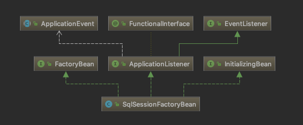

# SqlSessionFactoryBean

- [SqlSessionFactoryBean](#sqlsessionfactorybean)
  - [Class define](#class-define)
  - [UML](#uml)
  - [buildSqlSessionFactory](#buildsqlsessionfactory)
  - [XMLMapperBuilder](#xmlmapperbuilder)
  - [SqlSessionFactory](#sqlsessionfactory)
  - [SqlSession](#sqlsession)

## Class define

```java
public class SqlSessionFactoryBean implements FactoryBean<SqlSessionFactory>, InitializingBean, ApplicationListener<ApplicationEvent> {

}
```

## UML



首先 `SqlSessionFactoryBean` 实现了 `FactoryBean` 接口，根据签名可知,它的作用是生成 `SqlSessionFactory` 对象

在执行  `getObject` 方法的时候,会进行 `SqlSessionFactory` 的初始化操作


```java
// SqlSessionFactoryBean
public SqlSessionFactory getObject() throws Exception {
  if (this.sqlSessionFactory == null) {
    afterPropertiesSet();
  }
  return this.sqlSessionFactory;
}
```

## buildSqlSessionFactory

[SqlSessionFactoryBean.buildSqlSessionFactory](https://github.com/mybatis/spring/blob/master/src/main/java/org/mybatis/spring/SqlSessionFactoryBean.java#L489)

`SqlSessionFactoryBean` 的核心方法是 `buildSqlSessionFactory` 它做了下面的几个事情

```java
// 主要逻辑就是根据 SqlSessionFactoryBean 的配置，解析参数赋值
// 01. configuration
// 02. objectFactory
// 03. objectWrapperFactory
// 04. typeAliasesPackage
// 05. typeAliases
// 06. plugins
// 07. typeHandlersPackage
// 08. typeHandlers
// 09. transactionFactory
// 10. environment
// 11. databaseIdProvider
// 12. mapperLocations
protected SqlSessionFactory buildSqlSessionFactory() throws IOException {
  Configuration configuration;
  // DefaultSqlSessionFactory
  return this.sqlSessionFactoryBuilder.build(configuration);
}
```

```java
// 这里解析mapper
// 也就是 SqlSessionFactoryBean 的 mapperLocations 配置
XMLMapperBuilder xmlMapperBuilder = new XMLMapperBuilder(mapperLocation.getInputStream(),
              configuration, mapperLocation.toString(), configuration.getSqlFragments());
          xmlMapperBuilder.parse();
```

```xml
<bean id="sqlSessionFactory" class="org.mybatis.spring.SqlSessionFactoryBean">
      <property name="dataSource" ref="dataSource"/>
      <property name="typeAliasesPackage" value="cn.web1992.mybatiss.dal.domain"/>
      <property name="configLocation" value="classpath:/config/mybatis/mybatis-config.xml"/>
      <!-- 这里解析mapper -->
      <property name="mapperLocations" value="classpath*:cn/web1992/*/dal/dao/*.xml" />
</bean>
```

## XMLMapperBuilder

`parse` & `configurationElement`

```java
public void parse() {
  if (!configuration.isResourceLoaded(resource)) {
    configurationElement(parser.evalNode("/mapper"));
    configuration.addLoadedResource(resource);
    bindMapperForNamespace();
  }
  parsePendingResultMaps();
  parsePendingChacheRefs();
  parsePendingStatements();
}
private void configurationElement(XNode context) {
  try {
    String namespace = context.getStringAttribute("namespace");
    builderAssistant.setCurrentNamespace(namespace);
    cacheRefElement(context.evalNode("cache-ref"));
    cacheElement(context.evalNode("cache"));
    parameterMapElement(context.evalNodes("/mapper/parameterMap"));
    resultMapElements(context.evalNodes("/mapper/resultMap"));
    sqlElement(context.evalNodes("/mapper/sql"));
    buildStatementFromContext(context.evalNodes("select|insert|update|delete"));
  } catch (Exception e) {
    throw new RuntimeException("Error parsing Mapper XML. Cause: " + e, e);
  }
}
```

> UserDao.xml

```xml
<?xml version="1.0" encoding="UTF-8"?>
<!DOCTYPE mapper PUBLIC "-//mybatis.org//DTD Mapper 3.0//EN" "http://mybatis.org/dtd/mybatis-3-mapper.dtd">
<mapper namespace="cn.web1992.mybatiss.dal.dao.UserDao">

    <!-- mapper *. xml 文件需要通过 maven 插件复制到 classes 目录下面，才能被找到 -->
    <resultMap id="BaseResultMap" type="cn.web1992.mybatiss.dal.domain.User">
        <id column="id"  property="id"/>
        <result column="name" property="name"/>
    </resultMap>
    <insert id="add">
        insert into t_user (id,name) values(#{id},#{name})
    </insert>

    <select id="get" resultType="cn.web1992.mybatiss.dal.domain.User">
        select * from t_user where id =#{id};
    </select>

    <update id="update" parameterType="cn.web1992.mybatiss.dal.domain.User">
        update  t_user set `name`=#{name} where id=#{id};
    </update>

</mapper>
```

## SqlSessionFactory

```java
public interface SqlSessionFactory {
  SqlSession openSession();
  SqlSession openSession(boolean autoCommit);
  SqlSession openSession(Connection connection);
  SqlSession openSession(TransactionIsolationLevel level);
  SqlSession openSession(ExecutorType execType);
  SqlSession openSession(ExecutorType execType, boolean autoCommit);
  SqlSession openSession(ExecutorType execType, TransactionIsolationLevel level);
  SqlSession openSession(ExecutorType execType, Connection connection);
  Configuration getConfiguration();
}
```

## SqlSession

```java
public interface SqlSession {

  <T> T selectOne(String statement);

  <T> T selectOne(String statement, Object parameter);

  <E> List<E> selectList(String statement);

  <E> List<E> selectList(String statement, Object parameter);


  <E> List<E> selectList(String statement, Object parameter, RowBounds rowBounds);

  <K, V> Map<K, V> selectMap(String statement, String mapKey);

  <K, V> Map<K, V> selectMap(String statement, Object parameter, String mapKey);

  <K, V> Map<K, V> selectMap(String statement, Object parameter, String mapKey, RowBounds rowBounds);

  void select(String statement, Object parameter, ResultHandler handler);

  void select(String statement, ResultHandler handler);

  void select(String statement, Object parameter, RowBounds rowBounds, ResultHandler handler);

  int insert(String statement);

  int insert(String statement, Object parameter);

  int update(String statement);

  int update(String statement, Object parameter);

  int delete(String statement);

  int delete(String statement, Object parameter);

  void commit();

  void commit(boolean force);

  void rollback();

  void rollback(boolean force);

  public List<BatchResult> flushStatements();

  void close();

  void clearCache();

  Configuration getConfiguration();

  <T> T getMapper(Class<T> type);

  Connection getConnection();
}
```
