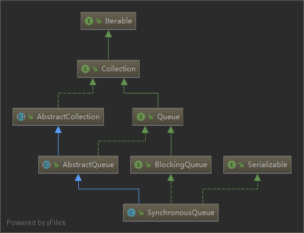
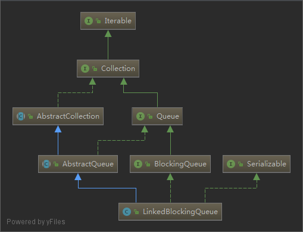
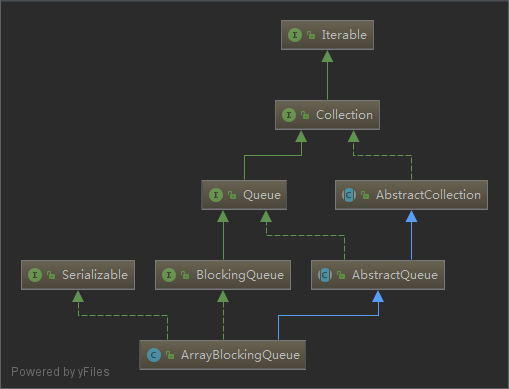
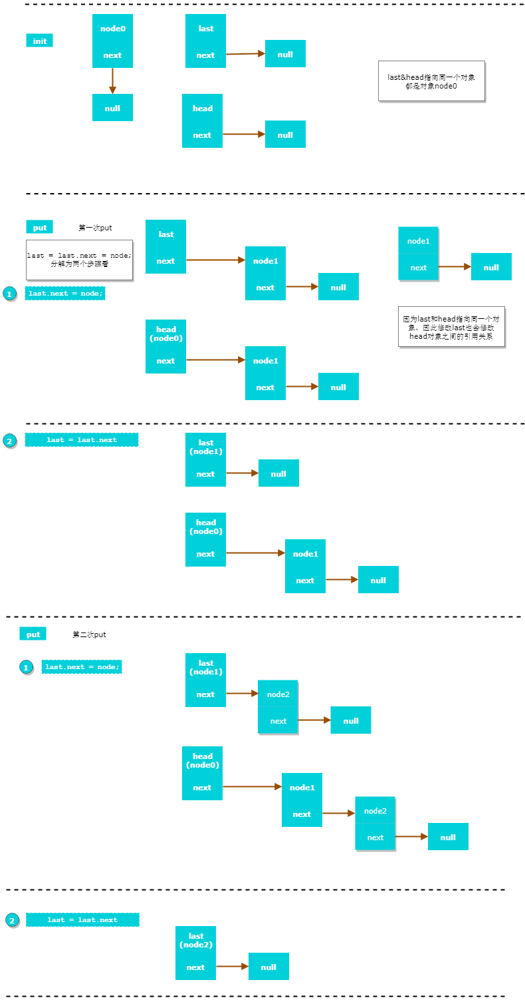

# Queue

- [Queue](#queue)
  - [queue-常见实现类](#queue-%E5%B8%B8%E8%A7%81%E5%AE%9E%E7%8E%B0%E7%B1%BB)
  - [BlockingQueue Method list](#blockingqueue-method-list)
  - [ArrayBlockingQueue](#arrayblockingqueue)
    - [put](#put)
    - [take](#take)
    - [enqueue](#enqueue)
    - [dequeue](#dequeue)
  - [LinkedBlockingQueue](#linkedblockingqueue)
    - [init](#init)
    - [LinkedBlockingQueue enqueue](#linkedblockingqueue-enqueue)
    - [LinkedBlockingQueue dequeue](#linkedblockingqueue-dequeue)
  - [demo](#demo)
  - [ArrayBlockingQueue vs LinkedBlockingQueue](#arrayblockingqueue-vs-linkedblockingqueue)
  - [SynchronousQueue](#synchronousqueue)
  - [参考文档](#%E5%8F%82%E8%80%83%E6%96%87%E6%A1%A3)

## queue-常见实现类

| queue               | uml                                                      |
| ------------------- | -------------------------------------------------------- |
| SynchronousQueue    |        |
| LinkedBlockingQueue |  |
| ArrayBlockingQueue  |  |

## BlockingQueue Method list

下面的方法，有些会阻塞，有些会抛出异常，在使用的时候，需要理解每个方法产生的影响，避免坑。

| Action  | Throws exception | Special value | Blocks         | Times out            |
| ------- | ---------------- | ------------- | -------------- | -------------------- |
| Insert  | add(e)           | offer(e)      | put(e)         | offer(e, time, unit) |
| Remove  | remove()         | poll()        | take()         | poll(time, unit)     |
| Examine | element()        | peek()        | not applicable | not applicable       |

## ArrayBlockingQueue


- FIFO (first-in-first-out)先进先出
- 底层实现是数组
- 线程安全，只使用一个可重入锁来来控制线程访问
- 添加元素总是在队列末部
- 删除元素总是在队列头部
- 基于数组,大小在初始化时固定不变
- 如果 queue 满了，`put`方法继续添加元素的时候，就会阻塞
- 如果 queue 是空的，`take`方法会阻塞一直到有数据插入

### put

```java
    public void put(E e) throws InterruptedException {
        checkNotNull(e);
        final ReentrantLock lock = this.lock;
        lock.lockInterruptibly();
        try {
            while (count == items.length)
                notFull.await();
            enqueue(e);
        } finally {
            lock.unlock();
        }
    }
```

### take

```java
    public E take() throws InterruptedException {
        final ReentrantLock lock = this.lock;
        lock.lockInterruptibly();
        try {
            while (count == 0)
                notEmpty.await();
            return dequeue();
        } finally {
            lock.unlock();
        }
    }
```

### enqueue

```java
    private void enqueue(E x) {
        // assert lock.getHoldCount() == 1;
        // assert items[putIndex] == null;
        final Object[] items = this.items;
        items[putIndex] = x;
        if (++putIndex == items.length)
            putIndex = 0;
        count++;
        notEmpty.signal();
    }
```

### dequeue

```java
    private E dequeue() {
        // assert lock.getHoldCount() == 1;
        // assert items[takeIndex] != null;
        final Object[] items = this.items;
        @SuppressWarnings("unchecked")
        E x = (E) items[takeIndex];
        items[takeIndex] = null;
        if (++takeIndex == items.length)
            takeIndex = 0;
        count--;
        if (itrs != null)
            itrs.elementDequeued();
        notFull.signal();
        return x;
    }
```

## LinkedBlockingQueue

- FIFO (first-in-first-out)
- 底层使用链表而非数组存储元素
- 添加元素总是在队列末部
- 删除元素总是在队列头部
- 使用两个锁来控制线程访问，这样队列可以同时进行put和take的操作，因此吞吐量相对ArrayBlockingQueue就高
- 可以不指定队列大小，此时默认大小为Integer.MAX_VALUE (无边际的队列，会导致内存泄漏)

### init

```java
    public LinkedBlockingQueue(int capacity) {
        if (capacity <= 0) throw new IllegalArgumentException();
        this.capacity = capacity;
        // last head 都指向同一个node
        // 因此enqueue，dequeue操作的都是同一个对象new Node<E>
        // last,head可以理解为初始化时候new Node<E>的两个别名
        last = head = new Node<E>(null);
    }
```

### LinkedBlockingQueue enqueue

```java
    private void enqueue(Node<E> node) {
        // assert putLock.isHeldByCurrentThread();
        // assert last.next == null;
        //  last和last.next 都指向node
        last = last.next = node;
    }
```

### LinkedBlockingQueue dequeue

```java
    private E dequeue() {
        // assert takeLock.isHeldByCurrentThread();
        // assert head.item == null;
        // 从队列的头部取元素
        Node<E> h = head;
        Node<E> first = h.next;
        h.next = h; // help GC
        head = first;
        E x = first.item;
        first.item = null;
        return x;
    }
```

## demo

`LinkedBlockingQueue`插入的图解[源文件(可导入draw.io进行编辑)](./draw.io/linked-bloking-queue.xml)

下面的图分为3部分:

1. init
2. 第一次put
3. 第二次put



下面是demo,里面的方法参考`LinkedBlockingQueue`中实现

```java
   public static void main(String[] args) {

        Node<String> node = new Node<>(null);
        Node<String> last = null;
        Node<String> head = null;
        last = head = node;
        System.out.println("last = " + last);
        System.out.println("head = " + head);

        Node<String> node1 = new Node<>("1");

        last = last.next = node1;//入队第一次）
        System.out.println("last = " + last);
        System.out.println("head = " + head);


        Node<String> node2 = new Node<>("2");

        last = last.next = node2;//入队（第二次）
        System.out.println("last = " + last);
        System.out.println("head = " + head);


        {   // 模拟出队（第一次）
            Node<String> h = head;
            Node<String> first = h.next;
            h.next = h; // help GC
            head = first;
            String x = first.item;
            first.item = null;

            System.out.println("last = " + last);
            System.out.println("head = " + head);
        }

        {   // 模拟出队（第二次）
            Node<String> h = head;
            Node<String> first = h.next;
            h.next = h; // help GC
            head = first;
            String x = first.item;
            first.item = null;

            System.out.println("last = " + last);
            System.out.println("head = " + head);

        }
    }


    static class Node<E> {
        E item;
        Node next;

        public Node(E item) {
            this.item = item;
        }

        @Override
        public String toString() {
            return "Node{" + "item=" + item + ", next=" + next + '}';
        }
    }
```

执行结果

```log
last = Node{item=null, next=null}
head = Node{item=null, next=null}
last = Node{item=1, next=null}
head = Node{item=null, next=Node{item=1, next=null}}
last = Node{item=2, next=null}
head = Node{item=null, next=Node{item=1, next=Node{item=2, next=null}}}
last = Node{item=2, next=null}
head = Node{item=null, next=Node{item=2, next=null}}
last = Node{item=null, next=null}
head = Node{item=null, next=null}
```

## ArrayBlockingQueue vs LinkedBlockingQueue

1. ArrayBlockingQueue 初始化必须声明大小, LinkedBlockingQueue 则不用，默认容量是 Integer.MAX_VALUE
2. ArrayBlockingQueue 基于数组, LinkedBlockingQueue 的数据结构是链表
3. ArrayBlockingQueue 中使用一个可重入锁进行并发控制, LinkedBlockingQueue 中使用二个可以重入锁，实现put,take的并发控制

## SynchronousQueue

## 参考文档

- [Queue (from oracle docs)](https://docs.oracle.com/javase/tutorial/collections/implementations/queue.html)
- [help GC(stackoverflow)](https://stackoverflow.com/questions/10106191/openjdks-linkedblockingqueue-implementation-node-class-and-gc)
