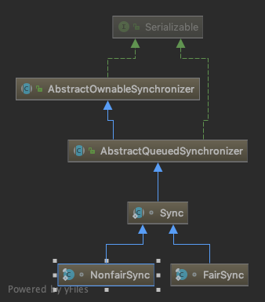

# ReentrantLock

- [ReentrantLock](#reentrantlock)
  - [简介](#%E7%AE%80%E4%BB%8B)
  - [Lock interface](#lock-interface)
  - [可重入的实现](#%E5%8F%AF%E9%87%8D%E5%85%A5%E7%9A%84%E5%AE%9E%E7%8E%B0)
  - [公平锁&非公平锁的实现](#%E5%85%AC%E5%B9%B3%E9%94%81%E9%9D%9E%E5%85%AC%E5%B9%B3%E9%94%81%E7%9A%84%E5%AE%9E%E7%8E%B0)
    - [NonfairSync](#nonfairsync)
    - [FairSync](#fairsync)
  - [AbstractQueuedSynchronizer](#abstractqueuedsynchronizer)
    - [acquire](#acquire)
    - [acquireQueued](#acquirequeued)
  - [demo](#demo)
  - [Link](#link)

## 简介

- 提供了和 `synchronized` 同样的语义，但是扩展了 `synchronized`
- 可以重入，同一个线程可以多次获取锁
- 实现了 `公平锁` & `非公平锁` 的语义
- 必须使用 `try`加锁，`finally` 来释放锁
- 可以使用 `tryLock` 设置锁的超时时间

## Lock interface

```java
// 这里看下 Lock接口的定义
// lock 用来获取锁
// unlock 用来释放锁
// Condition 负责线程的阻塞和唤醒
public interface Lock {
    void lock();
    void lockInterruptibly() throws InterruptedException;
    boolean tryLock();
    boolean tryLock(long time, TimeUnit unit) throws InterruptedException;
    void unlock();
    Condition newCondition();
}
```

## 可重入的实现

以公平锁为例，看下 `tryAcquire` 方法的实现

```java
protected final boolean tryAcquire(int acquires) {
    final Thread current = Thread.currentThread();
    int c = getState();// c=0 意味着没有线程获取锁
    if (c == 0) {
        // hasQueuedPredecessors 是判断是否有其他线程在排队，为了实现公平锁的语义
        // 下面尝试修改 state 的值，如果修改成功，那么代表获取锁成功
        if (!hasQueuedPredecessors() &&
            compareAndSetState(0, acquires)) {
            setExclusiveOwnerThread(current);
            return true;
        }
    }
    else if (current == getExclusiveOwnerThread()) {
        // 这里是可重入锁的实现
        // 如果之前获取锁的线程和当前线程是同一个
        // 就对 state +1
        // 这里 setState 直接设置，而没有使用 cas
        // 是因为当地线程已经获取锁了，其他线程不会修改 state 的值
        // 如果线程A执行了两次 lock 方法，那么必须执行两次 unlock
        // 线程A才会释放锁
        // 原因也很简单，执行了两次 lock 之后 state=2
        // 如果只执行一次 unlock ，此时state=1 ,不为 0
        // 其他线程是无法获取锁
        int nextc = c + acquires;
        if (nextc < 0)
            throw new Error("Maximum lock count exceeded");
        setState(nextc);
        return true;
    }
    return false;
}
```

> 陷阱： 如果使用了两次 try 获取锁，那么必须使用两次 unlock 去释放锁，否则其他线程会获取不到锁

## 公平锁&非公平锁的实现

`ReentrantLock` 使用两个内部类 `NonfairSync` 和 `FairSync` 来实现非公平锁和公平锁



### NonfairSync

```java
static final class NonfairSync extends Sync {
    private static final long serialVersionUID = 7316153563782823691L;
    /**
     * Performs lock.  Try immediate barge, backing up to normal
     * acquire on failure.
     */
    final void lock() {
        // 非公平锁在获取锁的时候，直接尝试修改 AbstractQueuedSynchronizer 的 state 字段来获取锁
        // 如果修改成功，那么就获取锁成功
        if (compareAndSetState(0, 1))
            setExclusiveOwnerThread(Thread.currentThread());
        else
            acquire(1);// 尝试获取锁失败，就去获取锁
    }
    protected final boolean tryAcquire(int acquires) {
        return nonfairTryAcquire(acquires); // 执行 nonfairTryAcquire 方法获取锁
    }
}

// Sync#nonfairTryAcquire
// nonfairTryAcquire 与 FairSync 的 tryAcquire 少了一个 !hasQueuedPredecessors() 这个操作
// hasQueuedPredecessors 方法会检查是否有线程在队列中，如果没有才会尝试获取锁
final boolean nonfairTryAcquire(int acquires) {
    final Thread current = Thread.currentThread();
    int c = getState();
    if (c == 0) {
        if (compareAndSetState(0, acquires)) {
            setExclusiveOwnerThread(current);
            return true;
        }
    }
    else if (current == getExclusiveOwnerThread()) {
        int nextc = c + acquires;
        if (nextc < 0) // overflow
            throw new Error("Maximum lock count exceeded");
        setState(nextc);
        return true;
    }
    return false;
}
```

### FairSync

```java
    static final class FairSync extends Sync {
        private static final long serialVersionUID = -3000897897090466540L;

        final void lock() {
            acquire(1);// 这里和 NonfairSync 的 lock  方法对比,少了一次尝试的动作
        }

        /**
         * Fair version of tryAcquire.  Don't grant access unless
         * recursive call or no waiters or is first.
         */
        protected final boolean tryAcquire(int acquires) {
            final Thread current = Thread.currentThread();
            int c = getState();
            if (c == 0) {
                if (!hasQueuedPredecessors() &&// 没有排队的线程才尝试获取锁，否则获取锁失败
                    compareAndSetState(0, acquires)) {
                    setExclusiveOwnerThread(current);
                    return true;
                }
            }
            else if (current == getExclusiveOwnerThread()) {
                int nextc = c + acquires;
                if (nextc < 0)
                    throw new Error("Maximum lock count exceeded");
                setState(nextc);
                return true;
            }
            return false;
        }
    }
```

## AbstractQueuedSynchronizer

### acquire

```java
// AbstractQueuedSynchronizer
// 1.tryAcquire 尝试获取锁
//   如果获取锁失败，那么把当前线程进入队列（执行addWaiter）
// 2.addWaiter 把当前线程封装成 Node 放入队列
// 3.acquireQueued 阻塞当前线程
public final void acquire(int arg) {
    if (!tryAcquire(arg) &&
        acquireQueued(addWaiter(Node.EXCLUSIVE), arg))
        selfInterrupt();
}
```

### acquireQueued

```java
// AbstractQueuedSynchronizer
// 这个方法做了下面几件事：
// 1.更新前一个 node 的 waitStatus = Node.SIGNAL
//   acquireQueued 方法是在 tryAcquire 执行失败之后执行的(获取锁失败)
//   然后通过 shouldParkAfterFailedAcquire 方法获取前一个node 的 waitStatus
//   如果不是 Node.SIGNAL 就更新为 Node.SIGNAL
// 2.阻塞当前线程
//   parkAndCheckInterrupt 方法使用 LockSupport.park(this); 阻塞当前线程
//   阻塞当前线程
// 3.获取锁
//   tryAcquire 是在 for(;;) 中执行的
//   当前线程在第一次调用 tryAcquire 时，获取锁失败，就会执行 parkAndCheckInterrupt
//   进入阻塞，当再次被唤醒时，再次调用 tryAcquire 获取锁,获取失败，再次进入阻塞
//   成功执行 return 结束循环
final boolean acquireQueued(final Node node, int arg) {
    boolean failed = true;
    try {
        boolean interrupted = false;
        for (;;) {
            final Node p = node.predecessor();
            if (p == head && tryAcquire(arg)) {// 尝试获取锁(当前线程)
                setHead(node);
                p.next = null; // help GC
                failed = false;
                return interrupted;
            }
            if (shouldParkAfterFailedAcquire(p, node) &&
                parkAndCheckInterrupt())// 这里会阻塞（阻塞当前线程）
                interrupted = true;
        }
    } finally {
        if (failed)
            cancelAcquire(node);
    }
}
```

## demo

```java
// 一个阻塞队列实现
class BlockArray<E> {

    Object[] element;


    int size;
    int count;
    int putprt;
    int takeptr;

    public BlockArray(int size) {
        this.size = size;
        element = new Object[size];
    }


    final ReentrantLock lock = new ReentrantLock();

    final Condition empty = lock.newCondition();

    final Condition full = lock.newCondition();


    public E put(E e) throws InterruptedException {
        lock.lock();
        try {
            while (count == size) {
                full.await();
            }
            element[putprt++] = e;
            if (putprt == size) {
                putprt = 0;
            }
            ++count;
            empty.signal();
        } finally {
            lock.unlock();
        }

        return e;
    }

    public E take() throws InterruptedException {
        E e = null;
        lock.lock();
        try {
            while (count == 0) {
                empty.await();
            }
            e = (E) element[takeptr++];
            if (takeptr == size) {
                takeptr = 0;
            }
            --count;
            full.signal();
        } finally {
            lock.unlock();
        }
        return e;
    }

}
    // test
    public static void main(String[] args) {
        BlockArray<Integer> blockArray = new BlockArray(5);

        new Thread(() -> {
            try {
                while (true) {
                    System.out.println("get " + blockArray.take());
                }
            } catch (InterruptedException e) {
                e.printStackTrace();
            }
        }).start();

        IntStream.range(0, 10).forEach(i -> {
            try {
                blockArray.put(i);
            } catch (InterruptedException e) {
                e.printStackTrace();
            }
        });
    }

```

## Link

- [condition.md](condition.md)
- [count-down-latch.md](count-down-latch.md)
- [https://tech.meituan.com/2018/11/15/java-lock.html](https://tech.meituan.com/2018/11/15/java-lock.html)
