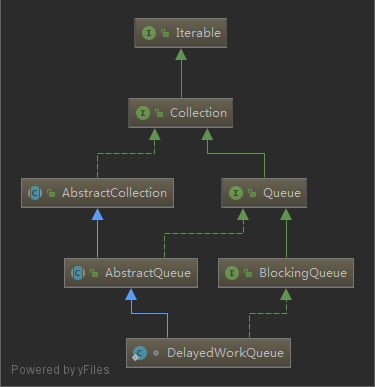

# ScheduledThreadPoolExecutor

`ScheduledThreadPoolExecutor` = `ThreadPoolExecutor`+`ScheduledExecutorService`


- [ScheduledThreadPoolExecutor](#scheduledthreadpoolexecutor)
  - [java doc](#java-doc)
  - [scheduleAtFixedRate](#scheduleatfixedrate)
  - [scheduleWithFixedDelay](#schedulewithfixeddelay)
  - [ScheduledFutureTask](#scheduledfuturetask)
    - [sequenceNumber](#sequencenumber)
    - [time](#time)
    - [period](#period)
    - [outerTask](#outertask)
    - [heapIndex](#heapindex)
  - [DelayedWorkQueue](#delayedworkqueue)
    - [offer](#offer)
    - [poll](#poll)

1. `ScheduledThreadPoolExecutor` 支持周期性执行某一个任务
2. 包装 `Runnable` `Callable` 为 ScheduledFutureTask
3. 使用自定义的 `DelayedWorkQueue` 执行任务

## java doc

 This class specializes ThreadPoolExecutor implementation by

 1. Using a custom task type, ScheduledFutureTask for
    tasks, even those that don't require scheduling (i.e.,
    those submitted using ExecutorService execute, not
    ScheduledExecutorService methods) which are treated as
    delayed tasks with a delay of zero.

 2. Using a custom queue (DelayedWorkQueue), a variant of
    unbounded DelayQueue. The lack of capacity constraint and
    the fact that corePoolSize and maximumPoolSize are
    effectively identical simplifies some execution mechanics
    (see delayedExecute) compared to ThreadPoolExecutor.

 3. Supporting optional run-after-shutdown parameters, which
    leads to overrides of shutdown methods to remove and cancel
    tasks that should NOT be run after shutdown, as well as
    different recheck logic when task (re)submission overlaps
    with a shutdown.

 4. Task decoration methods to allow interception and
    instrumentation, which are needed because subclasses cannot
    otherwise override submit methods to get this effect. These
    don't have any impact on pool control logic though.

## scheduleAtFixedRate

```java
public ScheduledFuture<?> scheduleAtFixedRate(Runnable command,
                                              long initialDelay,
                                              long period,
                                              TimeUnit unit) {
    if (command == null || unit == null)
        throw new NullPointerException();
    if (period <= 0)
        throw new IllegalArgumentException();
    ScheduledFutureTask<Void> sft =
        new ScheduledFutureTask<Void>(command,
                                      null,
                                      triggerTime(initialDelay, unit),
                                      unit.toNanos(period));
    RunnableScheduledFuture<Void> t = decorateTask(command, sft);
    sft.outerTask = t;
    delayedExecute(t);
    return t;
}
```

## scheduleWithFixedDelay

```java
public ScheduledFuture<?> scheduleWithFixedDelay(Runnable command,
                                                 long initialDelay,
                                                 long delay,
                                                 TimeUnit unit) {
    if (command == null || unit == null)
        throw new NullPointerException();
    if (delay <= 0)
        throw new IllegalArgumentException();
    ScheduledFutureTask<Void> sft =
        new ScheduledFutureTask<Void>(command,
                                      null,
                                      triggerTime(initialDelay, unit),
                                      unit.toNanos(-delay));
    RunnableScheduledFuture<Void> t = decorateTask(command, sft);
    sft.outerTask = t;
    delayedExecute(t);
    return t;
}
```

## ScheduledFutureTask


### sequenceNumber

### time

### period

### outerTask

### heapIndex

## DelayedWorkQueue



### offer

### poll