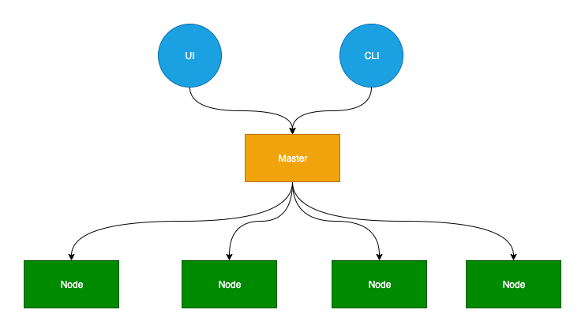
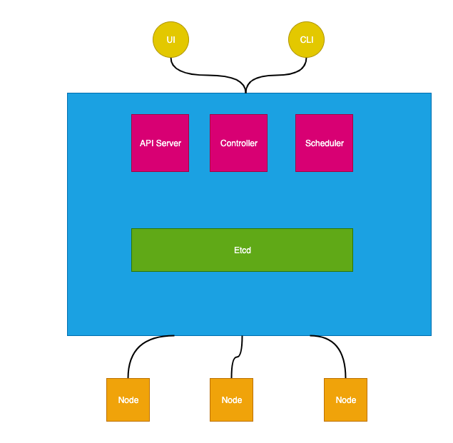
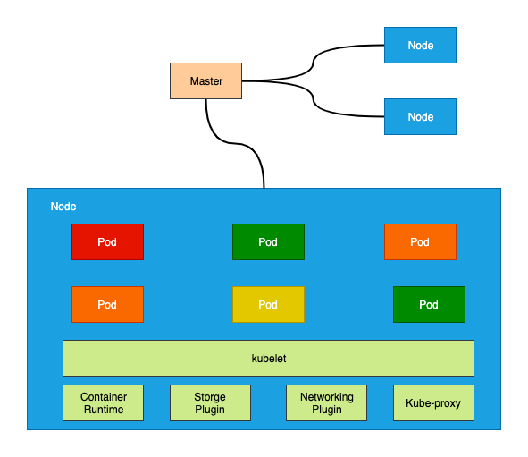

# Kubernetes

- [https://kubernetes.io/docs/concepts/overview/what-is-kubernetes/](https://kubernetes.io/docs/concepts/overview/what-is-kubernetes/)
- [https://kubernetes.io/docs/concepts/architecture](https://kubernetes.io/docs/concepts/architecture)
- [kubernetes.md](kubernetes.md)

## 自动化容器编排平台

- 部署
- 弹性
- 管理

## 核心功能

- 服务发现与负载均衡
- 容器自动装箱
- 存储编排
- 自动容器恢复
- 自动发布与回滚
- 配置与密文管理
- 批量执行
- 水平伸缩

- 调度
- 自动恢复
- 水平伸缩

## kubernets 架构

### Master

### Node

### Pod

Pod 解决的核心问题：容器之间高效的共享某些`资源`和`数据`

- 共享网络 Infra container
- 共享存储 Volumes shared-data

例子：War + Tomcat 应用部署

InitContainer(复制war) + Volumes(共享war) + Tomcat(使用war)

InitContainer 在其他容器启动之前启动

### Sidecar

容器的设计模式

场景：

- 应用日志收集
- 代理容器
- 适配器容器

设计模式的本质：解耦和重用
