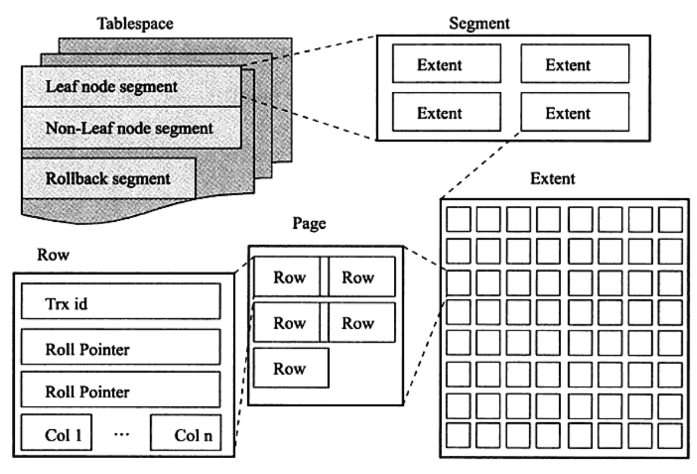

# mysql page

A unit representing how much data InnoDB transfers at any one time between disk (the data files) and memory (the buffer pool). A page can contain one or more rows, depending on how much data is in each row. If a row does not fit entirely into a single page, InnoDB sets up additional pointer-style data structures so that the information about the row can be stored in one page.

One way to fit more data in each page is to use `compressed` row format. For tables that use BLOBs or large text fields, compact row format allows those large columns to be stored `separately` from the rest of the row, reducing I/O overhead and memory usage for queries that do not reference those columns.

When InnoDB reads or writes sets of pages as a batch to increase I/O throughput, it reads or writes an extent at a time.

All the InnoDB disk data structures within a MySQL instance share the same page size.

## Links

- [https://dev.mysql.com/doc/refman/5.7/en/glossary.html#glos_page](https://dev.mysql.com/doc/refman/5.7/en/glossary.html#glos_page)
