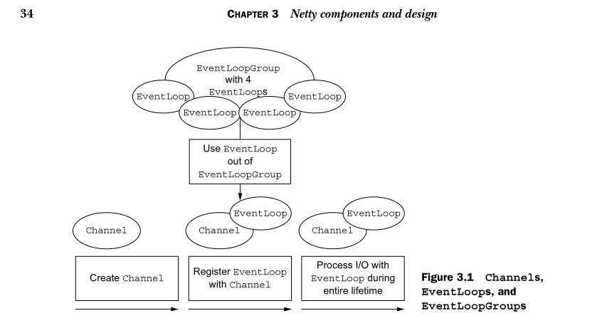

# CHAPTER 3

- Technical and architectural aspects of Netty
- `Channel` , `EventLoop` , and `ChannelFuture`
- `ChannelHandler` and `ChannelPipeline`
- Bootstrapping

## Channel

The following sections will add detail to our discussion of the `Channel` , `EventLoop` ,
and `ChannelFuture` classes which, taken together, can be thought of as representing
Netty’s networking abstraction:

- `Channel` —> Sockets
- `EventLoop` —> Control flow, multithreading, concurrency
- `ChannelFuture` —> Asynchronous notification

predefined, specialized implementations

- EmbeddedChannel
- LocalServerChannel
- NioDatagramChannel
- NioSctpChannel
- NioSocketChannel

## EventLoop

These relationships are:

- An `EventLoopGroup` contains one or more EventLoops.
- An `EventLoop` is bound to a single Thread for its lifetime.
- All I/O events processed by an `EventLoop` are handled on its dedicated Thread.
- A `Channel` is registered for its lifetime with a single `EventLoop`.
- A single `EventLoop` may be assigned to one or more Channels.

## ChannelFuture

`ChannelFutureListener`

## ChannelHandler

- `ChannelHandlerAdapter`
- `ChannelInboundHandlerAdapter`
- `ChannelOutboundHandlerAdapter`
- `ChannelDuplexHandlerAdapter`

## ChannelPipeline

## Encoders and decoders

- `ByteToMessageDecoder`
- `MessageToByteEncoder`

## SimpleChannelInboundHandler

## Bootstrapping

| Category                 | `Bootstrap`                        | `ServerBootstrap`     |
| ------------------------ | ---------------------------------- | --------------------- |
| Networking function      | Connects to a remote host and port | Binds to a local port |
| Number of EventLoopGroup | 1                                  | 2                     |
