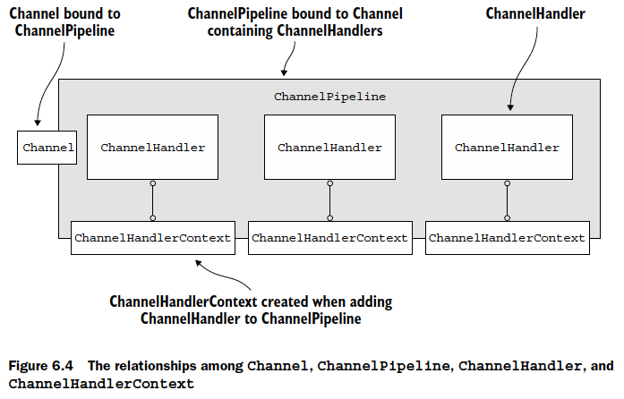

# CHAPTER 6

This chapter covers

- The ChannelHandler and ChannelPipeline APIs
- Detecting resource leaks
- Exception handling

- ChannelHandlers
- ChannelPipeline
- ChannelHandlerContext

## Channel lifecycle

## ChannelHandler lifecycle

## ChannelHandler adapters


## Resource management

## ChannelPipeline

In summary,

- A ChannelPipeline holds the ChannelHandlers associated with a Channel.
- A ChannelPipeline can be modified dynamically by adding and removing ChannelHandlers as needed.
- ChannelPipeline has a rich API for invoking actions in response to inbound and outbound events.

## ChannelHandlerContext

A ChannelHandlerContext represents an association between a ChannelHandler and
a ChannelPipeline and is created whenever a ChannelHandler is added to a Channel-
Pipeline. The primary function of a ChannelHandlerContext is to manage the interaction
of its associated ChannelHandler with others in the same ChannelPipeline.


ChannelHandlerContext, Channel, and ChannelPipeline. Figure
6.4 shows the relationships among them



- Accessing the Channel from a ChannelHandlerContext
- Accessing the ChannelPipeline from a ChannelHandlerContext

Why would you want to propagate an event starting at a specific point in the Channel-
Pipeline?
 - To reduce the overhead of passing the event through ChannelHandlers that are
not interested in it
- To prevent processing of the event by handlers that would be interested in
the event

## Handling inbound exceptions

To summarize,
- The default implementation of ChannelHandler.exceptionCaught() forwards
the current exception to the next handler in the pipeline.
- If an exception reaches the end of the pipeline, it’s logged as unhandled.
- To define custom handling, you override exceptionCaught(). It’s then your
decision whether to propagate the exception beyond that point.

## Handling outbound exceptions

Adding a ChannelFutureListener to a ChannelFuture

```java
ChannelFuture future = channel.write(someMessage);
future.addListener(new ChannelFutureListener() {
@Override
public void operationComplete(ChannelFuture f) {
if (!f.isSuccess()) {
f.cause().printStackTrace();
f.channel().close();
}
}
});
```