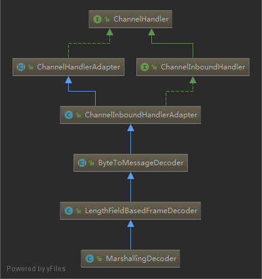
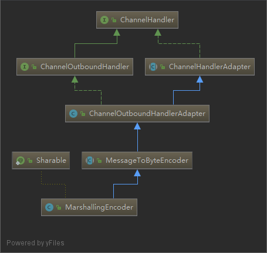
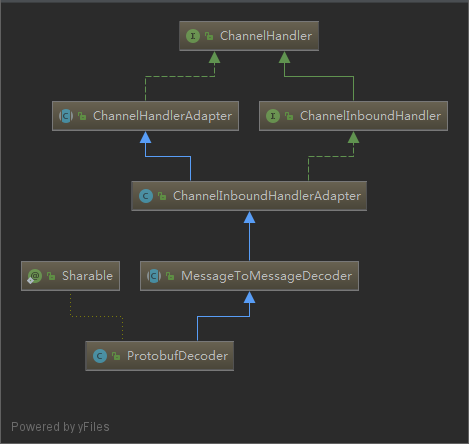
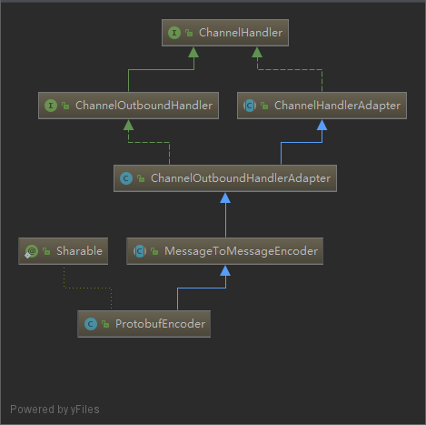

# CHAPTER 11

## Idle connections and timeouts

- `IdleStateHandler`
- `ReadTimeoutHandler`
- `WriteTimeoutHandler`

## Delimited protocols

Delimited message protocols use defined characters to mark the beginning or end of a
message or message segment, often called a frame. This is true of many protocols for-
mally defined by RFC documents, such as SMTP , POP3 , IMAP , and Telnet. 5 And, of
course, private organizations often have their own proprietary formats.

## Length-based protocols

## Serializing data

The JDK provides `ObjectOutputStream` and `ObjectInputStream` for serializing and deserializing primitive data types and graphs of POJOs over the network. The API isn’t
complex and can be applied to any object that implements `java.io.Serializable`. But
it’s also not terribly efficient. In this section we’ll see what Netty has to offer.

## JDK serialization

- CompatibleObjectDecoder(jdk)
- CompatibleObjectEncoder(jdk)

- ObjectDecoder(netty)
- ObjectEncoder(netty)

| Name                    | Description                                                                                                                                                                                                                 |
| ----------------------- | --------------------------------------------------------------------------------------------------------------------------------------------------------------------------------------------------------------------------- |
| CompatibleObjectDecoder | Decoder for interoperating with non-Netty peers that use JDK serialization.                                                                                                                                                 |
| CompatibleObjectEncoder | Encoder for interoperating with non-Netty peers that use JDK serialization.                                                                                                                                                 |
| ObjectDecoder           | Decoder that uses custom serialization for decoding on top of JDK serialization; it provides a speed improvement when external dependencies are excluded. Otherwise the other serialization implementations are preferable. |
| ObjectEncoder           | Encoder that uses custom serialization for encoding on top of JDK serialization; it provides a speed improvement when external dependencies are excluded. Otherwise the other serialization implementations are preferable. |

ObjectDecoder&ObjectEncoder

Netty `序列化`和`反序列化`java对象的工具类，与`ObjectOutputStream`和`ObjectInputStream`不兼容

| ObjectDecoder                                | ObjectEncoder                                |
| -------------------------------------------- | -------------------------------------------- |
|  |  |

## Serialization with JBoss Marshalling

JBoss Marshalling codecs

| Name                                                      | Description                                                                         |
| --------------------------------------------------------- | ----------------------------------------------------------------------------------- |
| CompatibleMarshallingDecoder CompatibleMarshallingEncoder | For compatibility with peers that use JDK serialization.                            |
| MarshallingDecoder MarshallingEncoder                     | For use with peers that use JBoss Marshalling. These classes must be used together. |

MarshallingDecoder&MarshallingEncoder

| MarshallingDecoder                                     | MarshallingEncoder                                     |
| ------------------------------------------------------ | ------------------------------------------------------ |
|  |  |

## Serialization via Protocol Buffers

The last of Netty’s solutions for serialization is a codec that utilizes Protocol Buffers, 8 a
data interchange format developed by Google and now open source. The code can be
found at [protobuf](https://github.com/google/protobuf).
Protocol Buffers encodes and decodes structured data in a way that’s compact and
efficient. It has bindings for many programming languages, making it a good fit for
cross-language projects

Protobuf codec

| Name                         | Description                                                                                                                       |
| ---------------------------- | --------------------------------------------------------------------------------------------------------------------------------- |
| ProtobufDecoder              | Decodes a message using protobuf                                                                                                  |
| ProtobufEncoder              | Encodes a message using protobuf                                                                                                  |
| ProtobufVarint32FrameDecoder | Splits received ByteBufs dynamically by the value of the Google Protocol "Base 128 Varints" a integer length field in the message |

ProtobufDecoder&ProtobufEncoder

| ProtobufDecoder                                  | ProtobufEncoder                                  |
| ------------------------------------------------ | ------------------------------------------------ |
|  |  |