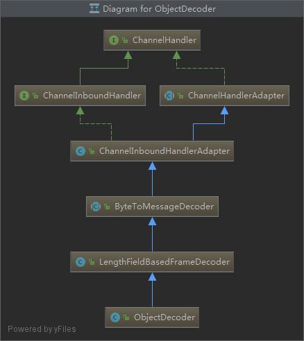
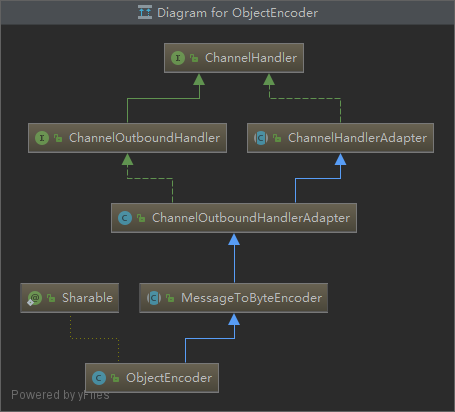

# ByteToMessageDecoder

Netty 中负责把字节流转化成一个具体对象的基类

> 来自Netty docs:

Generally frame detection should be handled earlier in the pipeline by adding a `DelimiterBasedFrameDecoder`, `FixedLengthFrameDecoder`, `LengthFieldBasedFrameDecoder`, or `LineBasedFrameDecoder`.

If a custom frame decoder is required, then one needs to be careful when implementing one with `ByteToMessageDecoder`. Ensure there are enough bytes in the buffer for a complete frame by checking `ByteBuf.readableBytes()`. If there are not enough bytes for a complete frame, return without modifying the reader index to allow more bytes to arrive.

To check for complete frames without modifying the reader index, use methods like ByteBuf.getInt(int). One MUST use the reader index when using methods like `ByteBuf.getInt(int)`. For example `calling in.getInt(0)` is assuming the frame starts at the beginning of the buffer, which is not always the case. Use `in.getInt(in.readerIndex())` instead.

## ObjectDecoder&ObjectEncoder

Netty `序列化`和`反序列化`java对象的工具类，与`ObjectOutputStream`和`ObjectInputStream`不兼容

| ObjectDecoder                                | ObjectEncoder                                |
| -------------------------------------------- | -------------------------------------------- |
|  |  |

## jdk serialization

| Name                    | Description                                                                                                                                                                                                                 |
| ----------------------- | --------------------------------------------------------------------------------------------------------------------------------------------------------------------------------------------------------------------------- |
| CompatibleObjectDecoder | Decoder for interoperating with non-Netty peers that use JDK serialization.                                                                                                                                                 |
| CompatibleObjectEncoder | Encoder for interoperating with non-Netty peers that use JDK serialization.                                                                                                                                                 |
| ObjectDecoder           | Decoder that uses custom serialization for decoding on top of JDK serialization; it provides a speed improvement when external dependencies are excluded. Otherwise the other serialization implementations are preferable. |
| ObjectEncoder           | Encoder that uses custom serialization for encoding on top of JDK serialization; it provides a speed improvement when external dependencies are excluded. Otherwise the other serialization implementations are preferable. |

## Serialization with JBoss Marshalling

JBoss Marshalling codecs

| Name                                                          | Description                                              |
| ------------------------------------------------------------- | -------------------------------------------------------- |
| `CompatibleMarshallingDecoder` `CompatibleMarshallingEncoder` | For compatibility with peers that use JDK serialization. |
| `MarshallingDecoder` `MarshallingEncoder`                     | For use with peers that use JBoss                        |

## Serialization via Protocol Buffers

Protobuf codec

| Name                         | Description                                                                                                                       |
| ---------------------------- | --------------------------------------------------------------------------------------------------------------------------------- |
| ProtobufDecoder              | Decodes a message using protobuf                                                                                                  |
| ProtobufEncoder              | Encodes a message using protobuf                                                                                                  |
| ProtobufVarint32FrameDecoder | Splits received ByteBufs dynamically by the value of the Google Protocol "Base 128 Varints" a integer length field in the message |