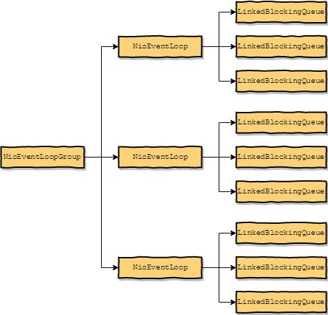

# EventLoop

## 1. NioEventLoop

类图继承关系：


从这个类图种可以看到`NioEventLoop`的作用：

1. 继承了`ExecutorService`,因此可以作为一个线程池,执行提交的任务
2. 继承了`ScheduledExecutorService`,  因此可以进行`定时`任务的执行
3. 继承了`EventLoopGroup`

下面从这几个方面进行分析：

1. EventLoop 的初始化
2. EventLoop 的定时任务
3. EventLoop 进行事件的分发
4. EventLoop与EventLoopGroup

### EventLoop 的初始化

`Channel`在进行初始之后，会进行一个注册`register`的操作,这个时候`Channel`与`EventLoop`进行了关联

`AbstractChannel#AbstractUnsafe#register`

```java
        @Override
        public final void register(EventLoop eventLoop, final ChannelPromise promise) {
            // Channel 与eventLoop 进行关联
            AbstractChannel.this.eventLoop = eventLoop;
            // 其他注册事件处理
            if (eventLoop.inEventLoop()) {
                register0(promise);
            } else {
                try {
                    eventLoop.execute(new Runnable() {
                        @Override
                        public void run() {
                            register0(promise);
                        }
                    });
                } catch (Throwable t) {
                    logger.warn(
                            "Force-closing a channel whose registration task was not accepted by an event loop: {}",
                            AbstractChannel.this, t);
                    closeForcibly();
                    closeFuture.setClosed();
                    safeSetFailure(promise, t);
                }
            }
        }
```

### EventLoop 的定时任务

下面来自 `Netty in action`

Occasionally you’ll need to schedule a task for later (deferred) or periodic execution.
For example, you might want to register a task to be fired after a client has been con-
nected for five minutes. A common use case is to send a heartbeat message to a
remote peer to check whether the connection is still alive. If there is no response, you
know you can close the channel

## NioEventLoopGroup

NioEventLoopGroup 的类图


1. `EventExecutorGroup`的作用
2. `EventExecutorGroup`的初始化

### `EventExecutorGroup`的作用

`EventExecutorGroup` 维护了一组`NioEventLoop`,并且提供了`EventExecutor next();`方法在这个数组中选择一个`NioEventLoop`进行事件的处理
这个方法提供了一个轮询策略，来选择不同的线程(可参考这篇文章[EventExecutorChooser](source-code-EventExecutorChooser.md))

### `EventExecutorGroup`的初始化

我们在构造一个`ServerBootstrap`对象的时候，需要一个`EventLoopGroup`，代码如下：

```java
    public void bootstrap() {
        NioEventLoopGroup group = new NioEventLoopGroup();
        ServerBootstrap bootstrap = new ServerBootstrap();
        bootstrap.group(group)
                .channel(NioServerSocketChannel.class)
                .childHandler(new SimpleChannelInboundHandler<ByteBuf>() {
                    @Override
                    protected void channelRead0(ChannelHandlerContext channelHandlerContext,
                                                ByteBuf byteBuf) throws Exception {
                        System.out.println("Received data");
                    }
                });
        ChannelFuture future = bootstrap.bind(new InetSocketAddress(8081));
        future.addListener(new ChannelFutureListener() {
            @Override
            public void operationComplete(ChannelFuture channelFuture)
                    throws Exception {
                if (channelFuture.isSuccess()) {
                    System.out.println("Server bound");
                } else {
                    System.err.println("Bind attempt failed");
                    channelFuture.cause().printStackTrace();
                }
            }
        });
    }
```

最终的方法在`MultithreadEventExecutorGroup#MultithreadEventExecutorGroup`的构造方法中实现的，

```java
this(nThreads, executor, DefaultEventExecutorChooserFactory.INSTANCE, args);
```

这个方法提供4个参数：

- nThreads 线程池的线程个数
- executor 线程执行器
- 线程选择器（实际是一个线程轮询策略）
- 其他参数,在`newChild(executor, args)`进行使用

`newChild`的代码实现(`NioEventLoopGroup#newChild`)：

```java
    @Override
    protected EventLoop newChild(Executor executor, Object... args) throws Exception {
        return new NioEventLoop(this, executor, (SelectorProvider) args[0],
            ((SelectStrategyFactory) args[1]).newSelectStrategy(), (RejectedExecutionHandler) args[2]);
    }
```

方法参数:

- this NioEventLoopGroup,这个线程所在的线程组
- executor 线程执行器
- SelectorProvider
- Selector 事件模型,nio中Selector的实现
- RejectedExecutionHandler 异常处理

初始之后，`EventExecutorGroup`,`NioEventLoop`类之间的引用关系:



虽然`EventExecutorGroup`中有多个`NioEventLoop`,但是只有一个`NioEventLoop`会与`Channel`进行关联，处理IO事件的转发

## 参考资料

- [eventLoop(开源中国)](https://my.oschina.net/andylucc/blog/618179)
- [eventLoop(segmentfault)](https://segmentfault.com/a/1190000007403873)
