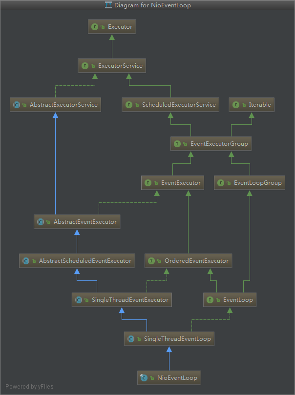

# EventLoop

- [eventLoop(开源中国)](https://my.oschina.net/andylucc/blog/618179)
- [eventloop(segmentfault)](https://segmentfault.com/a/1190000007403873)

## NioEventLoopGroup


## NioEventLoop



### NioEventLoop 何时启动

```java
{
        for (;;) {
            try {
                switch (selectStrategy.calculateStrategy(selectNowSupplier, hasTasks())) {
                    case SelectStrategy.CONTINUE:
                        continue;
                    case SelectStrategy.SELECT:
                        select(wakenUp.getAndSet(false));

                        // 'wakenUp.compareAndSet(false, true)' is always evaluated
                        // before calling 'selector.wakeup()' to reduce the wake-up
                        // overhead. (Selector.wakeup() is an expensive operation.)
                        //
                        // However, there is a race condition in this approach.
                        // The race condition is triggered when 'wakenUp' is set to
                        // true too early.
                        //
                        // 'wakenUp' is set to true too early if:
                        // 1) Selector is waken up between 'wakenUp.set(false)' and
                        //    'selector.select(...)'. (BAD)
                        // 2) Selector is waken up between 'selector.select(...)' and
                        //    'if (wakenUp.get()) { ... }'. (OK)
                        //
                        // In the first case, 'wakenUp' is set to true and the
                        // following 'selector.select(...)' will wake up immediately.
                        // Until 'wakenUp' is set to false again in the next round,
                        // 'wakenUp.compareAndSet(false, true)' will fail, and therefore
                        // any attempt to wake up the Selector will fail, too, causing
                        // the following 'selector.select(...)' call to block
                        // unnecessarily.
                        //
                        // To fix this problem, we wake up the selector again if wakenUp
                        // is true immediately after selector.select(...).
                        // It is inefficient in that it wakes up the selector for both
                        // the first case (BAD - wake-up required) and the second case
                        // (OK - no wake-up required).

                        if (wakenUp.get()) {
                            selector.wakeup();
                        }
                    default:
                        // fallthrough
                }

                cancelledKeys = 0;
                needsToSelectAgain = false;
                final int ioRatio = this.ioRatio;
                if (ioRatio == 100) {
                    try {
                        processSelectedKeys();
                    } finally {
                        // Ensure we always run tasks.
                        runAllTasks();
                    }
                } else {
                    final long ioStartTime = System.nanoTime();
                    try {
                        processSelectedKeys();
                    } finally {
                        // Ensure we always run tasks.
                        final long ioTime = System.nanoTime() - ioStartTime;
                        runAllTasks(ioTime * (100 - ioRatio) / ioRatio);
                    }
                }
            } catch (Throwable t) {
                handleLoopException(t);
            }
            // Always handle shutdown even if the loop processing threw an exception.
            try {
                if (isShuttingDown()) {
                    closeAll();
                    if (confirmShutdown()) {
                        return;
                    }
                }
            } catch (Throwable t) {
                handleLoopException(t);
            }
        }
    }
```