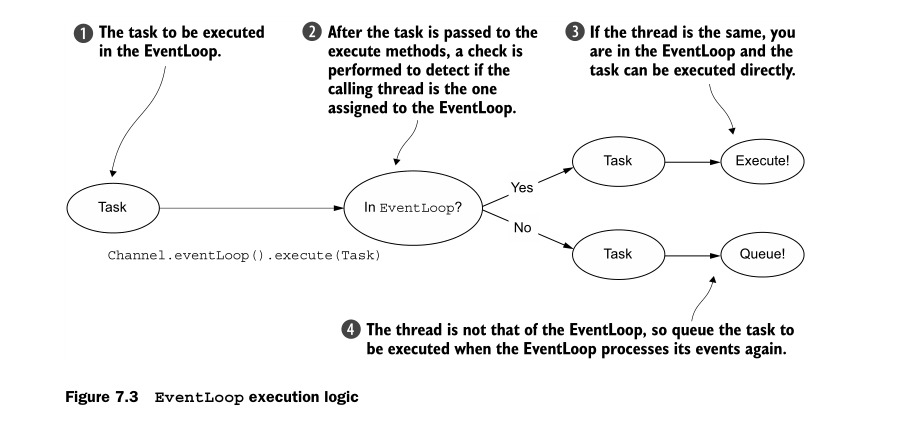

# EventLoop

## 1. NioEventLoop

类图继承关系：


从这个类图种可以看到`NioEventLoop`的作用：

1. 继承了`ExecutorService`,因此可以作为一个线程池,执行提交的任务
2. 继承了`ScheduledExecutorService`,  因此可以进行`定时`任务的执行
3. 继承了`EventLoopGroup`

下面从这几个方面进行分析：

1. EventLoop 的初始化
2. EventLoop 的定时任务
3. EventLoop 的异步任务
4. EventLoop I/O task and non-I/O tasks
5. EventLoop 与 EventLoopGroup

### EventLoop 的初始化

`Channel`在进行初始之后，会进行一个注册`register`的操作,这个时候`Channel`与`EventLoop`进行了关联

`AbstractChannel#AbstractUnsafe#register`

```java
        @Override
        public final void register(EventLoop eventLoop, final ChannelPromise promise) {
            // 省略其它代码
            // Channel 与eventLoop 进行关联
            AbstractChannel.this.eventLoop = eventLoop;
            // 其他注册事件处理
            if (eventLoop.inEventLoop()) {
                register0(promise);
            } else {
                try {
                    eventLoop.execute(new Runnable() {
                        @Override
                        public void run() {
                            register0(promise);
                        }
                    });
                } catch (Throwable t) {
                    logger.warn(
                            "Force-closing a channel whose registration task was not accepted by an event loop: {}",
                            AbstractChannel.this, t);
                    closeForcibly();
                    closeFuture.setClosed();
                    safeSetFailure(promise, t);
                }
            }
        }
```

### EventLoop 的定时任务

下面来自 `Netty in action`

Occasionally(偶尔) you’ll need to schedule a task for later (deferred) or periodic execution.
For example, you might want to register a task to be fired after a client has been connected for five minutes. A common use case is to send a heartbeat message to a
remote peer to check whether the connection is still alive. If there is no response, you
know you can close the channel

个人理解 `EventLoop`提供的定时任务和 jdk 提供的定时任务执行 API 功能相似，但是 netty 的`EventLoop`与
`Channel`进行了关联，可以定时对`Channel`连接执行一些操作(如心跳检查)

### EventLoop 的异步任务

下面来自 `Netty in action`

If the calling Thread is that of the EventLoop , the code block in question is executed. Otherwise, the EventLoop schedules a task for later execution and puts it in an
internal queue. When the EventLoop next processes its events, it will execute those in
the queue. This explains how any Thread can interact directly with the Channel with-
out requiring synchronization in the ChannelHandlers.

如果当前运行的线程和`EventLoop`是同一个线程，那么就直接执行这个任务，否则就吧这个任务提交到任务队列
进行异步任务的执行

```java
    // SingleThreadEventExecutor 中维护了一个任务队列，进行异步任务的处理
   private final Queue<Runnable> taskQueue;
```



代码例子：

```java
            if (eventLoop.inEventLoop()) {
                // 是同一个线程
                register0(promise);
            } else {
                // 不是同一个线程
                // 包装成Runnable，放到任务队列进行执行
                eventLoop.execute(new Runnable() {
                        @Override
                        public void run() {
                            register0(promise);
                        }
                    });
            }
```

We stated earlier the importance of not blocking the current I/O thread. We’ll say
it again in another way: “Never put a long-running task in the execution queue,
because it will `block` any other task from executing on the same thread.” If you must
make blocking calls or execute long-running tasks, we advise the use of a dedicated EventExecutor

> 请不要在`taskQueue`进行`耗时`的异步任务，耗时的任务会阻塞其他任务的执行（性能会下降）

### EventLoop I/O task and non-I/O tasks

- I/O task IO 事件
- non-I/O tasks 非 IO 事件

ioRatio 默认是`1:1`的比率，执行 1 秒 IO，再执行 1 秒非 IO 事件

```java
if (ioRatio == 100) {
    try {
        // 如果 ioRatio=100
        // 执行发生的IO事件(比如：socket连接，socket读事件，socket写事件)
        processSelectedKeys();
    } finally {
        // Ensure we always run tasks.
        // 执行在taskQueue中的任务
        runAllTasks();
    }
} else {
    final long ioStartTime = System.nanoTime();
    try {
        processSelectedKeys();
    } finally {
        // Ensure we always run tasks.
        final long ioTime = System.nanoTime() - ioStartTime;
        // 如果ioTime执行了 60 纳秒，ioRatio=50
        // 那么执行任务的时间就是60纳秒
        runAllTasks(ioTime * (100 - ioRatio) / ioRatio);
    }
}
```

## NioEventLoopGroup

NioEventLoopGroup 的类图


1. `EventExecutorGroup`的作用
2. `EventExecutorGroup`的初始化

### `EventExecutorGroup`的作用

`EventExecutorGroup` 维护了一组`NioEventLoop`,并且提供了`EventExecutor next();`方法在这个数组中选择一个`NioEventLoop`进行事件的处理
这个方法提供了一个轮询策略，来选择不同的线程(可参考这篇文章[EventExecutorChooser](source-code-EventExecutorChooser.md))

### `EventExecutorGroup`的初始化

我们在构造一个`ServerBootstrap`对象的时候，需要一个`EventLoopGroup`，代码如下：

```java
    public void bootstrap() {
        NioEventLoopGroup group = new NioEventLoopGroup();
        ServerBootstrap bootstrap = new ServerBootstrap();
        bootstrap.group(group)
                .channel(NioServerSocketChannel.class)
                .childHandler(new SimpleChannelInboundHandler<ByteBuf>() {
                    @Override
                    protected void channelRead0(ChannelHandlerContext channelHandlerContext,
                                                ByteBuf byteBuf) throws Exception {
                        System.out.println("Received data");
                    }
                });
        ChannelFuture future = bootstrap.bind(new InetSocketAddress(8081));
        future.addListener(new ChannelFutureListener() {
            @Override
            public void operationComplete(ChannelFuture channelFuture)
                    throws Exception {
                if (channelFuture.isSuccess()) {
                    System.out.println("Server bound");
                } else {
                    System.err.println("Bind attempt failed");
                    channelFuture.cause().printStackTrace();
                }
            }
        });
    }
```

最终的方法在`MultithreadEventExecutorGroup#MultithreadEventExecutorGroup`的构造方法中实现的，

```java
this(nThreads, executor, DefaultEventExecutorChooserFactory.INSTANCE, args);
```

这个方法提供 4 个参数：

- nThreads 线程池的线程个数
- executor 线程执行器
- 线程选择器（实际是一个线程轮询策略）
- 其他参数,在`newChild(executor, args)`进行使用

`newChild`的代码实现(`NioEventLoopGroup#newChild`)：

```java
    @Override
    protected EventLoop newChild(Executor executor, Object... args) throws Exception {
        return new NioEventLoop(this, executor, (SelectorProvider) args[0],
            ((SelectStrategyFactory) args[1]).newSelectStrategy(), (RejectedExecutionHandler) args[2]);
    }
```

方法参数:

- this NioEventLoopGroup,这个线程所在的线程组
- executor 线程执行器
- SelectorProvider
- Selector 事件模型,nio 中 Selector 的实现
- RejectedExecutionHandler 异常处理

初始之后，`EventExecutorGroup`,`NioEventLoop`类之间的引用关系:


虽然`EventExecutorGroup`中有多个`NioEventLoop`,但是只有一个`NioEventLoop`会与`Channel`进行关联，处理 IO 事件的转发

## 参考资料

- [eventLoop(开源中国)](https://my.oschina.net/andylucc/blog/618179)
- [eventLoop(segmentfault)](https://segmentfault.com/a/1190000007403873)
