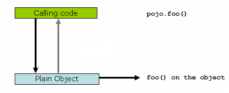
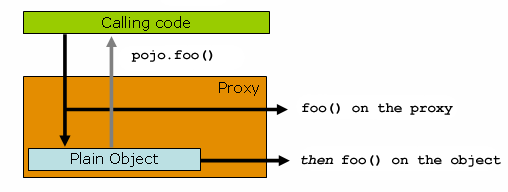

# Aspect Oriented Programming with Spring

- 01 [AOP concepts](#1-aop-concepts)
- 02 [Spring AOP capabilities and goals](#1-spring-aop-capabilities-and-goals)
- 03 [Enabling @AspectJ Support](#3-enabling-aspectj-support)
- 04 [@Aspect](#4-aspect)
- 05 [@Pointcut](#5-pointcut)
- 06 [Supported Pointcut Designators](#6-supported-pointcut-designators)
- 07 [execution](#7-execution)
- 08 [Declaring advice](#8-declaring-advice)
- 09 [Schema-based AOP support](#9-schema-based-aop-support)
- 10 [Advisors](#10-advisors)
- 11 [Choosing which AOP declaration style to use](#11-choosing-which-aop-declaration-style-to-use)
- 12 [@AspectJ or XML for Spring AOP](#12-aspectj-or-xml-for-spring-aop)
- 13 [Proxying mechanisms](#13-proxying-mechanisms)

## 1 AOP concepts

- `Aspect`: a modularization of a concern that cuts across multiple classes. Transaction management is a good example of a crosscutting concern in enterprise Java applications. In Spring AOP, aspects are implemented using regular classes (the schema-based approach) or regular classes annotated with the @Aspect annotation (the @AspectJ style).
- `Join point`: a point during the execution of a program, such as the execution of a method or the handling of an exception. In Spring AOP, a join point always represents a method execution.
- `Advice`: action taken by an aspect at a particular join point. Different types of advice include "around," "before" and "after" advice. (Advice types are discussed below.) Many AOP frameworks, including Spring, model an advice as an interceptor, maintaining a chain of interceptors around the join point.
- `Pointcut`: a predicate that matches join points. Advice is associated with a pointcut expression and runs at any join point matched by the pointcut (for example, the execution of a method with a certain name). The concept of join points as matched by pointcut expressions is central to AOP, and Spring uses the AspectJ pointcut expression language by default.
- `Introduction`: declaring additional methods or fields on behalf of a type. Spring AOP allows you to introduce new interfaces (and a corresponding implementation) to any advised object. For example, you could use an introduction to make a bean implement an IsModified interface, to simplify caching. (An introduction is known as an inter-type declaration in the AspectJ community.)
- `Target object`: object being advised by one or more aspects. Also referred to as the advised object. Since Spring AOP is implemented using runtime proxies, this object will always be a proxied object.
- `AOP proxy`: an object created by the AOP framework in order to implement the aspect contracts (advise method executions and so on). In the Spring Framework, an AOP proxy will be a JDK dynamic proxy or a CGLIB proxy.
- `Weaving`: linking aspects with other application types or objects to create an advised object. This can be done at compile time (using the AspectJ compiler, for example), load time, or at runtime. Spring AOP, like other pure Java AOP frameworks, performs weaving at runtime.

- Aspect 切面  ->   类
- Join point 连接点 ->  方法
- Advice 建议 -> interceptors 拦截器
- Pointcut 切入点 ->
- Introduction
- Target object
- AOP proxy
- Weaving

Types of advice:

- `Before advice`: Advice that executes before a join point, but which does not have the ability to prevent execution flow proceeding to the join point (unless it throws an exception).
- `After returning advice`: Advice to be executed after a join point completes normally: for example, if a method returns without throwing an exception.
- `After throwing advice`: Advice to be executed if a method exits by throwing an exception.
- `After (finally) advice`: Advice to be executed regardless of the means by which a join point exits (normal or exceptional return).
- `Around advice`: Advice that surrounds a join point such as a method invocation. This is the most powerful kind of advice. Around advice can perform custom behavior before and after the method invocation. It is also responsible for choosing whether to proceed to the join point or to shortcut the advised method execution by returning its own return value or throwing an exception.

## 2 Spring AOP capabilities and goals

[Link](https://docs.spring.io/spring/docs/4.3.x/spring-framework-reference/htmlsingle/#aop-introduction-spring-defn)

## 3  Enabling @AspectJ Support

`aspectjweaver.jar`

> The @AspectJ support can be enabled with XML or Java style configuration. In either case you will also need to ensure that AspectJ’s aspectjweaver.jar library is on the classpath of your application (version 1.6.8 or later). This library is available in the 'lib' directory of an AspectJ distribution or via the Maven Central repository.

Enabling @AspectJ Support with Java configuration

```java
@Configuration
@EnableAspectJAutoProxy
public class AppConfig {
}
```

Enabling @AspectJ Support with XML configuration

```xml
<aop:aspectj-autoproxy/>
```

## 4 Aspect

 `org.aspectj.lang.annotation.Aspect`

 Aspects (classes annotated with @Aspect) may have methods and fields just like any other class. They may also contain `pointcut`, `advic`e, and `introduction (inter-type) declarations`.

## 5 Pointcut

> and the pointcut expression is indicated using the @Pointcut annotation (the method serving as the pointcut signature must have a void return type).

## 6 Supported Pointcut Designators

- `execution` - for matching method execution join points, this is the primary pointcut designator you will use when working with Spring AOP
- `within` - limits matching to join points within certain types (simply the execution of a method declared within a matching type when using Spring AOP)
- `this` - limits matching to join points (the execution of methods when using Spring AOP) where the bean reference (Spring AOP proxy) is an instance of the given type
- `target` - limits matching to join points (the execution of methods when using Spring AOP) where the target object (application object being proxied) is an instance of the given type
- `args` - limits matching to join points (the execution of methods when using Spring AOP) where the arguments are instances of the given types
- `@target` - limits matching to join points (the execution of methods when using Spring AOP) where the class of the executing object has an annotation of the given type
- `@args` - limits matching to join points (the execution of methods when using Spring AOP) where the runtime type of the actual arguments passed have annotations of the given type(s)
- `@within` - limits matching to join points within types that have the given annotation (the execution of methods declared in types with the given annotation when using Spring AOP)
- `@annotation` - limits matching to join points where the subject of the join point (method being executed in Spring AOP) has the given annotation

## 7 execution

```java
execution(modifiers-pattern? ret-type-pattern declaring-type-pattern?name-pattern(param-pattern)
            throws-pattern?)
```

[Example](https://docs.spring.io/spring/docs/4.3.x/spring-framework-reference/htmlsingle/#aop-pointcuts-examples)

## 8 Declaring advice

[Link](https://docs.spring.io/spring/docs/4.3.x/spring-framework-reference/htmlsingle/#aop-advice)

- Before advice  `@Before` 在方法执行之前执行的`Aspect`
- After returning advice  `@AfterReturning` 在方法`return`之前执行的`Aspect` 可以拦截到`return`的结果 [Link](https://docs.spring.io/spring/docs/4.3.x/spring-framework-reference/htmlsingle/#aop-schema-advice-after-returning)
- After throwing advice `@AfterThrowing`  在发生异常的时候执行，可以指定异常的类型,如：`DataAccessException`
- After (finally) advice `@After` 通常用来释放资源
- Around advice `@Around`

Around

```java
@Aspect
public class AroundExample {

    @Around("com.xyz.myapp.SystemArchitecture.businessService()")
    public Object doBasicProfiling(ProceedingJoinPoint pjp) throws Throwable {
        // start stopwatch
        Object retVal = pjp.proceed();
        // stop stopwatch
        return retVal;
    }
}
```

> The value returned by the around advice will be the return value seen by the caller of the method. A simple caching aspect for example could return a value from a cache if it has one, and invoke proceed() if it does not. Note that proceed may be invoked once, many times, or not at all within the body of the around advice, all of these are quite legal.

可以用来缓存`昂贵的`计算结果,如果有，就不需要调用`pjp.proceed()`直接返回

- Advice parameters

- Access to the current JoinPoint

`org.aspectj.lang.JoinPoint`

- Passing parameters to advice

```java
@Before("com.xyz.myapp.SystemArchitecture.dataAccessOperation() && args(account,..)")
public void validateAccount(Account account) {
    // ...
}
```

## 9 Schema-based AOP support

- Declaring an aspect

```xml
aop:config>
    <aop:aspect id="myAspect" ref="aBean">
        ...
    </aop:aspect>
</aop:config>

<bean id="aBean" class="...">
    ...
</bean>
```

- Declaring a pointcut

```xml
<aop:config>

    <aop:pointcut id="businessService"
        expression="execution(* com.xyz.myapp.service.*.*(..))"/>

</aop:config>
```

- Declaring advice

- Before advice

```xml
<aop:aspect id="beforeExample" ref="aBean">

    <aop:before
        pointcut-ref="dataAccessOperation"
        method="doAccessCheck"/>

    ...

</aop:aspect>
```

- After returning advice

```xml
aop:aspect id="afterReturningExample" ref="aBean">

    <aop:after-returning
        pointcut-ref="dataAccessOperation"
        returning="retVal"
        method="doAccessCheck"/>

    ...

</aop:aspect>
```

- After throwing advice

```xml
<aop:aspect id="afterThrowingExample" ref="aBean">

    <aop:after-throwing
        pointcut-ref="dataAccessOperation"
        throwing="dataAccessEx"
        method="doRecoveryActions"/>

    ...

</aop:aspect>
```

- After (finally) advice

```xml
<aop:aspect id="afterFinallyExample" ref="aBean">

    <aop:after
        pointcut-ref="dataAccessOperation"
        method="doReleaseLock"/>

    ...

</aop:aspect>
```

- Around advice

```xml
<aop:aspect id="aroundExample" ref="aBean">

    <aop:around
        pointcut-ref="businessService"
        method="doBasicProfiling"/>

    ...

</aop:aspect>
```

- Advice parameters

```xml
<beans xmlns="http://www.springframework.org/schema/beans"
    xmlns:xsi="http://www.w3.org/2001/XMLSchema-instance"
    xmlns:aop="http://www.springframework.org/schema/aop"
    xsi:schemaLocation="
        http://www.springframework.org/schema/beans http://www.springframework.org/schema/beans/spring-beans.xsd
        http://www.springframework.org/schema/aop http://www.springframework.org/schema/aop/spring-aop.xsd">

    <!-- this is the object that will be proxied by Spring's AOP infrastructure -->
    <bean id="fooService" class="x.y.service.DefaultFooService"/>

    <!-- this is the actual advice itself -->
    <bean id="profiler" class="x.y.SimpleProfiler"/>

    <aop:config>
        <aop:aspect ref="profiler">

            <aop:pointcut id="theExecutionOfSomeFooServiceMethod"
                expression="execution(* x.y.service.FooService.getFoo(String,int))
                and args(name, age)"/>

            <aop:around pointcut-ref="theExecutionOfSomeFooServiceMethod"
                method="profile"/>

        </aop:aspect>
    </aop:config>

</beans>
```

## 10 Advisors

```xml
<aop:config>

    <aop:pointcut id="businessService"
        expression="execution(* com.xyz.myapp.service.*.*(..))"/>

    <aop:advisor
        pointcut-ref="businessService"
        advice-ref="tx-advice"/>

</aop:config>

<tx:advice id="tx-advice">
    <tx:attributes>
        <tx:method name="*" propagation="REQUIRED"/>
    </tx:attributes>
</tx:advice>
```

## 11 Choosing which AOP declaration style to use

- 应用需要
- 开发工具
- 团队习惯

Once you have decided that an aspect is the best approach for implementing a given requirement, how do you decide between using Spring AOP or AspectJ, and between the Aspect language (code) style, @AspectJ annotation style, or the Spring XML style? These decisions are influenced by a number of factors including `application requirements`, `development tools`, and `team familiarity with AOP`.

## 12 @AspectJ or XML for Spring AOP

- xml 对于熟悉使用spring 的人上手很快
- xml POJO
- xml 一目了然
- xml only singleton
- xml  不能用 && 组合Pointcut

## 13 Proxying mechanisms

代理的原理

> CGLIB  & JDK

代理的限制&注意点

- final methods cannot be advised, as they cannot be overridden.
- As of Spring 3.2, it is no longer necessary to add CGLIB to your project classpath, as CGLIB classes are repackaged under org.springframework and included directly in the spring-core JAR. This means that CGLIB-based proxy support 'just works' in the same way that JDK dynamic proxies always have.
- As of Spring 4.0, the constructor of your proxied object will NOT be called twice anymore since the CGLIB proxy instance will be created via Objenesis. Only if your JVM does not allow for constructor bypassing, you might see double invocations and corresponding debug log entries from Spring’s AOP support.

> To force the use of CGLIB proxies set the value of the proxy-target-class attribute of the <aop:config> element to true:

```xml
<aop:config proxy-target-class="true">
    <!-- other beans defined here... -->
</aop:config>
```

> To force CGLIB proxying when using the @AspectJ autoproxy support, set the 'proxy-target-class' attribute of the <aop:aspectj-autoproxy> element to true:

```xml
<aop:aspectj-autoproxy proxy-target-class="true"/>
```

图解

没有使用proxy



使用了proxy

