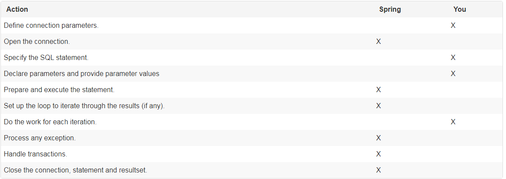

# Data access with JDBC

- 01 [Choosing an approach for JDBC database access](#01-choosing-an-approach-for-jdbc-database-access)
- 02 [Package hierarchy](#02-package-hierarchy)
- 03 [JdbcTemplate](#03-jdbcTemplate)
- 04 [JdbcTemplate best practices](#04-jdbctemplate-best-practices)
- 05 [NamedParameterJdbcTemplate](#05-namedparameterjdbctemplate)
- 06 [Controlling database connection](#06-controlling-database-connection)
- 07 [JDBC batch operations](#07-jdbc-batch-operations)
- 08 [Modeling JDBC operations as Java objects](#08-modeling-jdbc-operations-as-java-objects)
- 09 [Handling BLOB and CLOB objects](09-handling-blob-and-clob-objects)
- 10 [Embedded database support](#10-embedded-database-support)
- 11 [Initialization of other components that depend on the database](#11-initialization-of-other-components-that-depend-on-the-database)

The value-add provided by the Spring Framework JDBC abstraction is perhaps best shown by the sequence of actions outlined in the table below. The table shows what actions Spring will take care of and which actions are the responsibility of you, the application developer.



## 01 Choosing an approach for JDBC database access

- `JdbcTemplate` is the classic Spring JDBC approach and the most popular. This "lowest level" approach and all others use a JdbcTemplate under the covers.

- `NamedParameterJdbcTemplate` wraps a JdbcTemplate to provide named parameters instead of the traditional JDBC "?" placeholders. This approach provides better documentation and ease of use when you have multiple parameters for an SQL statement.

- `SimpleJdbcInsert` and `SimpleJdbcCall` optimize database metadata to limit the amount of necessary configuration. This approach simplifies coding so that you only need to provide the name of the table or procedure and provide a map of parameters matching the column names. This only works if the database provides adequate metadata. If the database doesn’t provide this metadata, you will have to provide explicit configuration of the parameters.

- `RDBMS Objects` including `MappingSqlQuery`, `SqlUpdate` and `StoredProcedure` requires you to create reusable and thread-safe objects during initialization of your data access layer. This approach is modeled after JDO Query wherein you define your query string, declare parameters, and compile the query. Once you do that, execute methods can be called multiple times with various parameter values passed in.

## 02 Package hierarchy

- `org.springframework.jdbc.core` `JdbcTemplate`
- `org.springframework.jdbc.core.simple` `SimpleJdbcInsert` `SimpleJdbcCall`
- `org.springframework.jdbc.core.namedparam` `NamedParameterJdbcTemplate`
- `org.springframework.jdbc.datasource`
- `org.springframework.jdbc.object`
- `org.springframework.jdbc.support`

## 03 JdbcTemplate

[Link](https://docs.spring.io/spring/docs/4.3.x/spring-framework-reference/htmlsingle/#jdbc-JdbcTemplate)

queryObject

```java
import javax.sql.DataSource;
import org.springframework.jdbc.core.JdbcTemplate;

public class RunAQuery {

    private JdbcTemplate jdbcTemplate;

    public void setDataSource(DataSource dataSource) {
        this.jdbcTemplate = new JdbcTemplate(dataSource);
    }

    public int getCount() {
        return this.jdbcTemplate.queryForObject("select count(*) from mytable", Integer.class);
    }

    public String getName() {
        return this.jdbcTemplate.queryForObject("select name from mytable", String.class);
    }
}
```

queryList

```java
private JdbcTemplate jdbcTemplate;

public void setDataSource(DataSource dataSource) {
    this.jdbcTemplate = new JdbcTemplate(dataSource);
}

public List<Map<String, Object>> getList() {
    return this.jdbcTemplate.queryForList("select * from mytable");
}
```

update

```java
import javax.sql.DataSource;

import org.springframework.jdbc.core.JdbcTemplate;

public class ExecuteAnUpdate {

    private JdbcTemplate jdbcTemplate;

    public void setDataSource(DataSource dataSource) {
        this.jdbcTemplate = new JdbcTemplate(dataSource);
    }

    public void setName(int id, String name) {
        this.jdbcTemplate.update("update mytable set name = ? where id = ?", name, id);
    }
}
```

## 04 JdbcTemplate best practices

[Link](https://docs.spring.io/spring/docs/4.3.x/spring-framework-reference/htmlsingle/#jdbc-JdbcTemplate-idioms)

JdbcTemplate 是线程安全的

Instances of the JdbcTemplate class are threadsafe once configured. This is important because it means that you can configure a single instance of a JdbcTemplate and then safely inject this shared reference into multiple DAOs (or repositories). `The JdbcTemplate is stateful, in that it maintains a reference to a DataSource, but this state is not conversational state`.

A common practice when using the JdbcTemplate class (and the associated NamedParameterJdbcTemplate classes) is to configure a DataSource in your Spring configuration file, and then dependency-inject that shared DataSource bean into your DAO classes; the JdbcTemplate is created in the setter for the DataSource. This leads to DAOs that look in part like the following:

```java
public class JdbcCorporateEventDao implements CorporateEventDao {

    private JdbcTemplate jdbcTemplate;

    public void setDataSource(DataSource dataSource) {
        this.jdbcTemplate = new JdbcTemplate(dataSource);
    }

    // JDBC-backed implementations of the methods on the CorporateEventDao follow...
}
```

## 05 NamedParameterJdbcTemplate

Remember that the NamedParameterJdbcTemplate class wraps a classic JdbcTemplate template; if you need access to the wrapped JdbcTemplate instance to access functionality only present in the JdbcTemplate class, you can use the getJdbcOperations() method to access the wrapped JdbcTemplate through the JdbcOperations interface.

See also [the section called “JdbcTemplate best practices”](#https://docs.spring.io/spring/docs/4.3.x/spring-framework-reference/htmlsingle/#jdbc-JdbcTemplate-idioms) for guidelines on using the NamedParameterJdbcTemplate class in the context of an application.

## 06 Controlling database connections

DBCP configuration

```xml
<bean id="dataSource" class="org.apache.commons.dbcp.BasicDataSource" destroy-method="close">
    <property name="driverClassName" value="${jdbc.driverClassName}"/>
    <property name="url" value="${jdbc.url}"/>
    <property name="username" value="${jdbc.username}"/>
    <property name="password" value="${jdbc.password}"/>
</bean>

<context:property-placeholder location="jdbc.properties"/>
```

C3P0 configuration

```xml
<bean id="dataSource" class="com.mchange.v2.c3p0.ComboPooledDataSource" destroy-method="close">
    <property name="driverClass" value="${jdbc.driverClassName}"/>
    <property name="jdbcUrl" value="${jdbc.url}"/>
    <property name="user" value="${jdbc.username}"/>
    <property name="password" value="${jdbc.password}"/>
</bean>

<context:property-placeholder location="jdbc.properties"/>
```

- DataSourceUtils
- SmartDataSource
- AbstractDataSource -> 抽象
- SingleConnectionDataSource
- DriverManagerDataSource -> for test 测试使用
- TransactionAwareDataSourceProxy
- DataSourceTransactionManager -> support timeout
- NativeJdbcExtractor
  - SimpleNativeJdbcExtractor
  - C3P0NativeJdbcExtractor
  - CommonsDbcpNativeJdbcExtractor
  - JBossNativeJdbcExtractor
  - WebLogicNativeJdbcExtractor
  - WebSphereNativeJdbcExtractor
  - XAPoolNativeJdbcExtractor

## 07 JDBC batch operations

可以参考Spring 如何进行处理的

- Basic batch operations with the JdbcTemplate -> dbcTemplate.batchUpdate + BatchPreparedStatementSetter
- Batch operations with a List of objects
- Batch operations with multiple batches

## 08 Modeling JDBC operations as Java objects

- SqlQuery 使用 `MappingSqlQuery`代替
- MappingSqlQuery
- SqlUpdate
- StoredProcedure

```java
public class ActorMappingQuery extends MappingSqlQuery<Actor> {

    public ActorMappingQuery(DataSource ds) {
        super(ds, "select id, first_name, last_name from t_actor where id = ?");
        super.declareParameter(new SqlParameter("id", Types.INTEGER));
        compile();
    }

    @Override
    protected Actor mapRow(ResultSet rs, int rowNumber) throws SQLException {
        Actor actor = new Actor();
        actor.setId(rs.getLong("id"));
        actor.setFirstName(rs.getString("first_name"));
        actor.setLastName(rs.getString("last_name"));
        return actor;
    }

}
```

## 09 Handling BLOB and CLOB objects

[Link](https://docs.spring.io/spring/docs/4.3.x/spring-framework-reference/htmlsingle/#jdbc-lob)

## 10 Embedded database support

- HSQL
- H2
- Derby

The `org.springframework.jdbc.datasource.embedded` package provides support for embedded Java database engines. Support for `HSQL`, `H2`, and `Derby` is provided natively. You can also use an extensible API to plug in new embedded database types and DataSource implementations.

```xml
<jdbc:embedded-database id="dataSource" generate-name="true">
    <jdbc:script location="classpath:schema.sql"/>
    <jdbc:script location="classpath:test-data.sql"/>
</jdbc:embedded-database>
```

```java
EmbeddedDatabase db = new EmbeddedDatabaseBuilder()
		.generateUniqueName(true)
		.setType(H2)
		.setScriptEncoding("UTF-8")
		.ignoreFailedDrops(true)
		.addScript("schema.sql")
		.addScripts("user_data.sql", "country_data.sql")
		.build();

// perform actions against the db (EmbeddedDatabase extends javax.sql.DataSource)

db.shutdown()
```

## 11 Initialization of other components that depend on the database

如何修改(控制)`spring`的初始化过程

[Link](https://docs.spring.io/spring/docs/4.3.x/spring-framework-reference/htmlsingle/#jdbc-client-component-initialization)
